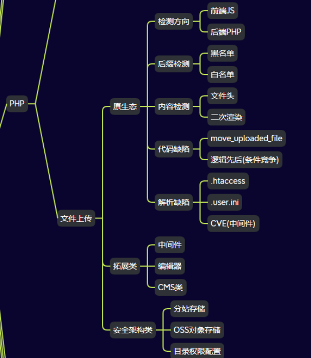

# 47WEB攻防-PHP应用&文件上传&函数缺陷&条件竞争&二次渲染&黑白名单&JS绕过

\#学习前必读：

1、课前一定要明白：

无文件解析安全问题上，格式解析是一对一的（不能jpg解析php）

换句话来说有解析错误配置或后缀解析漏洞时才能实现格式差异解析

 

2、文件上传安全指的是攻击者通过利用上传实现后门的写入连接后门进行权限控制的安全问题，对于如何确保这类安全问题，一般会从原生态功能中的文件内容，文件后缀，文件类型等方面判断，但是漏洞可能不仅在本身的代码验证逻辑中出现安全问题，也会在语言版本，语言函数，中间件，引用的第三方编辑器等存在缺陷地方配合利用。另外文件上传也有多个存储逻辑，不同的文件存储方案也会给攻击者带来不一样的挑战！

 

 

\#测试环境安装参考：

https://github.com/ffffffff0x/f8x

https://github.com/fuzzdb-project/fuzzdb

https://github.com/sqlsec/upload-labs-docker

0、下载上述资源

1、docker安装

f8x -d 或 f8x -docker

2、进入项目文件夹

cd upload-labs-docker

3、一键部署运行

docker-compose up -d

 

\#upload-labs-docker知识点：

1、前端JS

如何判断是否是前端验证呢？

首先抓包监听，如果上传文件的时候还没有抓取到数据包，但是浏览器就提示文件类型不正确的话，那么这个多半就是前端校验了

 

2、.htaccess

AddType application/x-httpd-php .png

 

3、MIME类型

Content-Type：image/png

 

4、文件头判断

GIF89a

 

5、黑名单-过滤不严

无递归，pphphp

 

6、黑名单-过滤不严

系统大小写敏感属性

 

7、低版本GET-%00截断

自动解码一次

/var/www/html/upload/x.php%00

 

8、低版本POST-%00截断

手工解码一次

../upload/x.php%00 二次解码

 

9、黑名单-过滤不严

php3

 

10、逻辑不严-条件竞争

<?php                                                       ?>');?>

上传不断发包

请求不断发包

 

11、二次渲染

先搞个正常图片，上传导出渲染后的图片

对比保留部分，在保留部分添加后门代码

最后利用提示的文件包含执行图片后门代码

 

11、函数缺陷

move_uploaded_file 1.php/.

 

12、代码审计-数组绕过

-----------------------------174283082921961

Content-Disposition: form-data; name="save_name[0]"

 

http://2.php/

-----------------------------174283082921961

Content-Disposition: form-data; name="save_name[2]"

 

gif