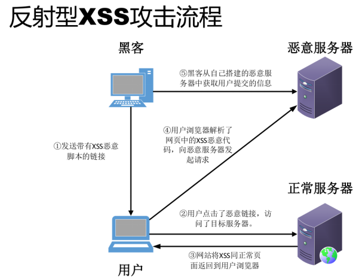
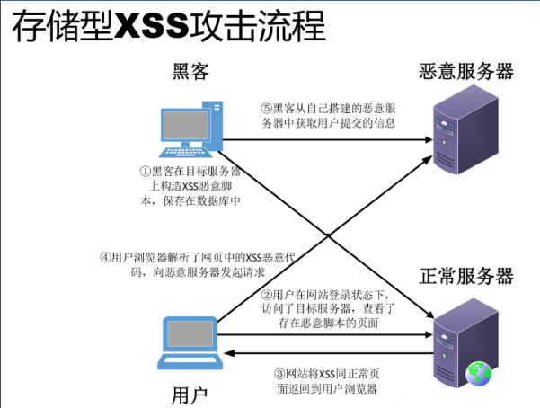

# WEB攻防-XSS跨站&反射型&存储型&DOM型&标签闭合&输入输出&JS代码解析

\#XSS跨站-输入输出-原理&分类&闭合

漏洞原理：接受输入数据，输出显示数据后解析执行

基础类型：反射(非持续)，存储(持续)，DOM-BASE

拓展类型：jquery，mxss，uxss，pdfxss，flashxss，上传xss等

常用标签：https://www.freebuf.com/articles/web/340080.html

攻击利用：盲打，COOKIE盗取，凭据窃取，页面劫持，网络钓鱼，权限维持等

安全修复：字符过滤，实例化编码，http_only，CSP防护，WAF拦截等

测试流程：看输出想输入在哪里，更改输入代码看执行（标签，过滤决定）

 

\#XSS跨站-分类测试-反射&存储&DOM

-数据交互的地方

  get、post、headers

  反馈与浏览

  富文本编辑器

  各类标签插入和自定义

-数据输出的地方

  用户资料

  数据输出

  评论，留言等

  关键词、标签、说明

  文件上传

 

-反射型XSS：（某案例测试）

常见情况是攻击者通过构造一个恶意链接的形式，诱导用户传播和打开，

由于链接内所携带的参数会回显于页面中或作为页面的处理数据源，最终造成XSS攻击。

 

-存储型XSS：（某案例测试）

存储型XSS是持久化的XSS攻击方式，将恶意代码存储于服务器端，

当其他用户再次访问页面时触发，造成XSS攻击。

 

-DOM-base型XSS：（某案例测试）

通过修改原始的客户端代码，受害者浏览器的DOM环境改变，导致有效载荷的执行。

页面本身没有变化，但由于DOM环境被恶意修改，有客户端代码被包含进了页面并执行。