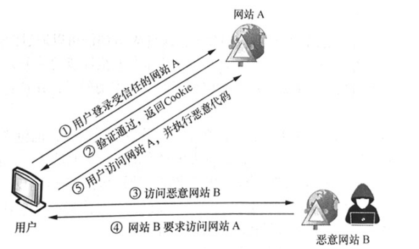
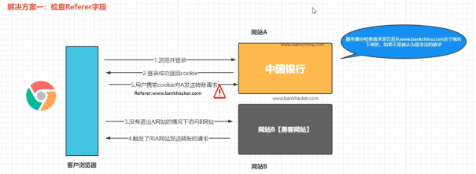
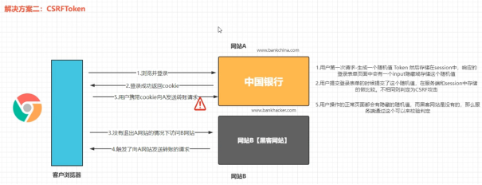

# WEB攻防-CSRF请求伪造&Referer同源&置空&配合XSS&Token值校验&复用删除

\#CSRF-无检测防护-检测&生成&利用

检测：黑盒手工利用测试，白盒看代码检验（有无token，来源检验等）

生成：BurpSuite->Engagement tools->Generate CSRF Poc

利用：将文件防止自己的站点下，诱使受害者访问（或配合XSS触发访问）

 

\#CSRF-Referer同源-规则&上传&XSS

https://blog.csdn.net/weixin_50464560/article/details/120581841

严谨代码PHP DEMO：

<?php

// 检测来源

function checkReferrer() {

  $expectedReferrer = "http://example.com"; // 期望的来源页面

 

  if (!isset($_SERVER['HTTP_REFERER']) || $_SERVER['HTTP_REFERER'] !== $expectedReferrer) {

​    die("非法访问");

  }

}

 

// 处理表单提交

if ($_SERVER['REQUEST_METHOD'] === 'POST') {

  // 检测来源

  checkReferrer();

 

  // 获取用户输入的数据

  $name = $_POST['name'];

  $email = $_POST['email'];

 

  // 输出用户输入的数据

  echo "姓名：$name ";

  echo "邮箱：$email ";

  exit;

}

?>

 

<!DOCTYPE html>

<html>

<head>

  <title>检测来源示例</title>

</head>

<body>

  <h1>检测来源示例</h1>

  <form action="<?php echo $_SERVER['PHP_SELF']; ?>" method="POST">

​    <label for="name">姓名：</label>

​    <input type="text" name="name" id="name" required />

​     

​    <label for="email">邮箱：</label>

​    <input type="email" name="email" id="email" required />

​     

​    <input type="submit" value="提交" />

  </form>

</body>

</html>

 

绕过0：规则匹配绕过问题（代码逻辑不严谨）

1、<meta name="referrer" content="no-referrer">

2、http://xx.xx.xx.xx/http://xx.xx.xx.xx

绕过1：配合文件上传绕过（严谨使用同源绕过）

绕过2：配合存储XSS绕过（严谨使用同源绕过）

 

 

\#CSRF-Token校验-值删除&复用&留空

https://blog.csdn.net/weixin_50464560/article/details/120581841

严谨代码PHP DEMO：

<?php

session_start();

 

// 生成并存储 CSRF Token

function generateCSRFToken() {

  $token = bin2hex(random_bytes(32));

  $_SESSION['csrf_token'] = $token;

  return $token;

}

 

// 检查 CSRF Token 是否有效

function validateCSRFToken($token) {

  return isset($_SESSION['csrf_token']) && $_SESSION['csrf_token'] === $token;

}

 

// 处理表单提交

if ($_SERVER['REQUEST_METHOD'] === 'POST') {

  // 检查 CSRF Token

  if (!isset($_POST['csrf_token']) || !validateCSRFToken($_POST['csrf_token'])) {

​    die("CSRF Token 验证失败");

  }

 

  // 获取用户输入的数据

  $name = $_POST['name'];

  $email = $_POST['email'];

 

  // 输出用户输入的数据

  echo "姓名：$name ";

  echo "邮箱：$email ";

  exit;

}

 

// 生成 CSRF Token

$csrfToken = generateCSRFToken();

?>

 

<!DOCTYPE html>

<html>

<head>

  <title>CSRF Token 示例</title>

</head>

<body>

  <h1>CSRF Token 示例</h1>

  <form action="<?php echo $_SERVER['PHP_SELF']; ?>" method="POST">

​    <input type="hidden" name="csrf_token" value="<?php echo $csrfToken; ?>" />

​    <label for="name">姓名：</label>

​    <input type="text" name="name" id="name" required />

​     

​    <label for="email">邮箱：</label>

​    <input type="email" name="email" id="email" required />

​     

​    <input type="submit" value="提交" />

  </form>

</body>

</html>

 

绕过0：将Token参数值复用（代码逻辑不严谨）

绕过1：将Token参数删除（代码逻辑不严谨）

绕过2：将Token参数值置空（代码逻辑不严谨）