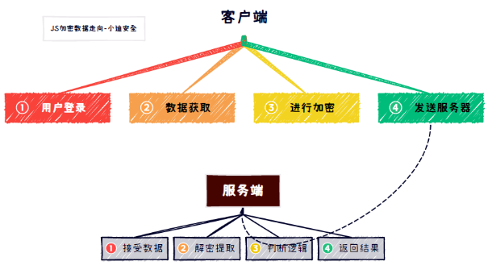
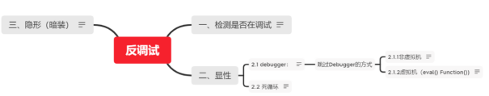

# WEB攻防-JS应用&反调试分析&代码混淆&AST加密还原&本地覆盖&断点条件

\#JS逆向-反调试-检测&绕过

程序加入反调试：

1、反调试：

实现防止他人调试、动态分析自己的代码

2、检测调试方法：(见图)

-键盘监听（F12）

-检测浏览器的高度插值

-检测开发者人员工具变量是否为true

-利用console.log调用次数

-利用代码运行的时间差

--利用toString

-检测非浏览器

3、常见绕过方法：

-禁用断点法

-条件断点法

-此处暂停法

-置空函数法

-本地覆盖法

 

\#JS逆向-混淆加密-识别&还原

代码混淆加密：

上述几种方法，已经达到了反调试的效果，但如果他人查看代码，也可能被找出检测功能并删去。为了防止反调试功能被剔除，我们可以对JS代码进行混淆加密。

1、开源代码混淆解密

JJEncode AAEncode JSFuck

https://www.sojson.com/

2、商业代码混淆解密

https://www.jsjiami.com/

https://jsdec.js.org/