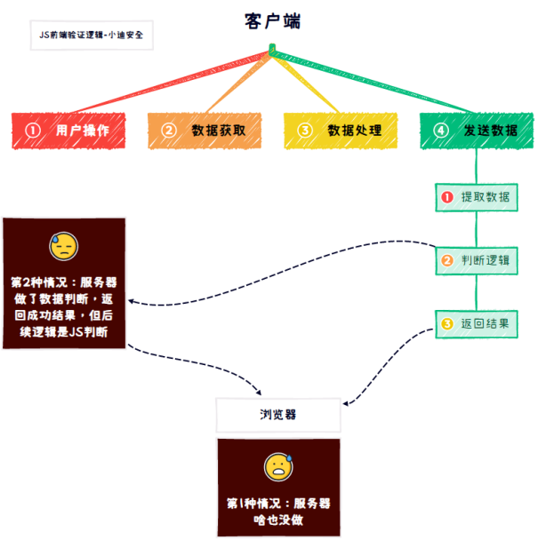

# WEB攻防-JS应用&安全案例&泄漏云配置&接口调试&代码逻辑&框架漏洞自检

在Javascript中也存在变量和函数，当存在可控变量及函数调用即可参数漏洞。

JS开发应用和PHP，JAVA等区别在于即没源代码，也可通过浏览器查看源代码。

获取URL，获取JS敏感信息，获取代码传参等，所以相当于JS开发的WEB应用属于白盒测试，一般会在JS中寻找更多URL地址，（加密算法，APIkey配置，验证逻辑，框架漏洞等）进行后期安全测试。

 

1、会增加攻击面（URL、接口，分析调试代码逻辑）

2、敏感信息（用户密码、ak/sk、token/session）

3、潜在危险函数（eval、dangerallySetInnerHTML）

4、开发框架类(寻找历史漏洞Vue、NodeJS、Angular等)

 

打包器Webpack：PackerFuzzer

AK/SK云安全利用：工具箱CF（云安全后续会讲更多）

浏览器插件：Pentestkit FindSomething Wappalyzer（前期的JS收集项目）