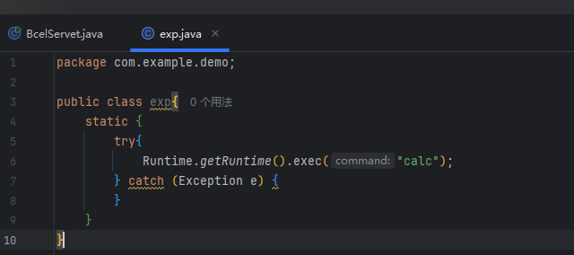
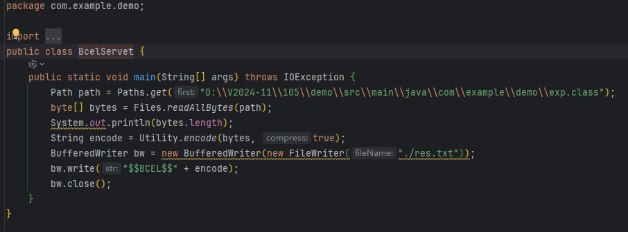
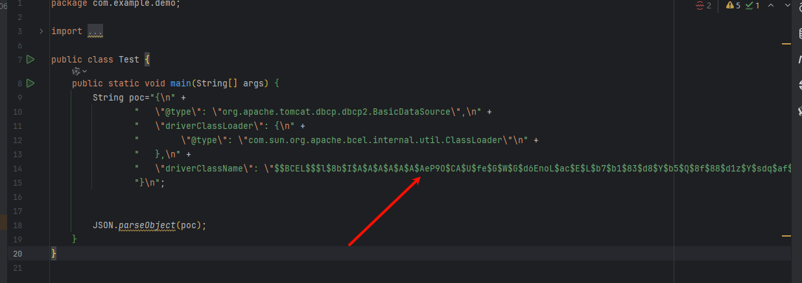
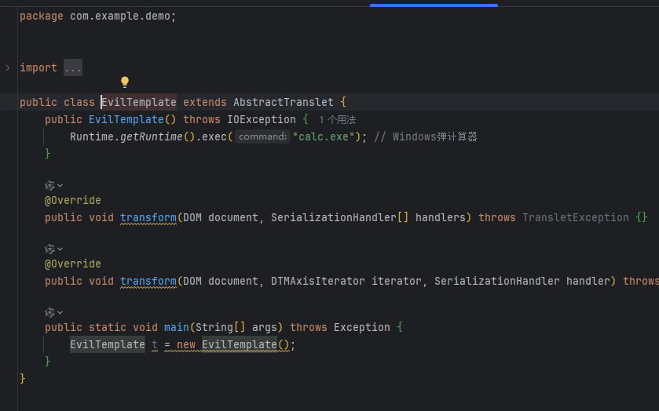
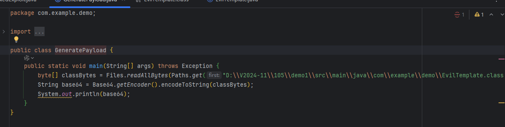
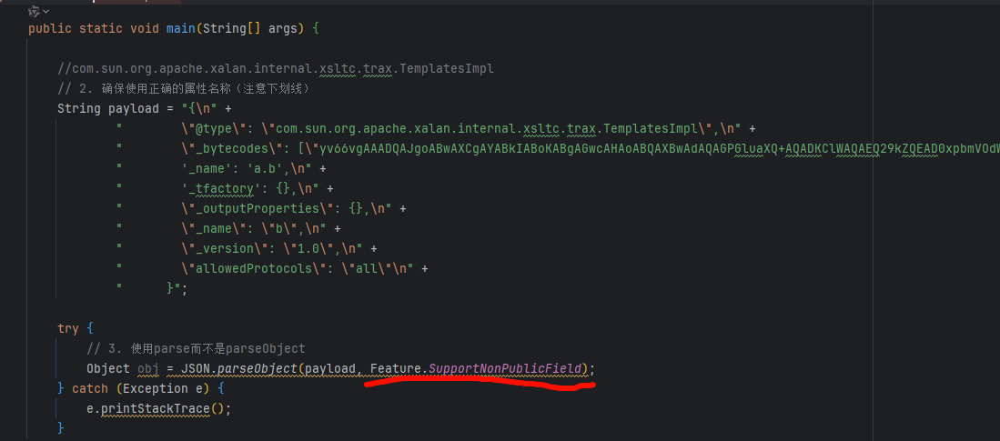
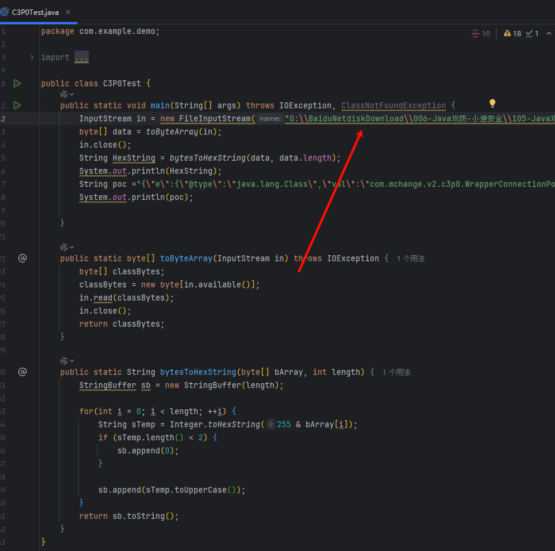
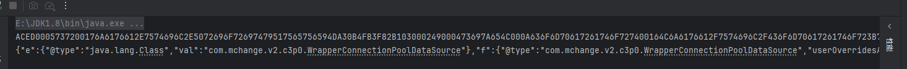
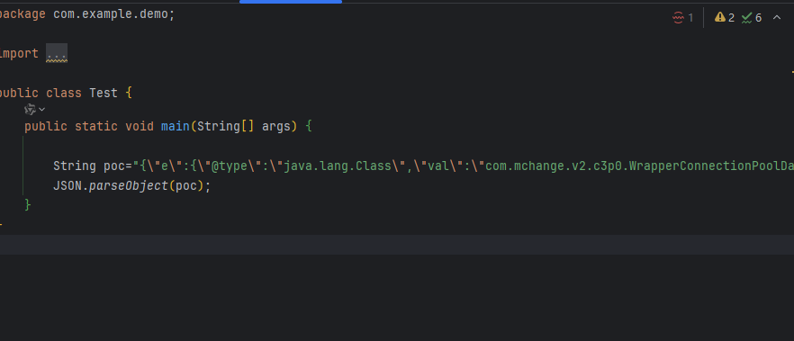

## BCEL-Tomcat&Spring链



编译成class

```
javac .\exp.java
```

替换变成路径 运行变成Becl格式



##   修改poc   gadget链



## TemplatesImpl链

条件条件：JSON.parseObject(payload, Feature.SupportNonPublicField);

编译成class



变成字节流



对方必须要有SupportNonPublicField



## c3p0链

条件：依赖包

```
java -jar ysoserial.jar CommonsCollections2 "clac" > calc.ser
```

生成后放入项目中 写入路径



生成数据 获得利用链



