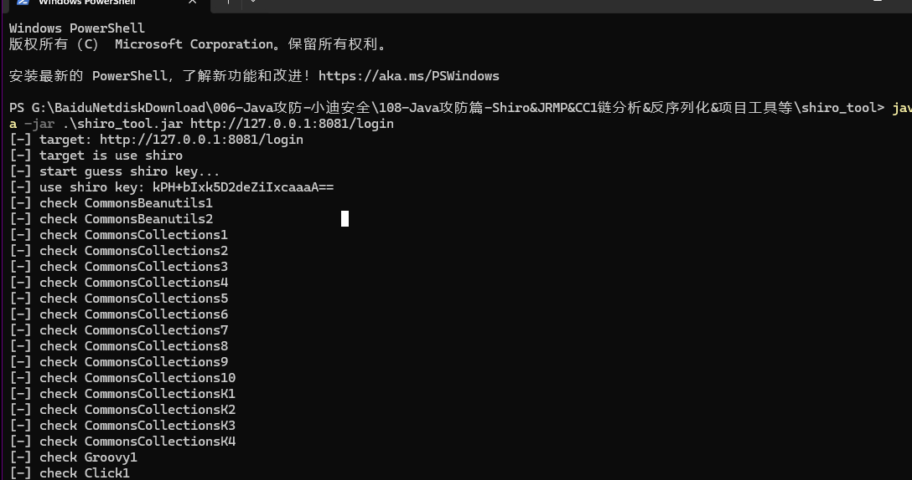
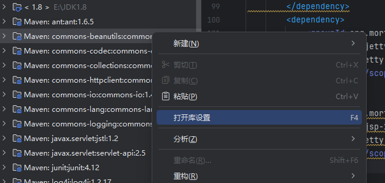
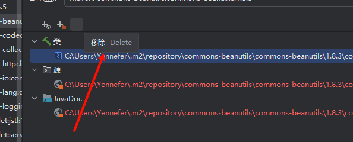
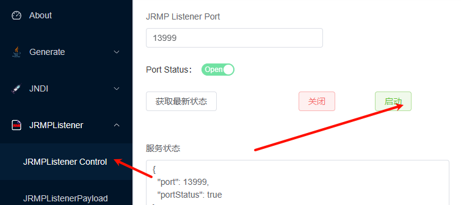
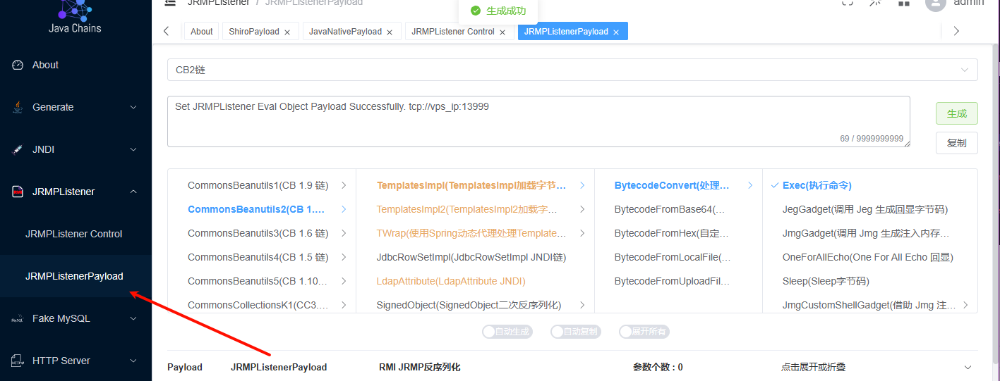
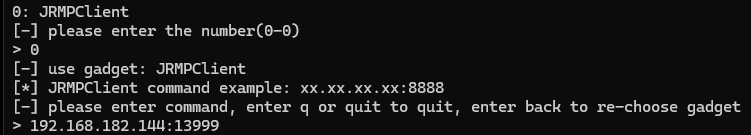

# Shiro有key无链

JRMP指的是Java远程方法协议（Java Remote Method Protocol）。它是 Java 对象实现远程通信的基础技术，也是Java RMI（Remote Method Invocation，远程方法调用）的底层通信协议。借助JRMP，运行于某个Java虚拟机（JVM）中的对象能够调用另一个JVM中对象的方法，就如同调用本地对象的方法一样便

使用shiro_tool 检测

```
java -jar .\shiro_tool.jar http://127.0.0.1:8081/login
```



删掉利用链






打开端口



生成cb链



攻击机ip加端口

