## 内存码

模拟实验在已经拿下权限的情况下实验

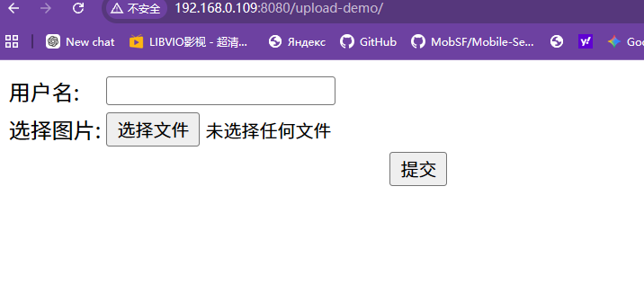

## 哥斯拉

利用哥斯拉生成后门  并上传

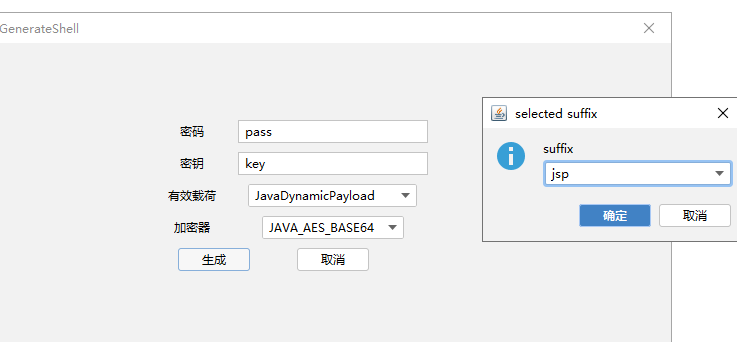

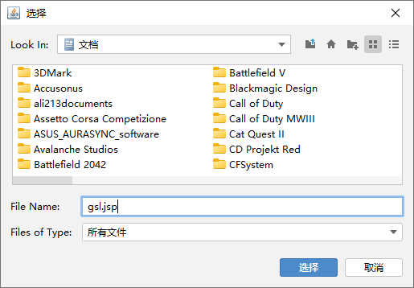

访问后门

连接

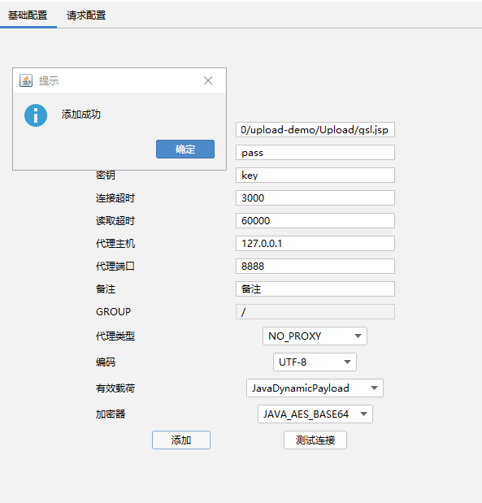

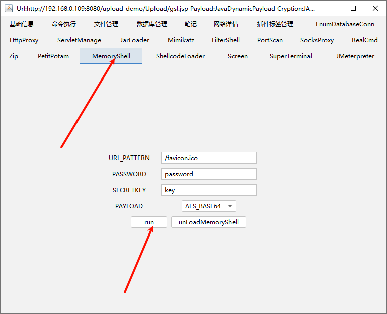

访问地址变成  //favicon.ico

连接  这里只需要一个斜杠

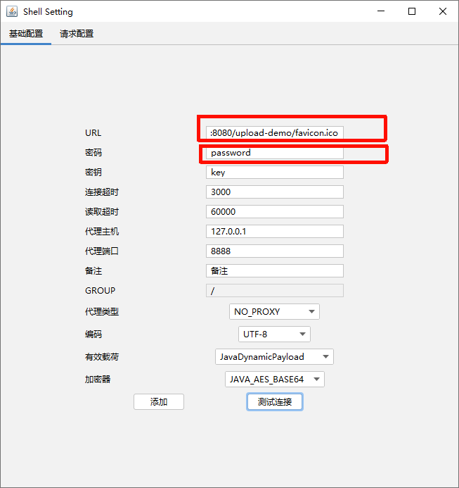

目录下无

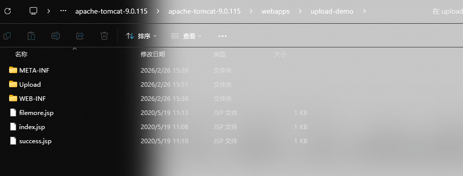

利用filter

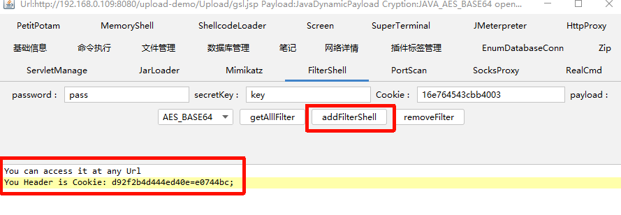

随便点进一个 输入任意地址 添加

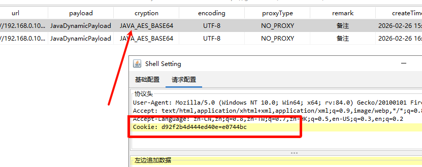

## 冰蝎

冰蝎的后门文件在目录下

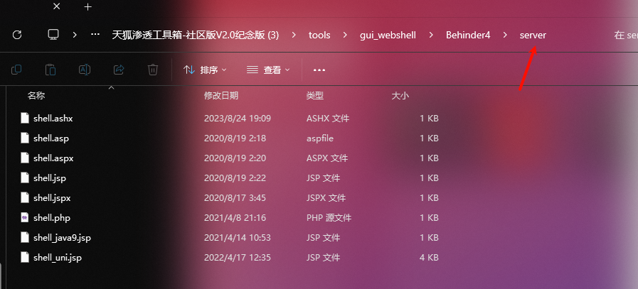

上传到网站->访问地址->可以在后门文件中查看密码 连接

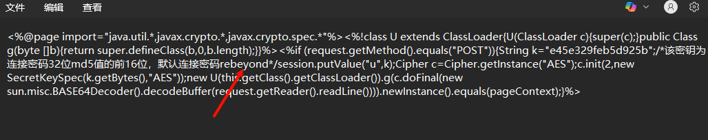

植入内存码

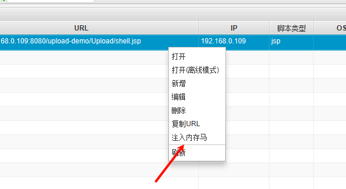

环境可能不支持

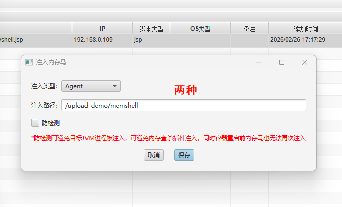

## 中国蚁剑

添加数据->随便写个连接地址->生成shell

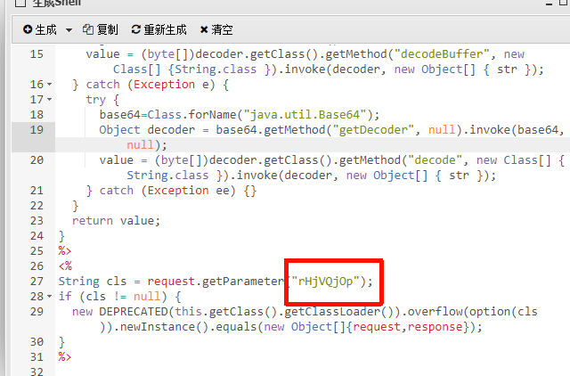

复制shell->上传到网址目录下（这里直接txt->jsp）

编辑连接

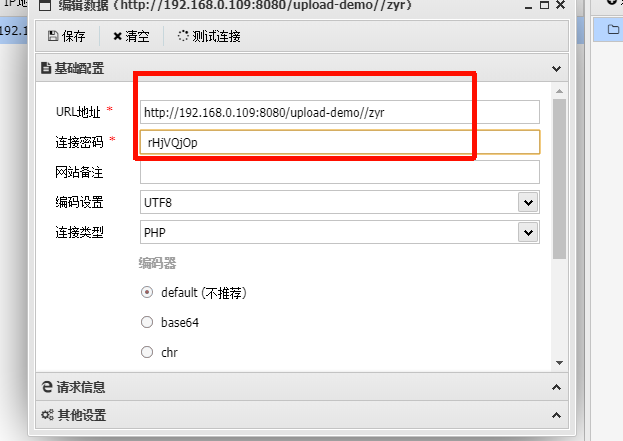

内存码注入

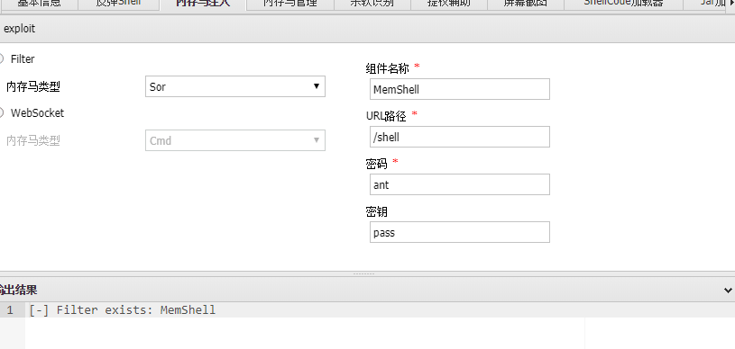

## 工具java-memshell

## 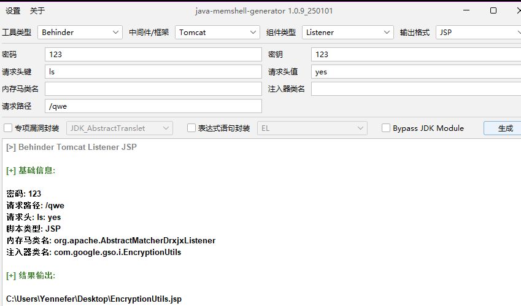

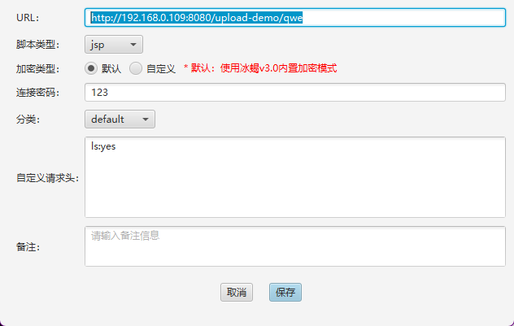

连接成功后删除后门也可以连接
