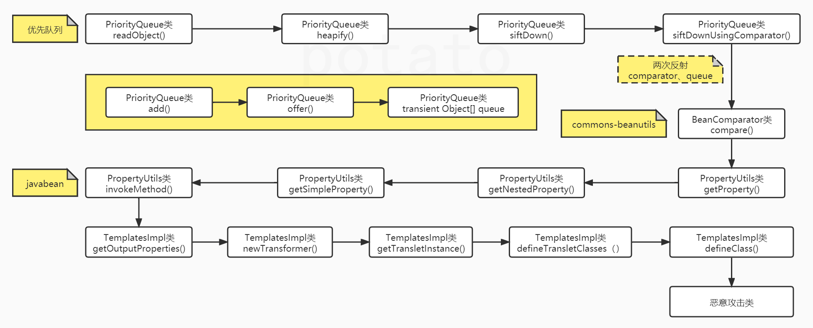
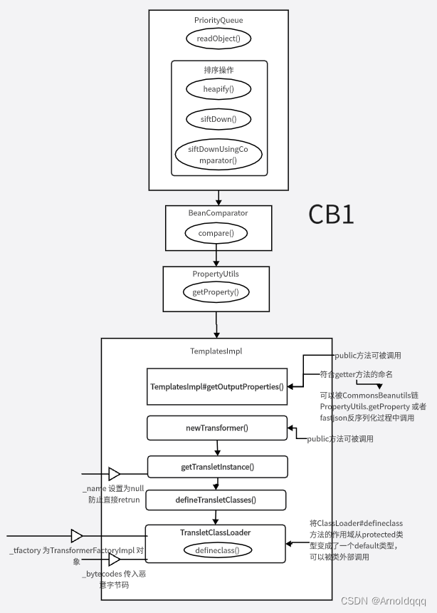

# JAVA攻防-Shiro专题&key利用链&CC&CB1链分析&入口点&调用链&执行地&Class加载





```JAVA
#Shiro 550 无CC依赖CB利用链分析
参考分析文章：https://www.freebuf.com/articles/web/319397.html
1、source，入口点，一般就是readObject方法
2、sink，执行点，一般动态方法执行，JNDI注入，写文件之类的
3、gadget，连接入口执行的多个类，有几个条件：
-类之间方法调用是链式的
-类实例之间的关系是嵌套的
-调用链上的类都需要是可以序列化的

原理：知识点1（入口点解释）
触发反序列化的重写readObject方法
参看安全开发的Java反序列化课（第35天）

原理：知识点2（CB中的JavaBean利用）
PropertyUtils.getProperty(new Person(),"name");
自动调用Person对象里面的getName方法
PropertyUtils.getProperty(new TemplatesImpl(),"outputProperties")
自动调用TemplatesImpl对象里面的getOutputProperties方法

原理：知识点3（CB链中的写法调用）
defineClass实现动态类加载（RCE）
-> TemplatesImpl#newTransformer()
-> TemplatesImpl#getTransletInstance() 
-> TemplatesImpl#defineTransletClasses() 
-> TransletClassLoader#defineClass()

ClassPool pool = ClassPool.getDefault();
CtClass clazz = pool.get(com.govuln.shiroattack.Evil.class.getName());
TemplatesImpl obj = new TemplatesImpl();
setFieldValue(obj, "_bytecodes", new byte[][]{clazz.toBytecode()});
setFieldValue(obj, "_name", "HelloTemplatesImpl");
setFieldValue(obj, "_tfactory", new TransformerFactoryImpl());
obj.newTransformer();

而此条利用链，这三点分别为：
执行点：TemplatesImpt类->调用恶意类
调用链：BeanComparator类->利用javabean调用getOutputProperties()
入口点：PriorityQueue类->反射调用PropertyUtils.getPropert

1）入口：
PriorityQueue#readObject 

2）调用链：
->heapify
->siftDown(size值大于等于2)
->siftDownUsingComparator
->comparator.compare（谁能使用还能承上启下）
->BeanComparator#compare（PropertyUtils.getProperty）
->TemplatesImpl#getOutputProperties
条件1：(size值大于等于2)
条件2：property != null
条件3：comparator != null
条件4：o1=TemplatesImpl,this.property=outputProperties

3）触发漏洞的目标方法：
TemplatesImpl链
现在根据调用链分析即可，
跟进TemplatesImpl#newTransformer()触发RCE，
发现其调用了getTransletInstance()，
条件（name!=null）->所以setFieldValue(obj,"_name","123");
之后调用defineTransletClasses()
发现这里最开始有一个if(_bytecodes==0) 所以setFieldValue(obj, "_bytecodes", new byte[][]{clazzBytes});
-> TemplatesImpl#getOutputProperties()
-> TemplatesImpl#newTransformer() 
-> TemplatesImpl#getTransletInstance() 
-> TemplatesImpl#defineTransletClasses() 
-> TransletClassLoader#defineClass()

```

