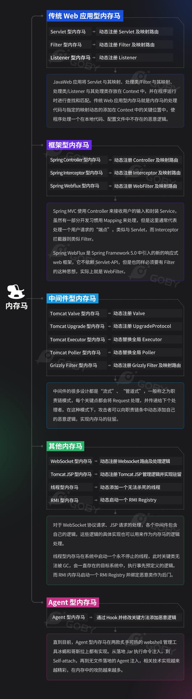

# JAVA攻防-内存马技术&中间型&框架型&Shell上植入&平台生成&无文件逃离&防查杀检`



```java
#内存马技术
1、出现:
Web安全领域，Webshell一直是一个非常重要且热门的话题。在目前传统安全领域，Webshell根据功能的不同分为三种类型，分别是：一句话木马，小马，大马。而根据现在防火墙技术的更新迭代，随后出现了加密的木马技术，比如：加密一句话。而我们今天要说的是一种新的无文件的Webshell类型：内存马。

2、解决：
但是由于近几年防火墙，IDS，IPS，流量分析等各种安全设备的普及和更新，这种连接方式非常容易被设备捕获拦截，而且由于文件是明文存放在服务器端，所以又很容易被杀毒软件所查杀。在今天看来这种传统连接方式显然已经过时，于是乎，进化了一系列的加密一句话木马，但是这种方式还是不能绕过有类似文件监控的杀毒软件，于是乎进化了新一代的Webshell---》内存马。

3、原理：
内存马是无文件Webshell，什么是无文件webshell呢？简单来说，就是服务器上不会存在需要链接的webshell脚本文件。那有的同学可能会问了？这种方式为什么能链接呢？内存马的原理就像是MVC架构，即通过路由访问控制器，我通过自身的理解，概述的说一下， 内存马的原理就是在web组件或者应用程序中，注册一层访问路由，访问者通过这层路由，来执行我们控制器中的代码。

4、类型：
PHP,Java,Python,ASPX等

#内存马-Java类
1、Webshell工具：
蚁剑，哥斯拉，冰蝎，天蝎，游魂等

2、内存马生成项目：
https://github.com/ReaJason/MemShellParty
https://github.com/pen4uin/java-memshell-generator

其他注意：
1、框架型内存马
2、反序列化打内存马
3、SSTI注入内存马等

```

