# api案例实验

## 利用文档访问API端点

https://portswigger.net api模块

### 1关卡：要解决实验室问题,请找到泄露的API文档并删除`carlos`。您可以使用以下凭据登录您自己的账户:`wiener:peter`。

输入默认账号密码 登录进去

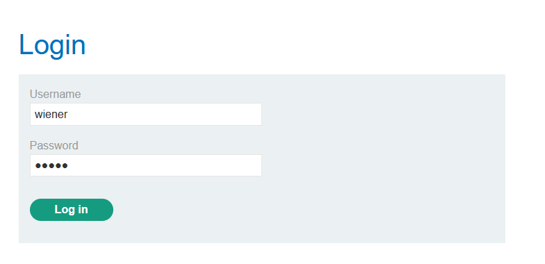

输入个邮箱抓包

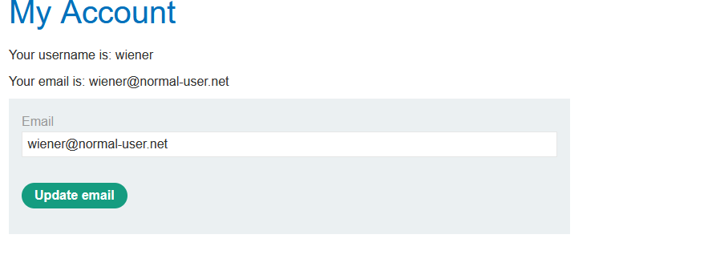

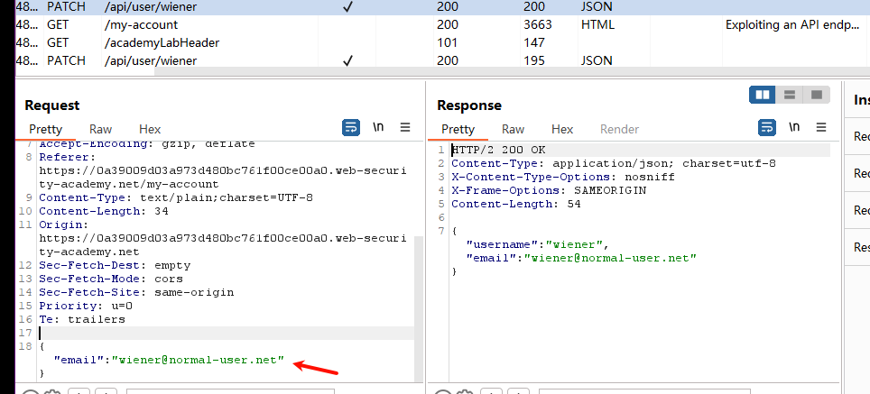

修改成DELETE 提示"用户删除了"

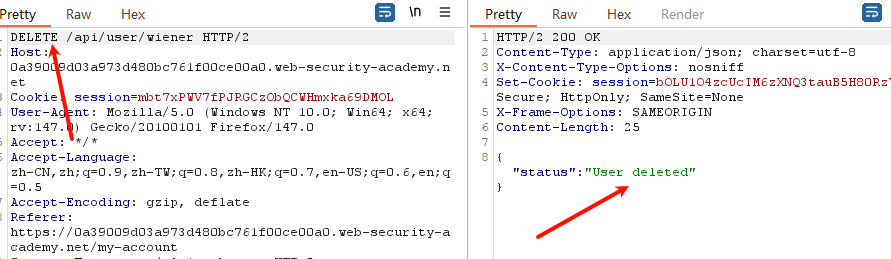

修改成`carlos`尝试删除提示未授权

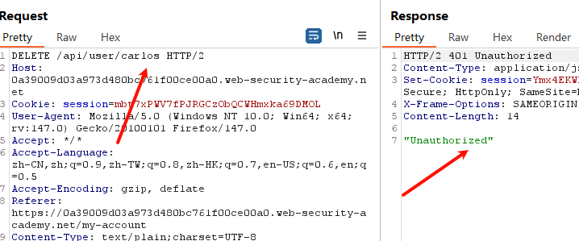

重新实验

抓到修改邮箱地址包

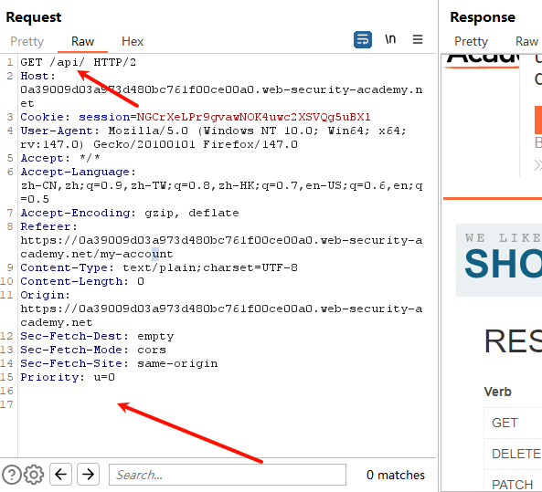

知道了 删除条件 DELETE /user/需要删除的用户 parameters {} 为空

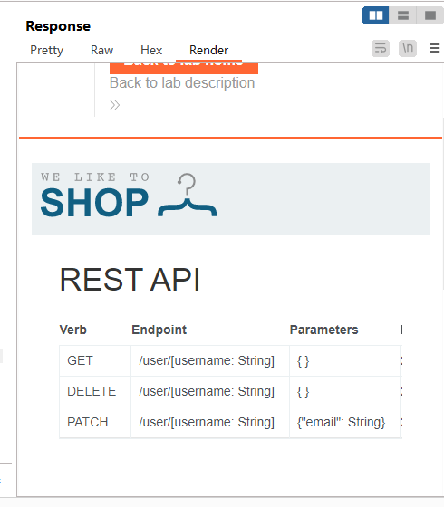

成功删除

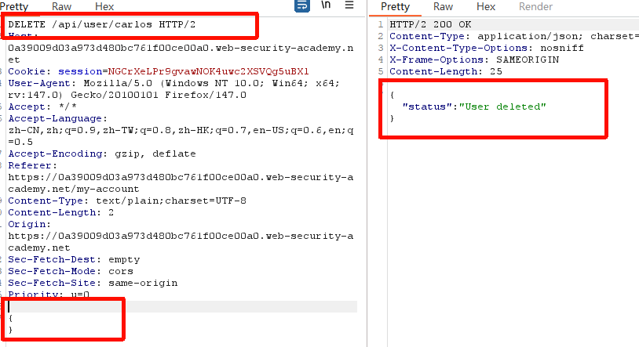

实验总计：跟换提交方法 DELETE PATCH GET 

## 关卡2：要解决实验室问题,请以该实验室身份登录`administrator`并删除`carlos`。

随便输入内容登录抓包查看

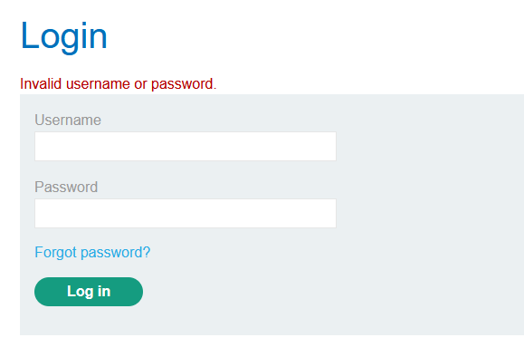

修改数据包 查看报错 情况  （没有报错提示）

```
%26a=b       //  & 
```


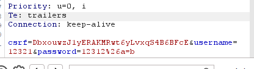

点击忘记密码->随便输入 抓包

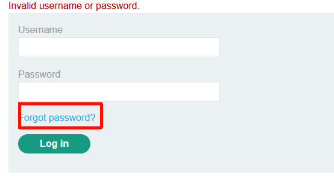

抓包发现页面加载了一个 JavaScript 文件。
 在该 JS 文件中发现如下关键代码：

```
fetch(window.location.pathname, config)
```

分析可知，前端使用 `fetch` 方法向当前路径发送 POST 请求

```
POST /forgot-password    
```

发现参数提交方式  请求体是表单格式 参数格式为 `username=xxx`

```
           headers: {
                "Content-Type": "x-www-form-urlencoded",
```

发现返回 JSON 判断逻辑  如果不存在 result 字段 → 提示 Invalid username  如果存在 result → 显示邮箱

```
.then(jsonResponse => {
    if (!jsonResponse.hasOwnProperty("result"))
```

抓修改密码包 里面填入 `&`提示参数不支持

```
username=administrator%26x=y
```

得到了`reset-token`获取url重置密码

```
const resetToken = urlParams.get('reset-token');

if (resetToken)
{
    window.location.href = `/forgot-password?reset_token=${resetToken}`;
}
```


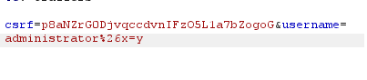

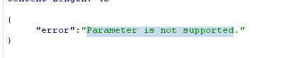

`#`尝试  报错 Field可能拼接了额外的参数或内容。

```
administrator%23
```

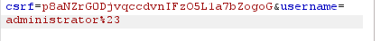

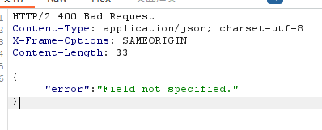

（靶场出现了问题）

## 关卡3：实验室:查找并利用未使用的API终端

目标：要解决实验室问题,**Lightweight l33t Leather Jacket**请利用隐藏的API终端购买轻量级L33t皮夹克。您可以使用以下凭据登录您自己的账户:            `wiener:peter`。

登录选则商品抓包 发生调整数字会更改商品信息

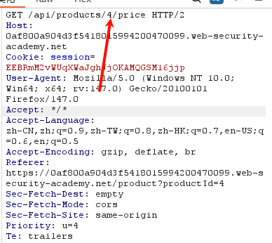

尝试改成POST提交 发现不允许 只能 允许 GRT PATCH

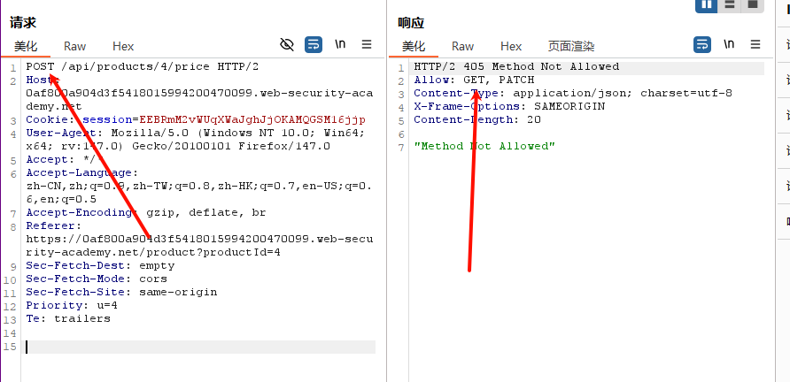

尝试改成 PATCH提交  发现只能传入 json数据

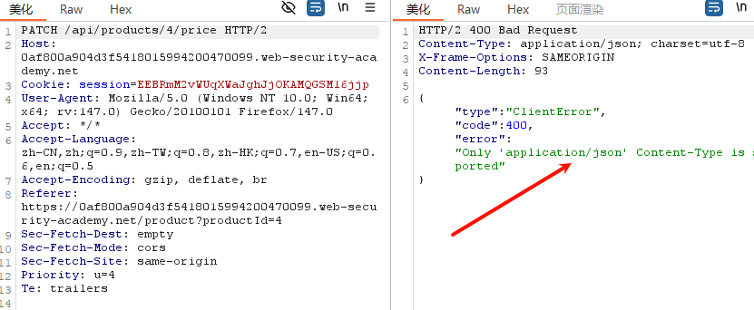

加入json请求头 发现报错

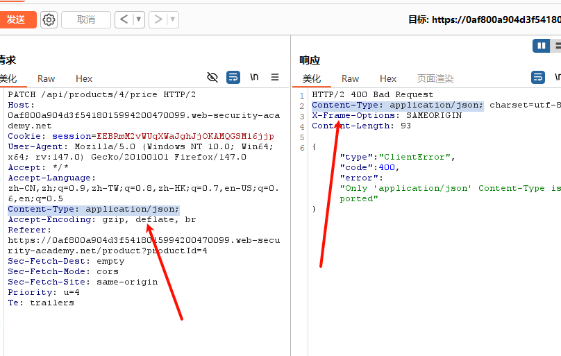

测试GET请求 有price 参数

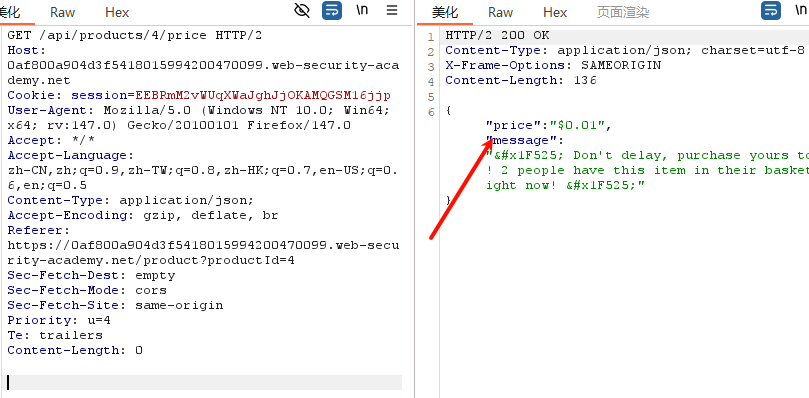

将数据添加在下面 成功触发 修改了价格

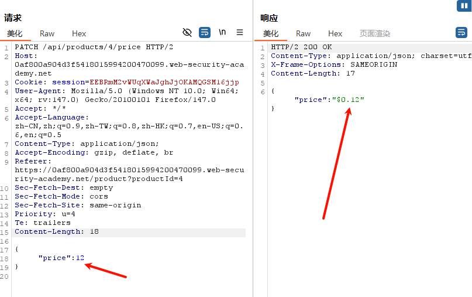

完成目标修改金额为0 购买即可

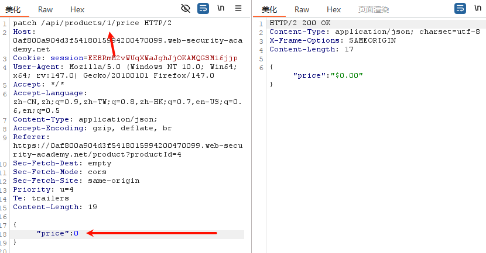

## 关卡4

目的要解决实验室问题,**Lightweight l33t Leather Jacket**应找出并利用大规模作业漏洞购买轻质L33t皮夹克。您可以使用以下凭据登录您自己的账户:`wiener:peter`

登录->操作网站尝试触发`api`->抓包  发现json数据中可以控制折扣

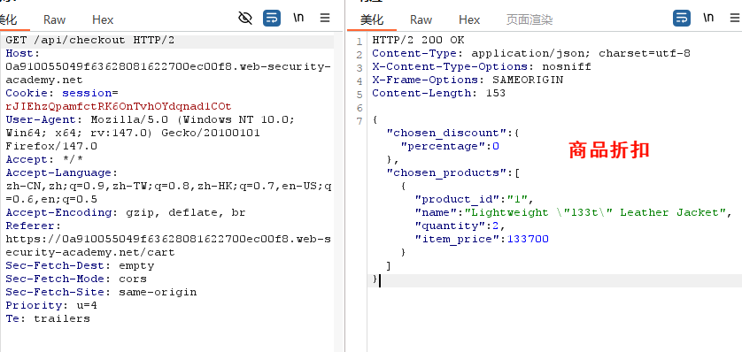

```
{"chosen_discount":{"percentage":0},"chosen_products":[{"product_id":"1","name":"Lightweight \"l33t\" Leather Jacket","quantity":2,"item_price":133700}]}
```

点击购物车->购买 抓购买包  修改``json`数据 折扣设置成100 购买成功

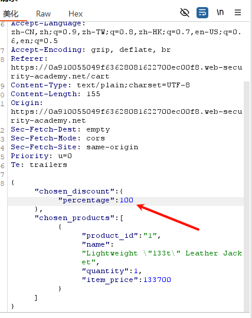

## 5

利用插件

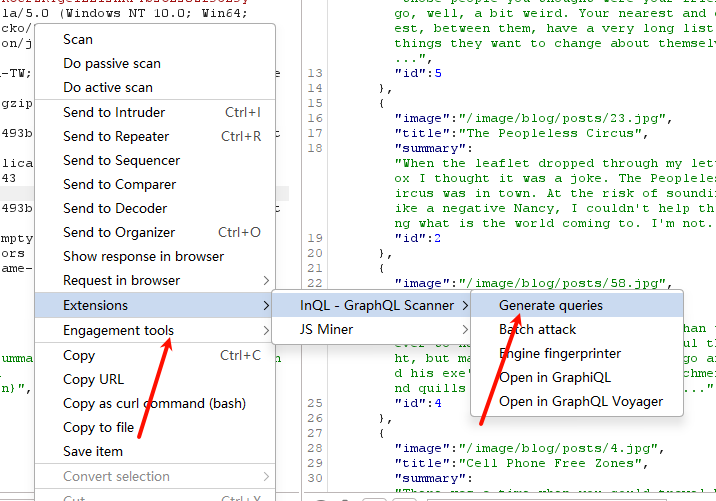

点击分析  选择接口 

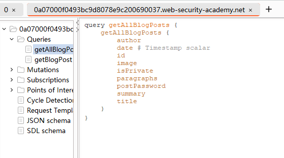

观察返回值 没有id为3

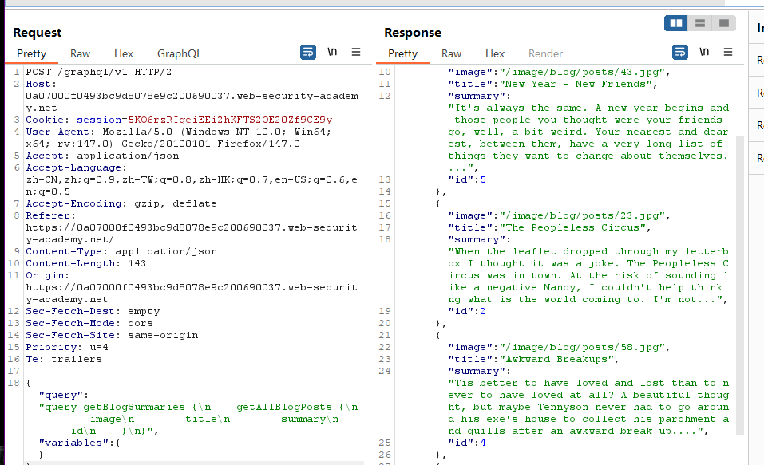

选择带参数的

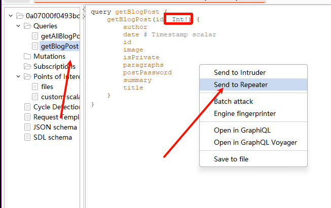

设置成id为3

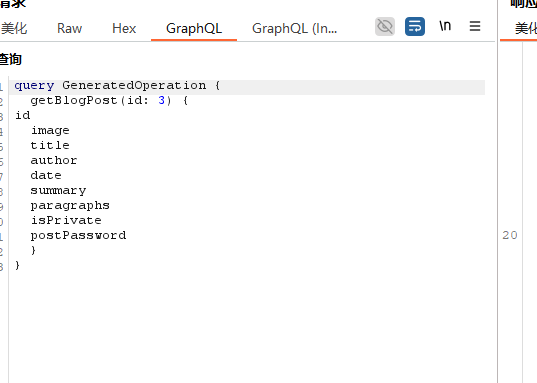

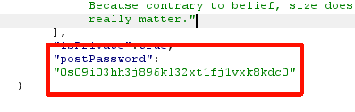