# GraphQL

## 实验室:寻找一个隐藏的 GraphQL 端点

目标：该实验室的用户管理功能由隐藏的 GraphQL 端点驱动。只需点击网站上的页面,即可找到此终端。终点也存在一些抵御内省的防御措施。要解决实验室,请找到隐藏的终端并删除`carlos`。        

抓包发现没有找到接口，找个GET请求

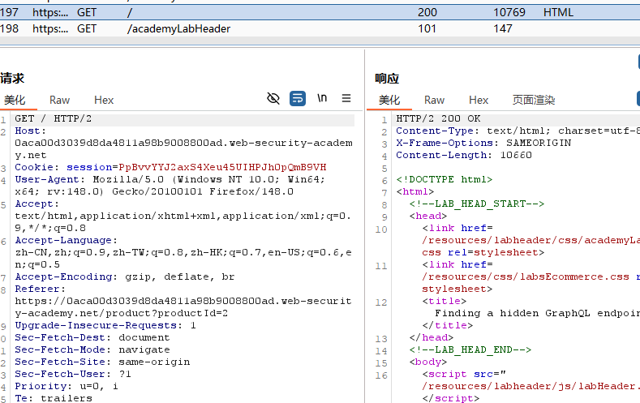

设置爆破路径

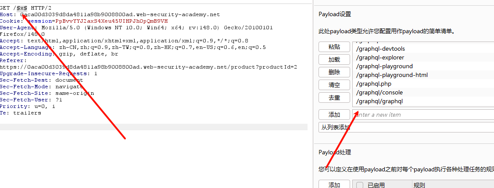

在访问`/api` 时返回

**“Query not present”** 是 GraphQL 服务器常见报错

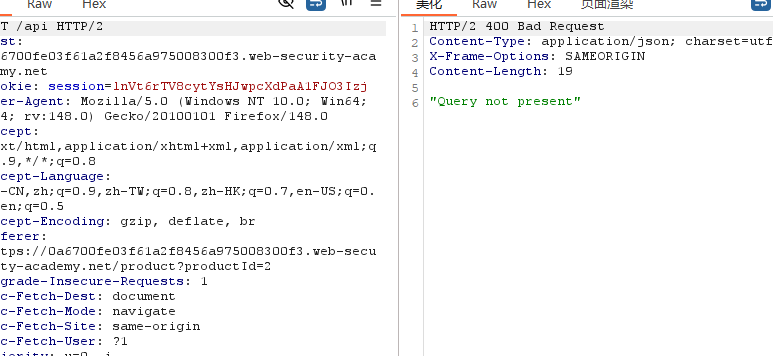

修改成 POST  

```
{
  __schema {
    types {
      name
    }
  }
}
```

只能运行get  通过查询 `__schema` 字段来向 GraphQL 询问哪些类型是可用的。一个查询的根类型总是有 `__schema` 这个字段。现在来试试，查询一下有哪些可用的类型。

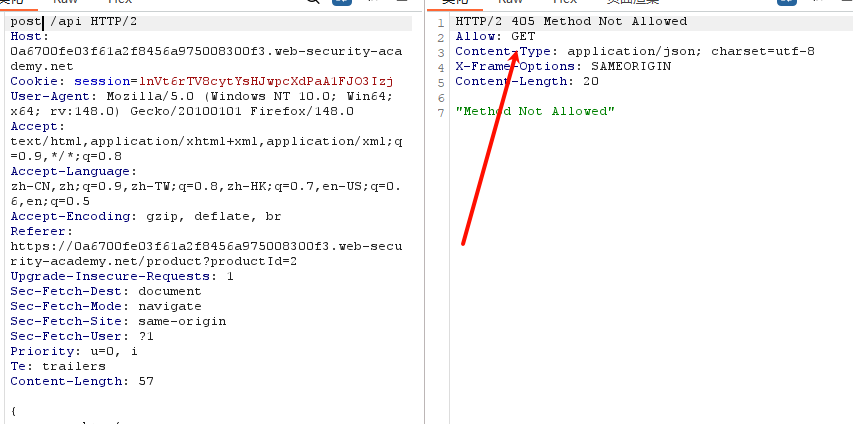

改用get提交 并且被插件识别出来了

```
query=query{__typename}
```

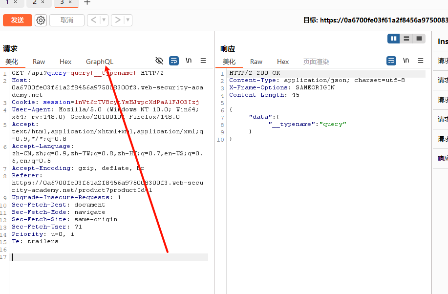

替换内容  

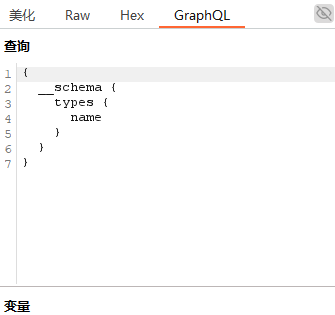

发现有过滤

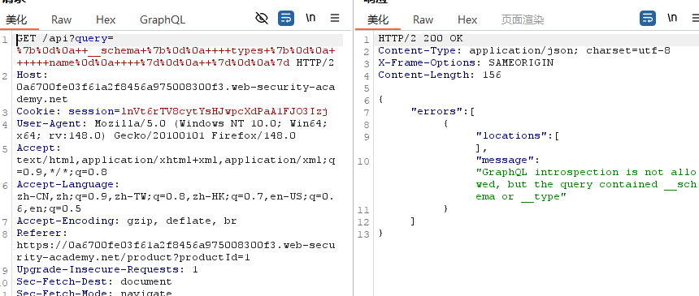

用换行符绕过

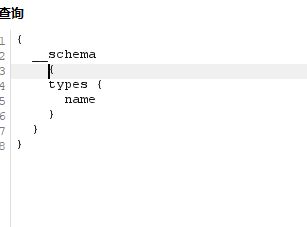

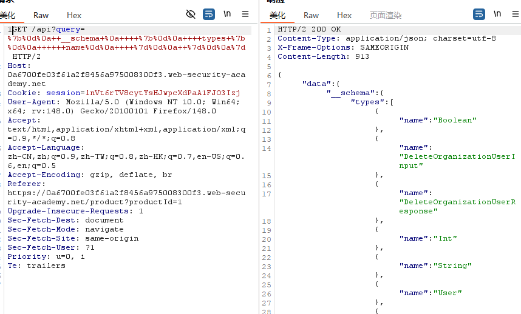

替换`PayloadsAllTheThings-4.1\GraphQL Injection `工具里面的payload，获取到接口的所有架构

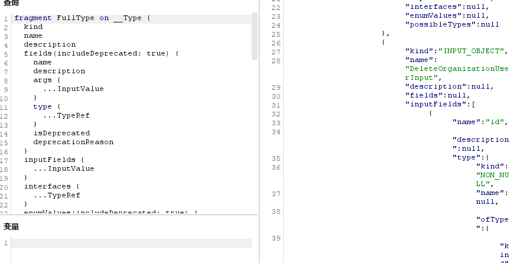

将`json`数据保存到`data.json`里  添加文件

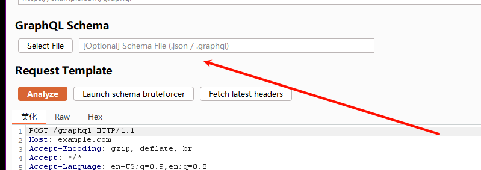

获取查询语句

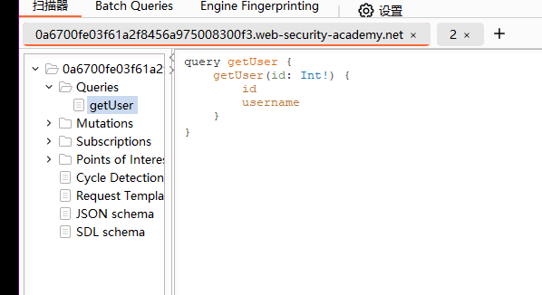

当id=3 时成功 找到用户

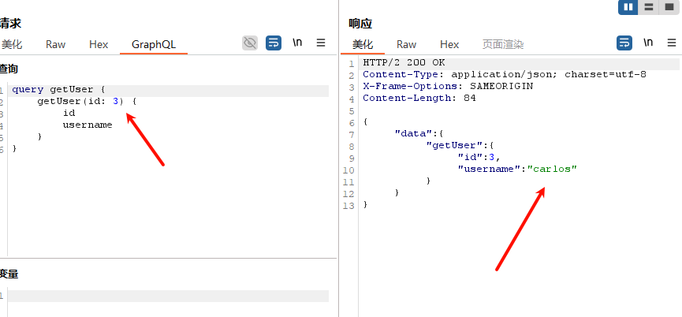

找到删除方法

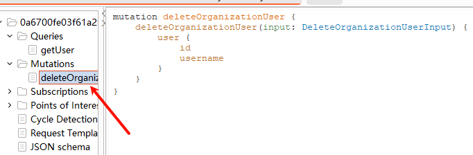

成功删除

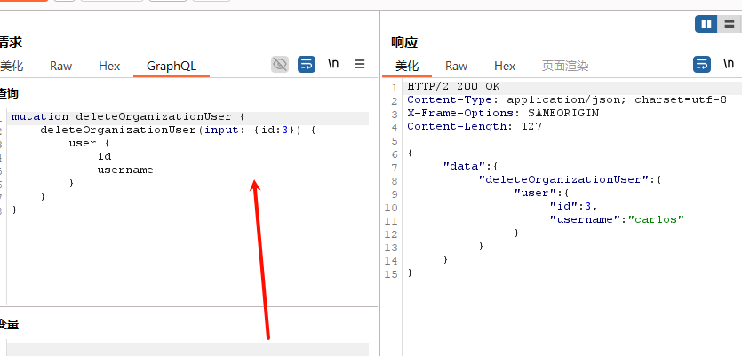