# 蓝队技能-应急响应篇&Web入侵指南&后门查杀&日志分析&流量解密&攻击链梳理&排查口

## IIS日志入口

进入(IIS)管理器，点击高级查看ID

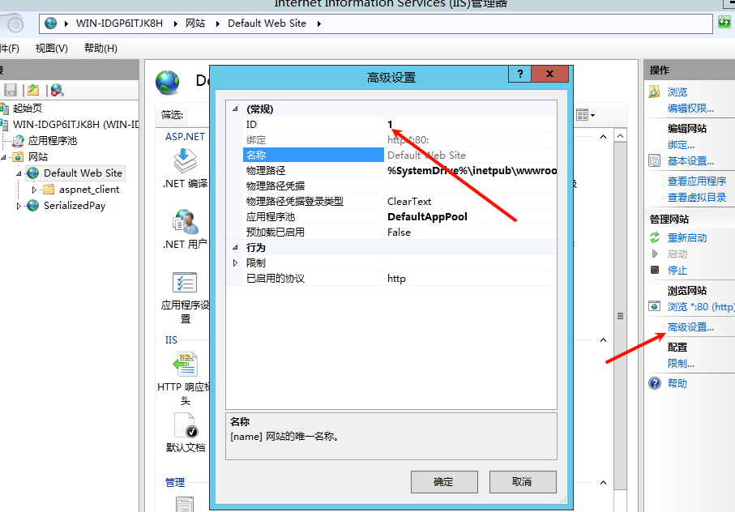

点击日志

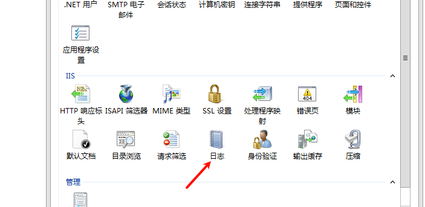

复制路径

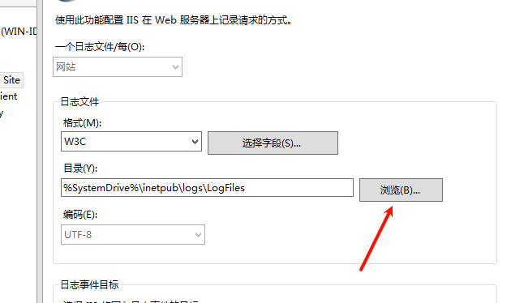

ID等于后面的数字

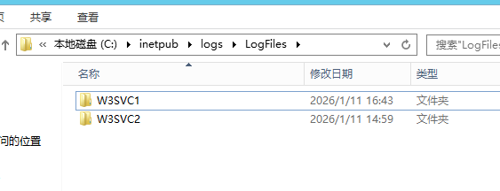

### PHP日志

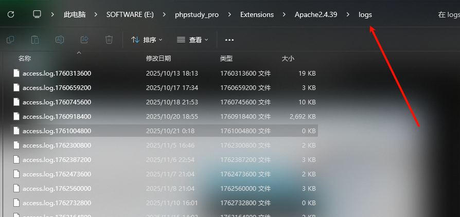

access.log是访问日志

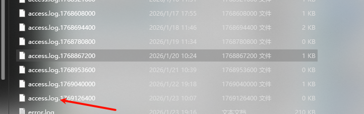

tomcat

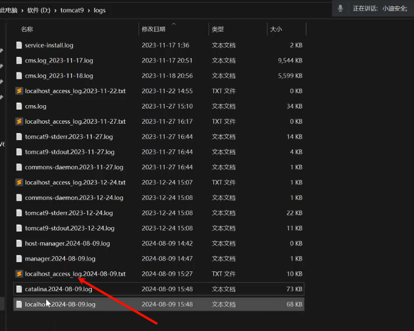

u盾扫描

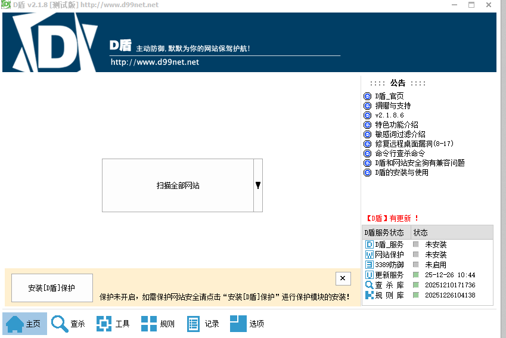

## 流量包捕获解密分析

 实现环境

用哥斯拉生成2.jsp后门

新建文件夹->把2.jsp放入文件夹->修改文件名->压缩成zip->修改成war

登录tomcat后台，上传.war

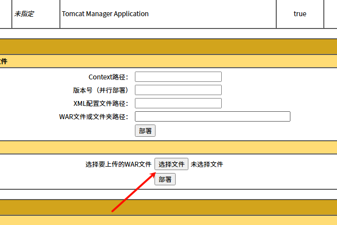

访问后门

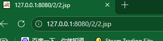

查看日志

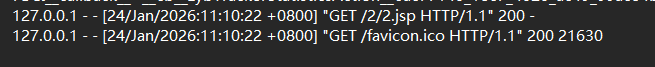

利用kali 打开虚拟机连接哥斯拉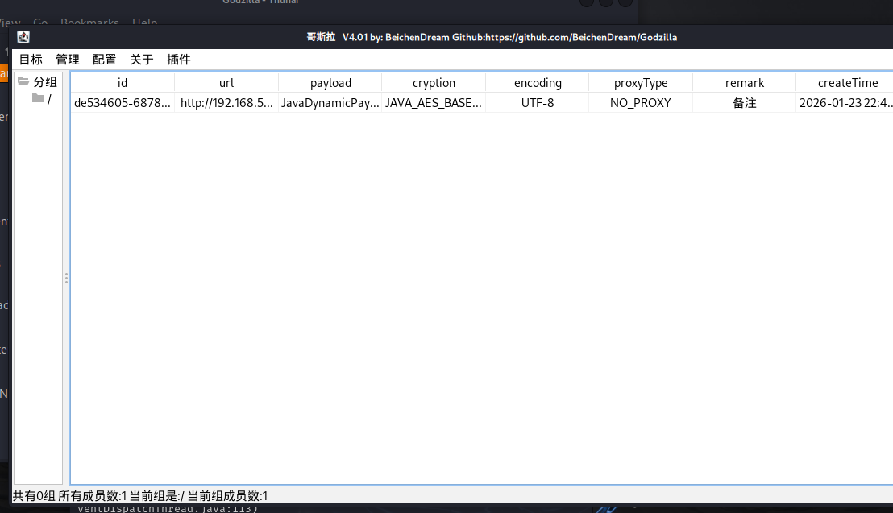

打开Wireshark 

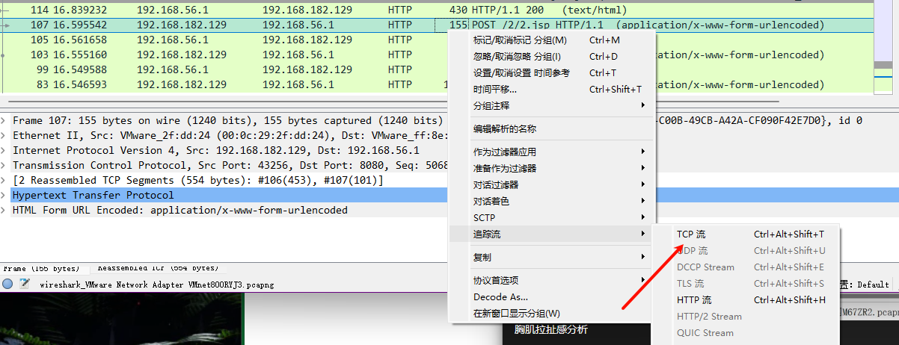

打开BlueTeamTools

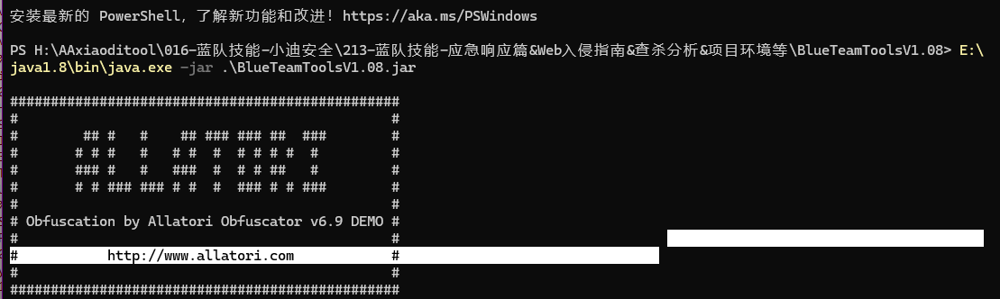

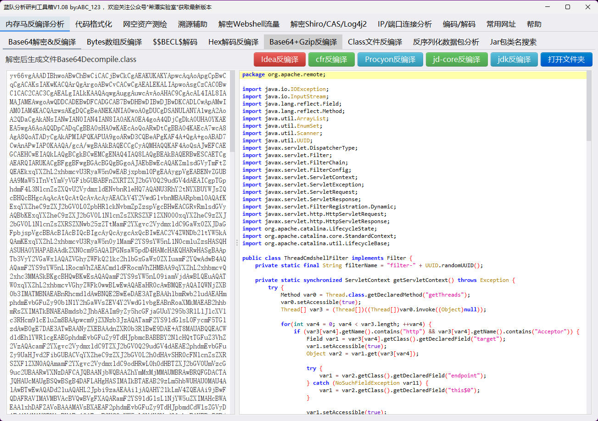

成功解密出请求包

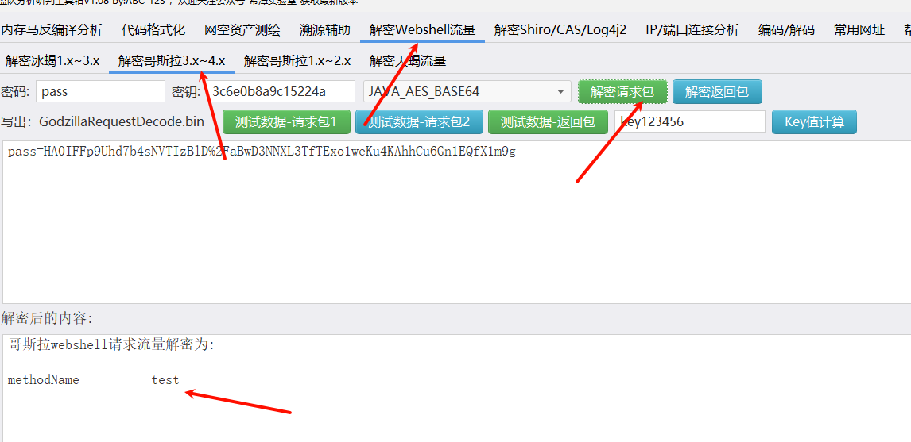