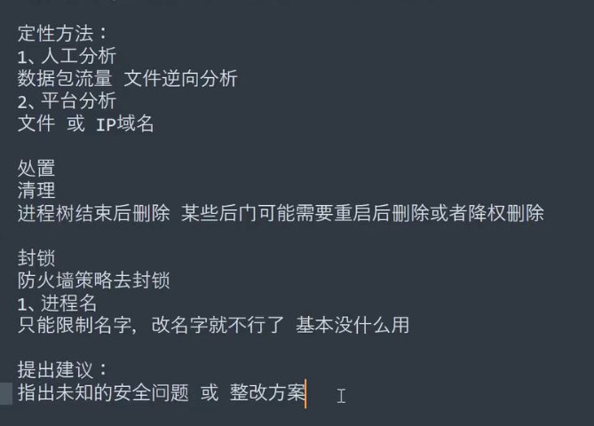

## 防火墙的简单配置

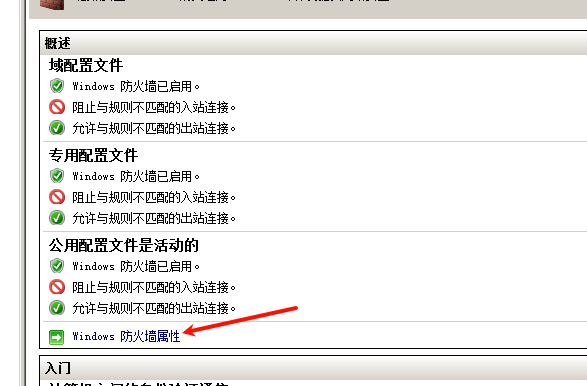

设置出入站规则

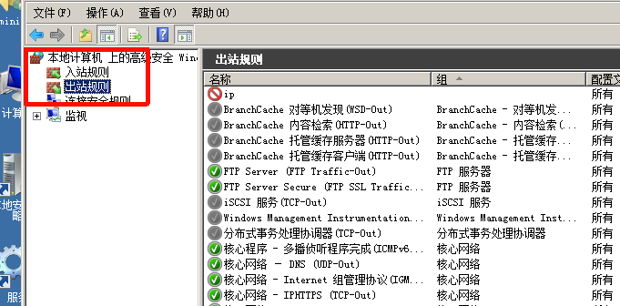

简单示例 让远程IP192.168.111.111 阻止任何连接

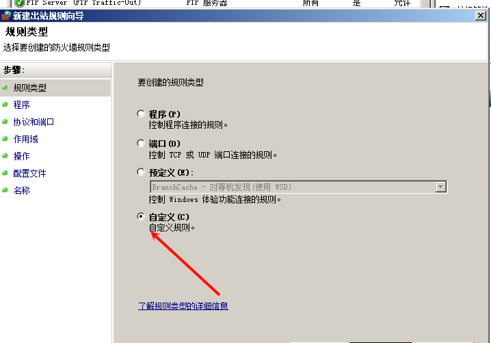

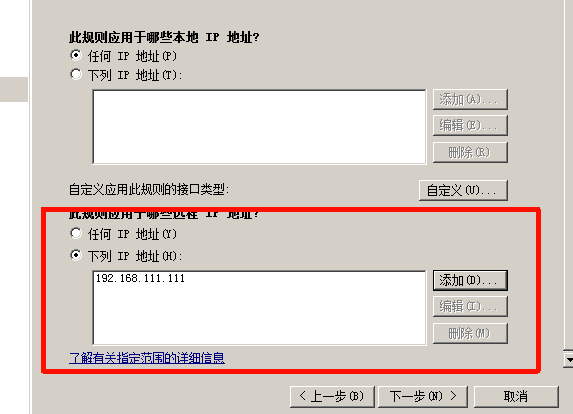

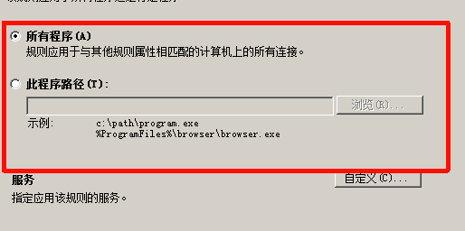

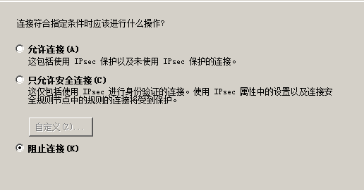

## FindAll的使用 windows 不是很准

客户端和服务器端

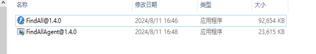

自启动测试：

```
REG ADD "HKCU\SOFTWARE\Microsoft\Windows\CurrentVersion\Run" /V "backdoor" /t REG_SZ /F /D "C:\shell.exe"
```

自启动测试：

```
net user xiaodi$ xiaodi!@#X123 /add
```

映像劫持

```
REG ADD "HKLM\SOFTWARE\Microsoft\Windows NT\CurrentVersion\Image File Execution Options\notepad.exe" /v debugger /t REG_SZ /d "C:\Windows\System32\cmd.exe /c calc"
```

屏保&登录

```
reg add "HKEY_CURRENT_USER\Control Panel\Desktop" /v SCRNSAVE.EXE /t REG_SZ /d "C:\shell.exe" /f
REG ADD "HKLM\SOFTWARE\Microsoft\Windows NT\CurrentVersion\Winlogon" /V "Userinit" /t REG_SZ /F /D "C:\shell.exe"

```

运行客户端 会在当前c盘创建文件


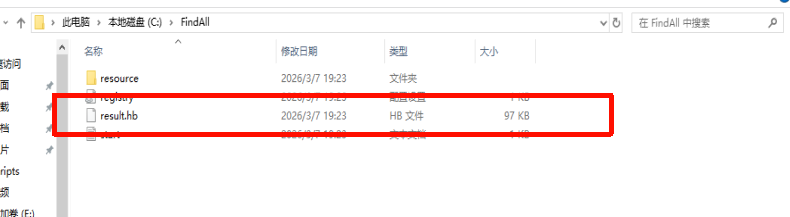

将result.hb文件放入到 findeall


扫描出隐藏用户

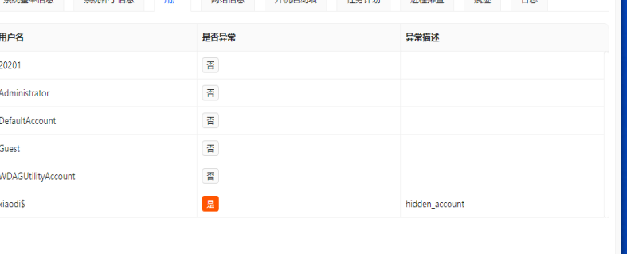

## d-eyes_windows

https://github.com/m-sec-org/d-eyes

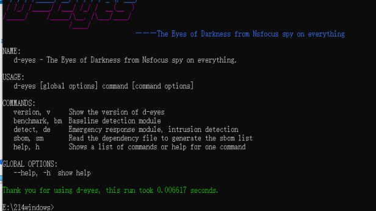

```
D-Eyes 应急响应操作命令
异常文件排查
若扫到恶意文件，会在 D-Eyes 所在目录下自动生成扫描结果 D-Eyes.xlsx 文件，若未检测到恶意文件则不会生成文件，会在终端进行提示。

默认扫描(默认以 50 个线程扫描脚本当前执行目录)
命令：D-Eyes de fs
指定路径扫描(-P 参数)
单一路径扫描： windows：D-Eyes de fs -p D:\tmp linux：./D-Eyes de fs -p /tmp 多个路径扫描： windows：D-Eyes de fs -p C:\Windows\TEMP,D:\tmp,D:\tools linux：./D-Eyes de fs -p /tmp,/var
指定线程扫描(-t 参数)
windows：D-Eyes de fs -p C:\Windows\TEMP,D:\tmp -t 3 linux：./D-Eyes de fs -p /tmp,/var -t 3
指定单一 yara 规则扫描(-r 参数)
windows：D-Eyes de fs -p D:\tmp -t 3 -r ./Botnet.Festi.yar linux：./D-Eyes de fs -p /tmp -t 3 -r ./Botnet.Festi.yar
```

```
de netstat //提取进程外联IP信息
```

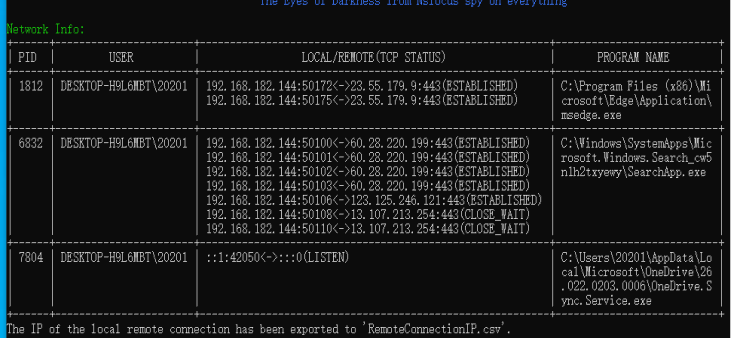

## linuxcheckshoot Linux

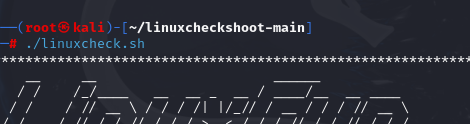

