# 挖矿病毒

## 病毒1

病毒1 安装成功

观察任务管理器 没有发现cpu高占用 也没有新的网络连接

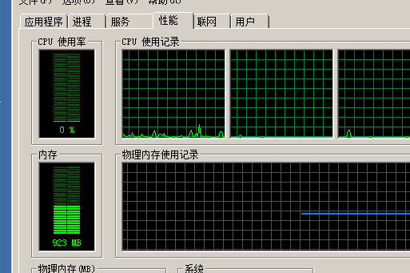

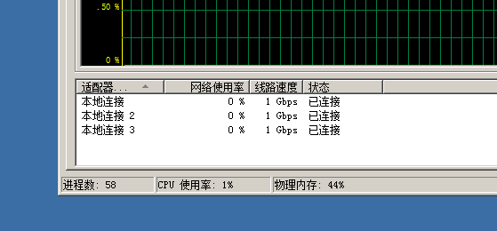

Update64.exe 结束任务

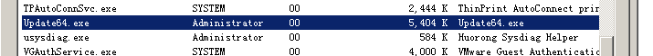

检查任务计划 没有其他计划

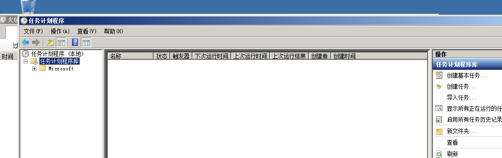

重启电脑后 还是会出现

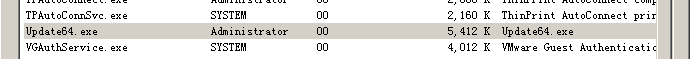

打开文件所在位置

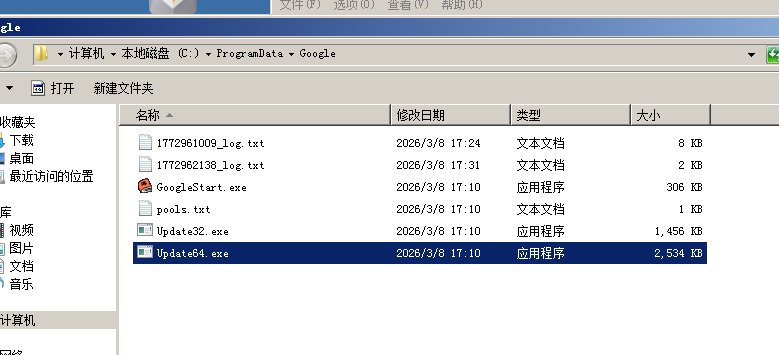

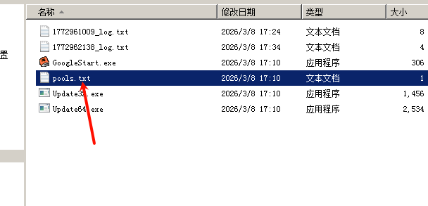

复制地址到云沙箱

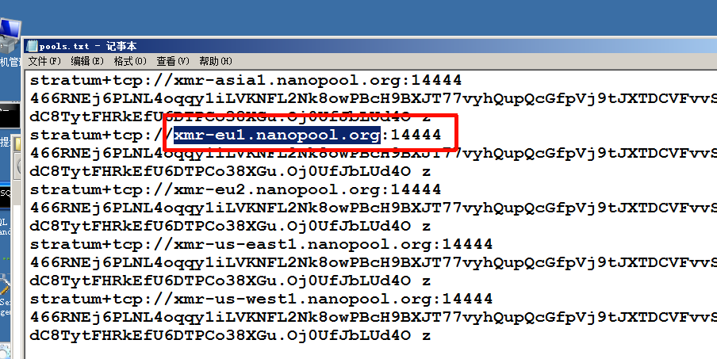

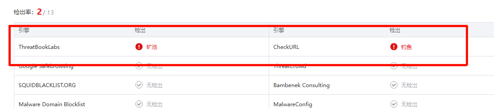

打开火绒剑 -启动项-禁用  注册表删除

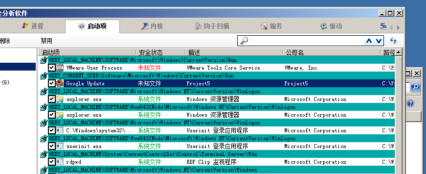

## 病毒2

运行病毒后cpu占用拉满

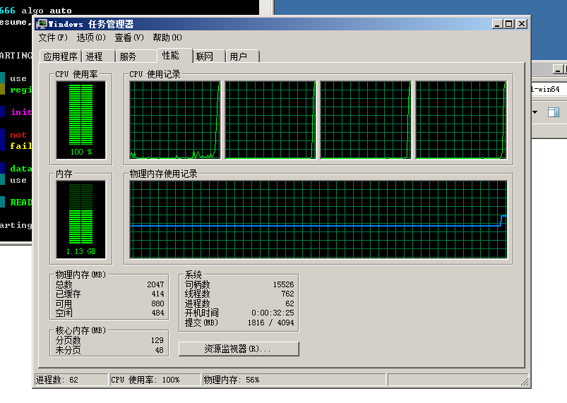

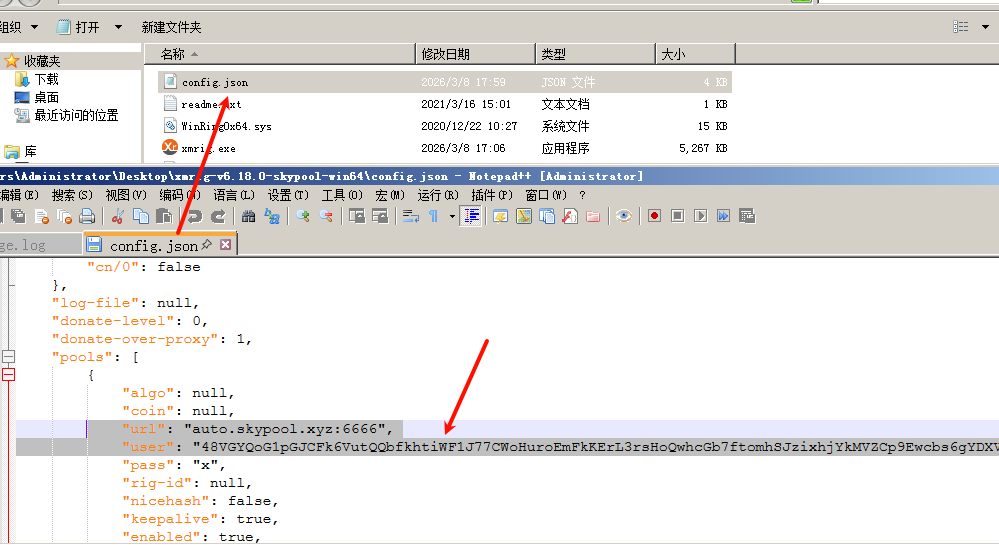

## linux 挖矿病毒

运行挖矿病毒 cpu占用100%

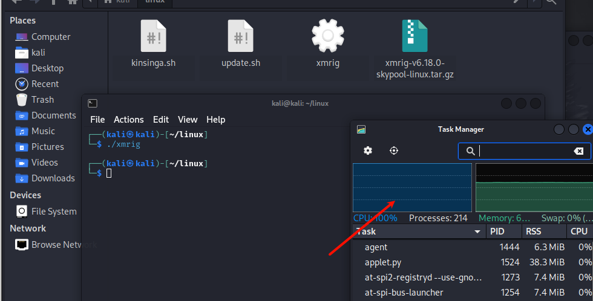

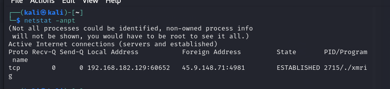

## 应急响应  windows 挖矿病毒

查看任务管理器 CPU占用率拉满

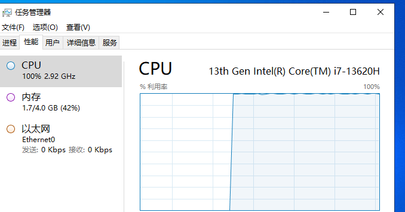

在进程中 xmring 占用了大量的

`netstat -an`查看所有网络连接（IP形式显示） 有大量的外联地址 ：443 ：80

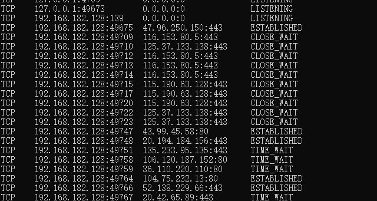

任务管理器 定位到文件中 打开`config.json `文件

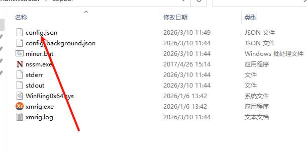

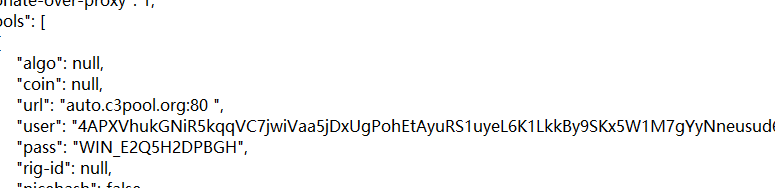

监听一下

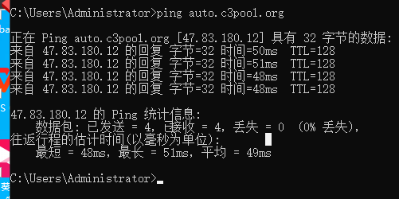

放入云沙箱检测出矿池

常见横向移动端口

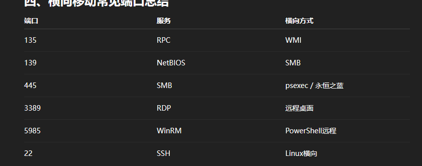

计算机管理->事件查看器->安全   发现有大量失败 后的成功 很可能是对方尝试爆破账号密码

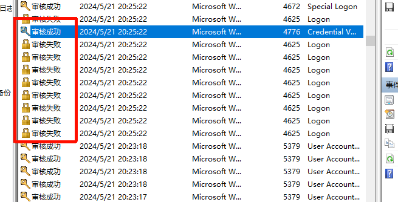

有登录成功的信息

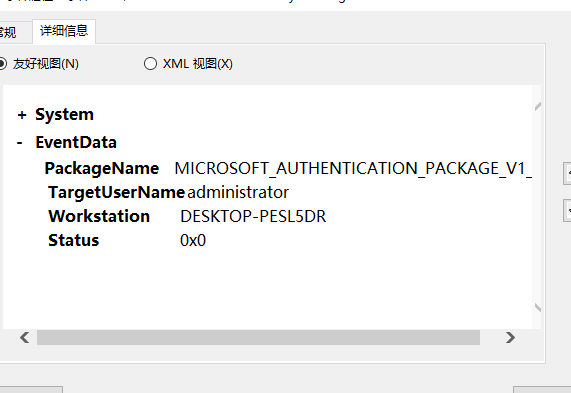

查看失败日志 发现连接的电脑并非本机名称和ip

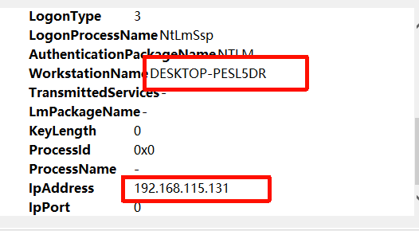

尝试结束任务后会继续运行

在计划任务中查看 疑似权限维持 并删除

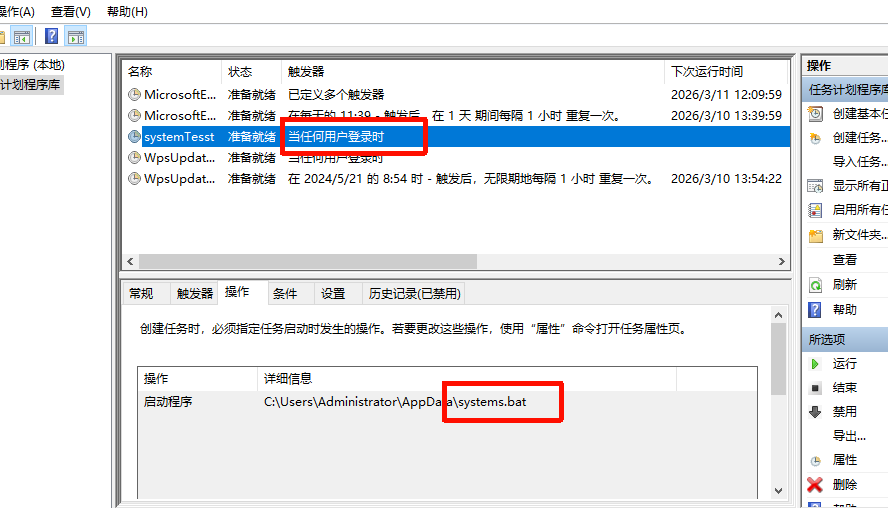

删除任务后还是不能结束进程

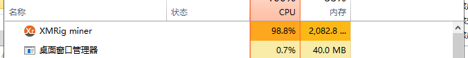

在服务中找到了没有描述信息的

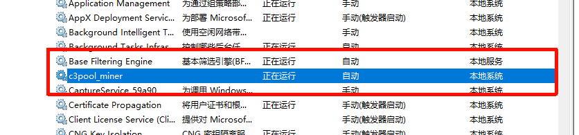

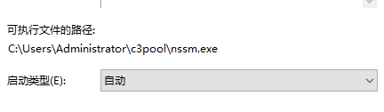

禁用并停止它

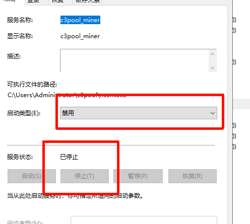

进程消失 系统恢复正常

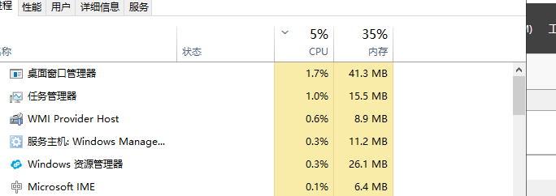

完全删掉病毒文件-重启电脑 发生病毒还会运行

 

msconfig 打开启动项

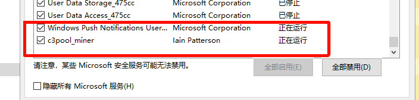

关闭启动项 禁用服务

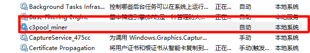

找到脚本位置

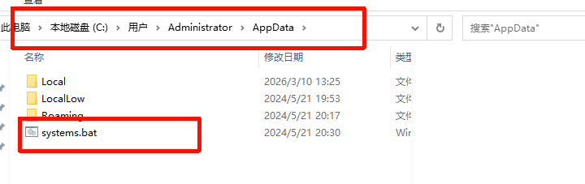

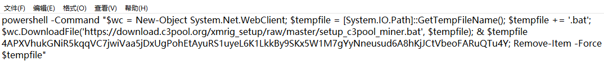

重启电脑成功删除病毒和启动

## linux 案例
