## linux服务器

利用ssh协议字典爆破

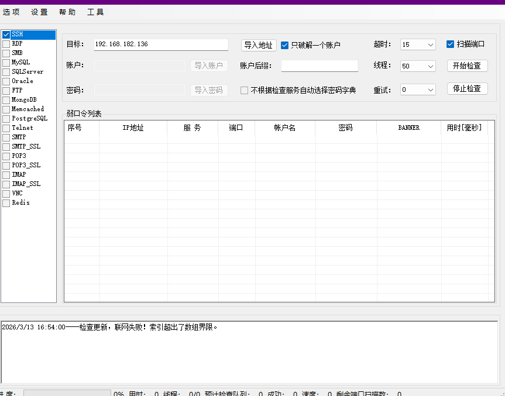

查看日志

```
gedit /var/log/secure
```

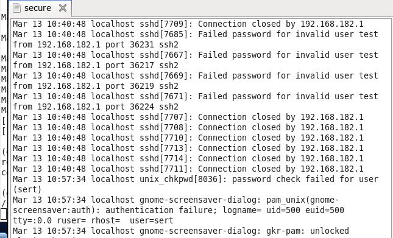

检查成功登录

```
cat /var/log/secure | grep "Accept"
```

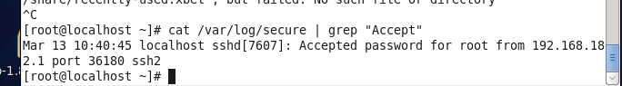

查看失败包

```
cat /var/log/secure | grep "Failed password for"
```

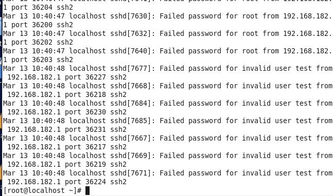

## windows服务器

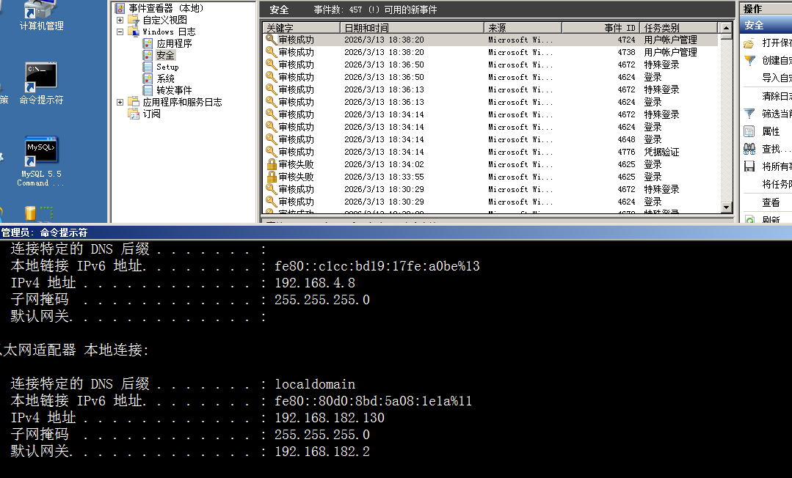

利用rdp协议爆破

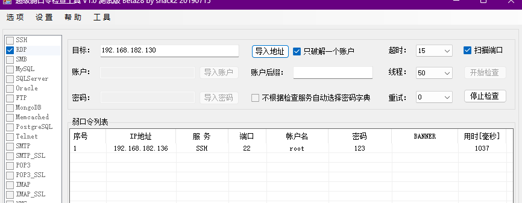

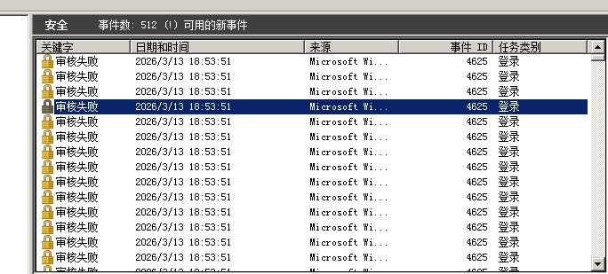

在详细信息中查看

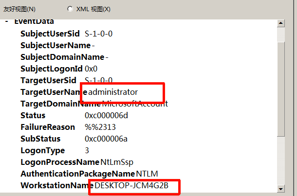

筛选日志

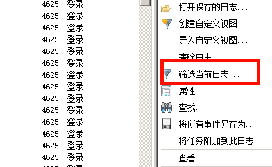

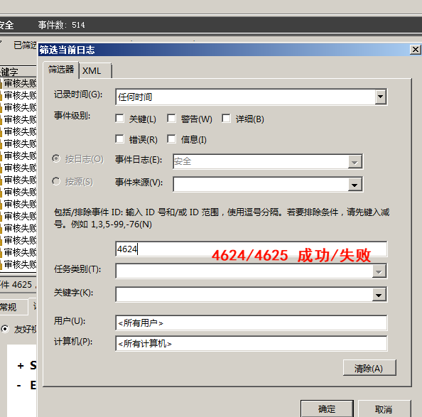

## sql server日志查看

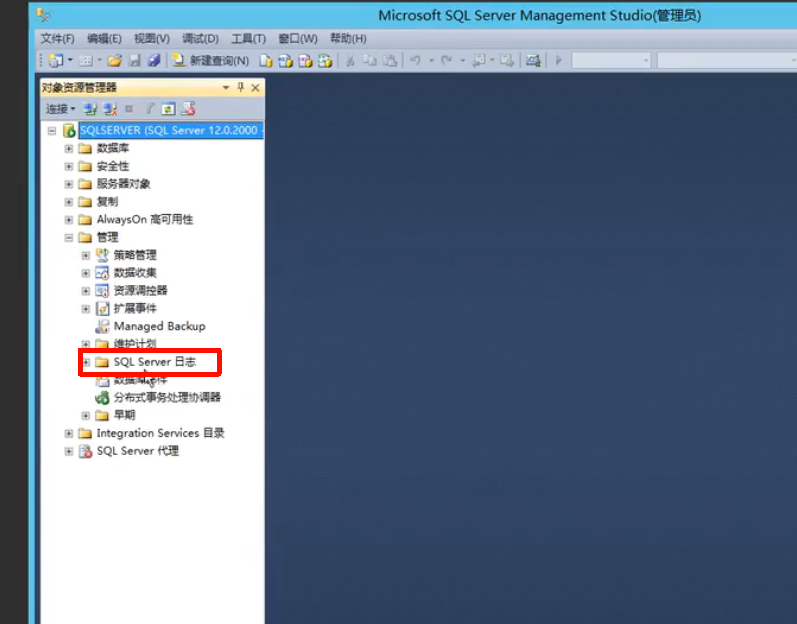

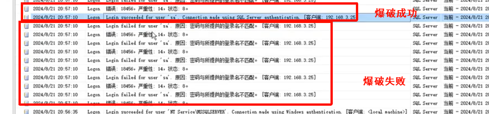

## Linux-ICMP 隧道

攻击机

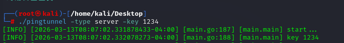

靶机

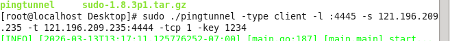

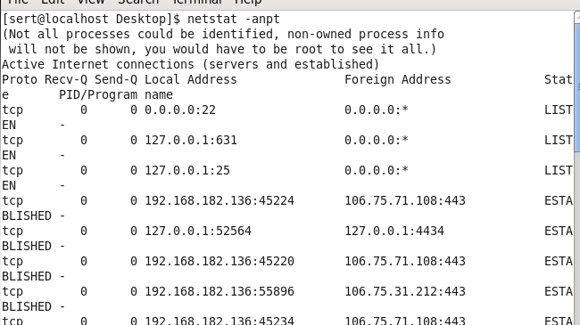

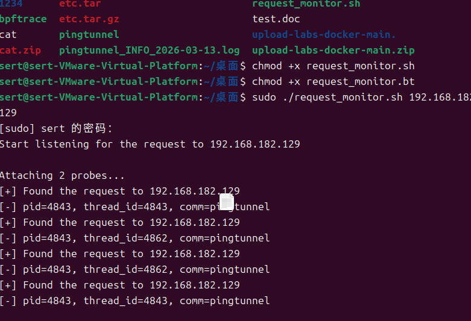

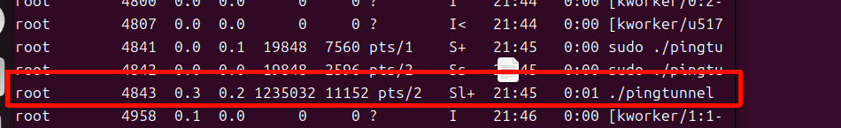

```
实验：https://github.com/esrrhs/pingtunnel
sudo ./pingtunnel -type server -key 1234
sudo ./pingtunnel -type client -l :4445 -s 121.196.209.235 -t 121.196.209.235:4444 -tcp 1 -key 1234
分析：
https://github.com/Just-Hack-For-Fun/request_monitor
https://blog.csdn.net/native_lee/article/details/124751325
安装：
sudo apt update
sudo apt install bpftrace
chmod +x request_monitor.sh
chmod +x request_monitor.bt
sudo ./request_monitor.sh xx.xx.xx.xx
ps -aux

```

# Windows icmp 隧道

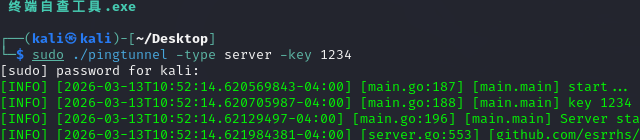

**利用445端口 + ICMP进行通信”**，一般出现在 **内网渗透 / 不出网环境绕过**里，本质是 **把原本走445端口的流量通过 ICMP 隧道转发出去**

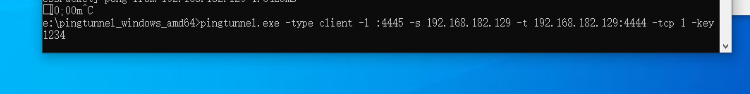

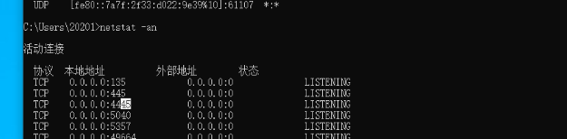

用wirshark发现有大量icmp包

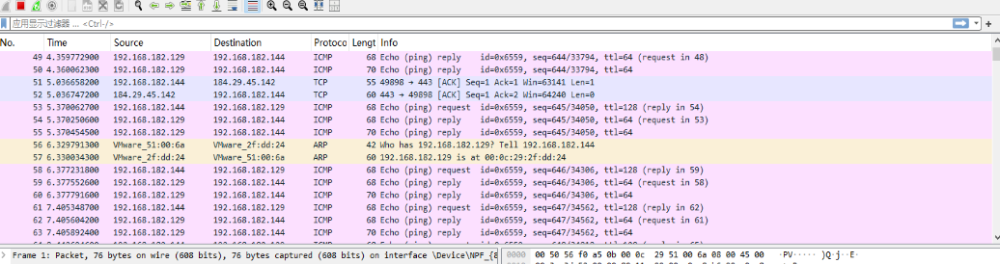

微软抓包==MessageAnalyzer== 可以定位到程序

开始抓包 注意要管理员启动

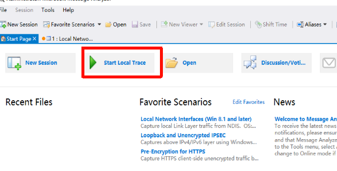

显示更全

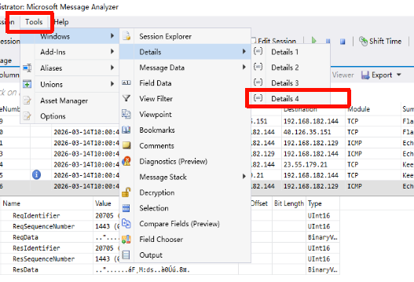

找到对应进程后

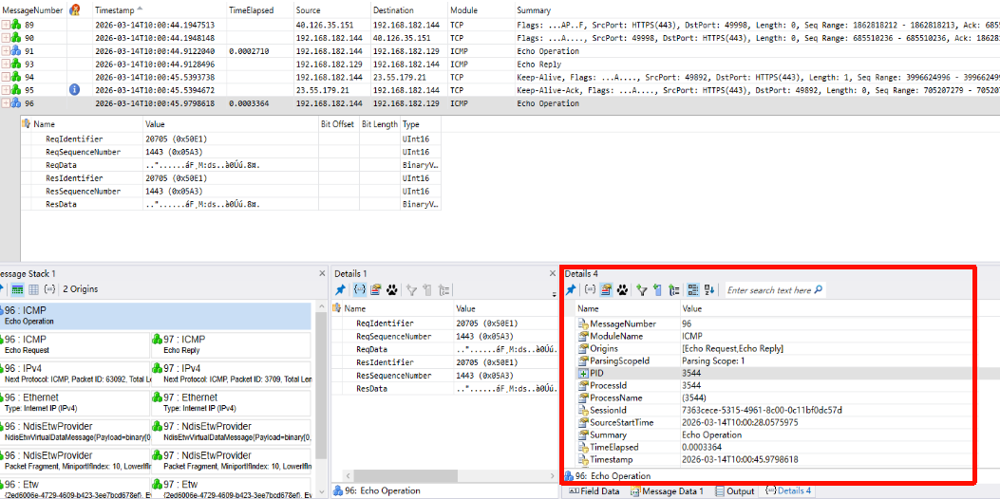

可以看到程序进程号

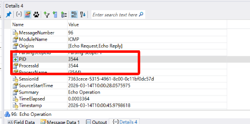

用火绒剑 找到对应程序 定位到 icmp是哪个进程发起的

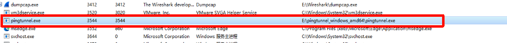