top 查看

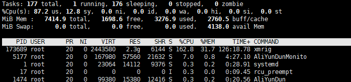

尝试删除进程

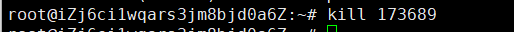

病毒会重启启动 更新pid

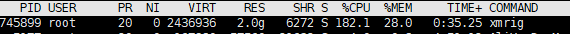

ps -aux 查看 所有进程信息查看 **所有进程信息**

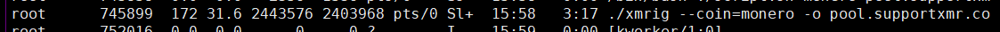

./xmrig 说明在当前目录 查看当前目录没有发现 xmrig

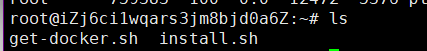

ls -al 查看隐藏文件没有发现

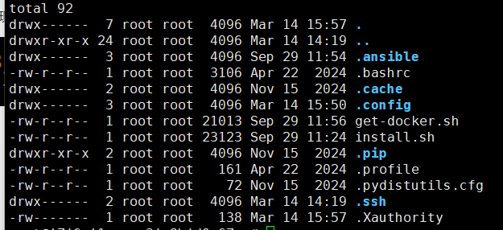

systemd 典型的docker启动 ,启动后会出现

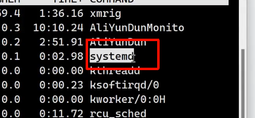

docker top 查看当前运行镜像

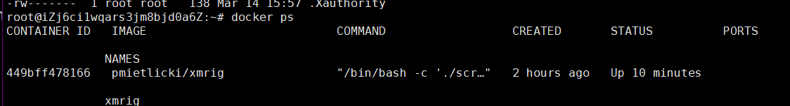

使用docker history命令查看指定镜像的创建历史 docker镜像加载的全部命令

```
docker history pmietlicki/xmrig 
```

```
docker history pmietlicki/xmrig | grep xmrig
```

可能是这个镜像跟刚才cpu进程相关

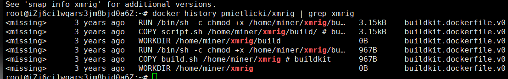

查看路径

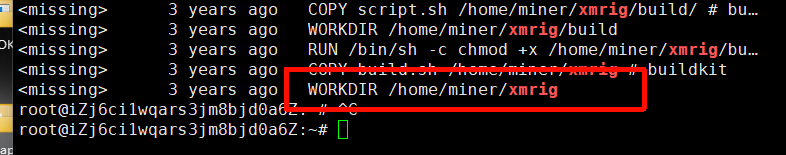

无法直接进入文件夹

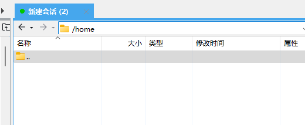

确认id号 docker ps

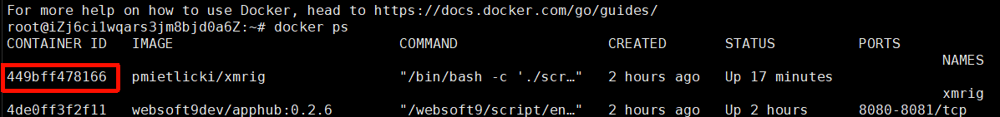

```
查看镜像：docker ps
进入镜像：docker exec -it xxxxx /bin/bash
暂停镜像：docker pause <容器ID>
删除镜像：
docker rm -f <containerId>
docker rmi <IMAGE_NAME>
```

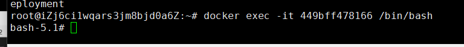

成功进入

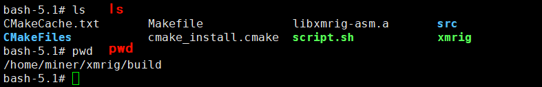

ps 进程1 和 7 与病毒相关

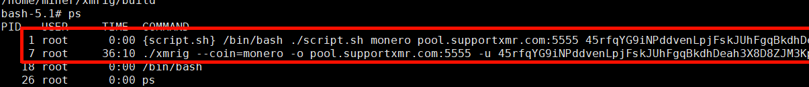

尝试删除进程

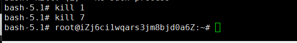

查看任务管理器 发现病毒进程还在运行

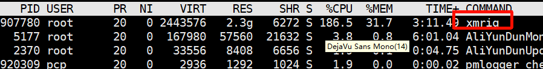

给一条很长的 Docker 命令起一个 **简写名字 `dfimage`** 分析 Docker 镜像每一层占用多少空间

```
alias dfimage="docker run --rm -v /var/run/docker.sock:/var/run/docker.sock alpine/dfimage"
dfimage -sV=1.36 pmietlicki/xmrig
```

可以看到镜像的环境变量

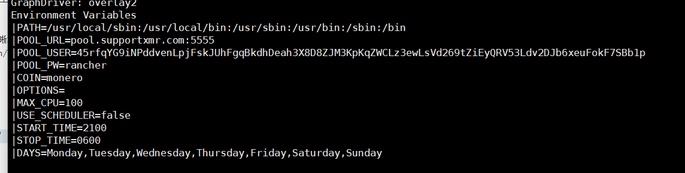

查看镜像的配置信息

```
docker inspect --format='{{json .Config}}' pmietlicki/xmrig
```

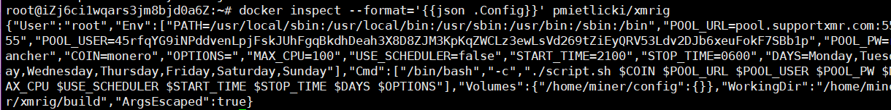

获取镜像的运行路径    (获取的docker 的磁盘路径)

```
docker inspect --format='{{.GraphDriver.Data.LowerDir}}' pmietlicki/xmrig
```

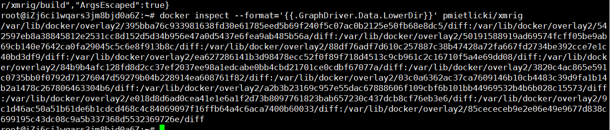

这里有多个路径 一个一个找 找到 xmrig

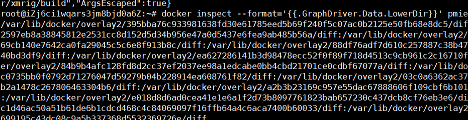

其中在这个路径下找到了  挨个排除每个路径

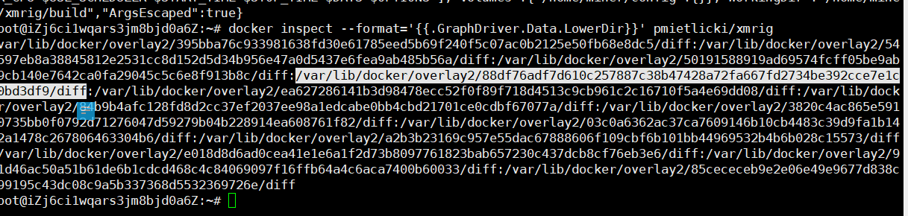

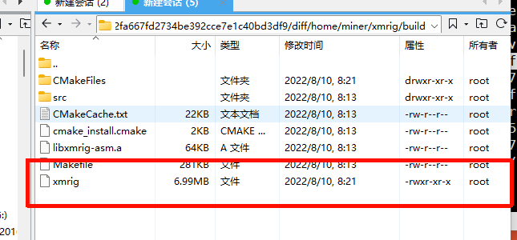

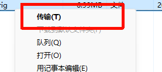

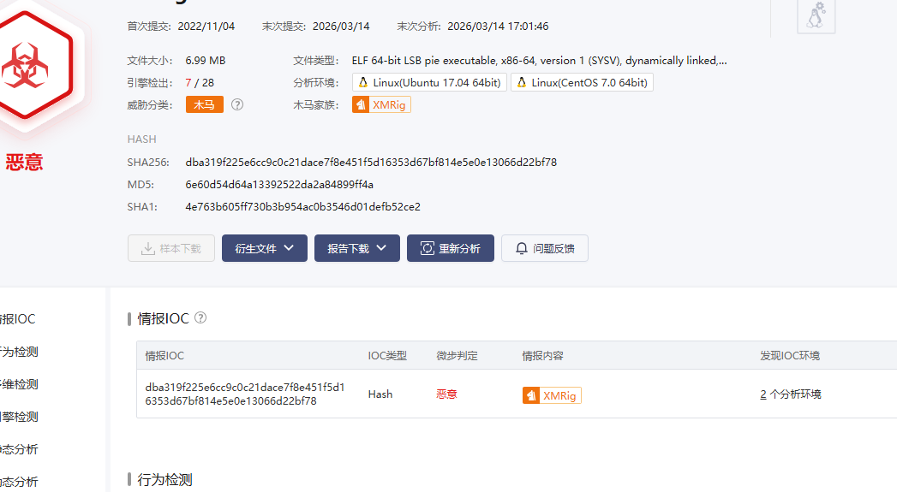

删掉文件

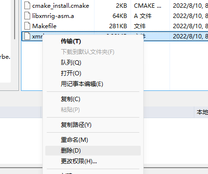

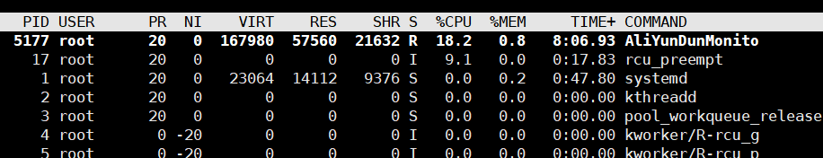

kill 1 和7

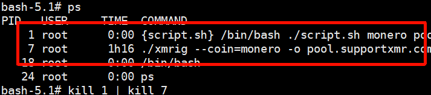

病毒成功结束进程

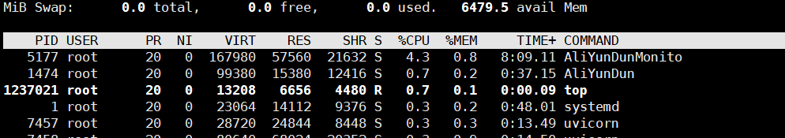

重新启动docker  病毒不在启动

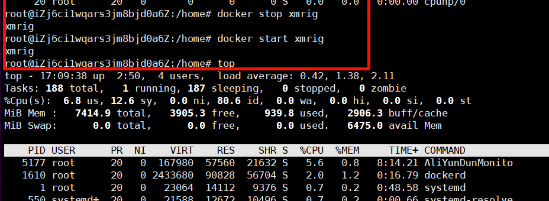


## grype 检查docker 入口点 修复方案

```
https://github.com/anchore/grype/releases
rpm -ivh grype_0.80.0_linux_amd64.rpm
grype <image>
grype <image> --scope all-layers

```

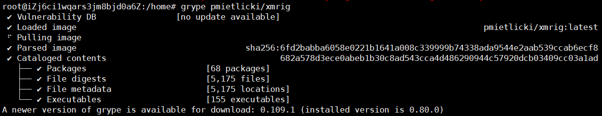


## trivy

```
https://github.com/aquasecurity/trivy
wget https://github.com/aquasecurity/trivy/releases/download/v0.54.1/trivy_0.54.1_Linux-64bit.deb
sudo dpkg -i trivy_0.54.1_Linux-64bit.deb
trivy image xxx:xxxx

```

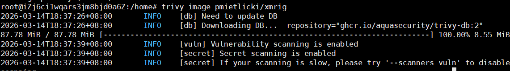

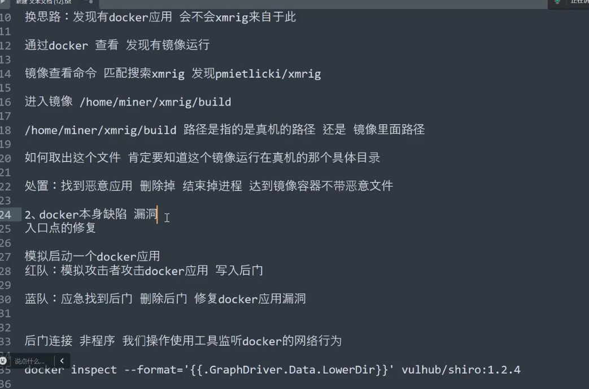