## 传统web应用型内存码

Servlet型内存马：动态注册Servlet及映射路由。
Filter型内存马：动态注册Filter及映射路由。
Listener型内存马：动态注册Listener中的处理逻辑。

上传后门植入内存码

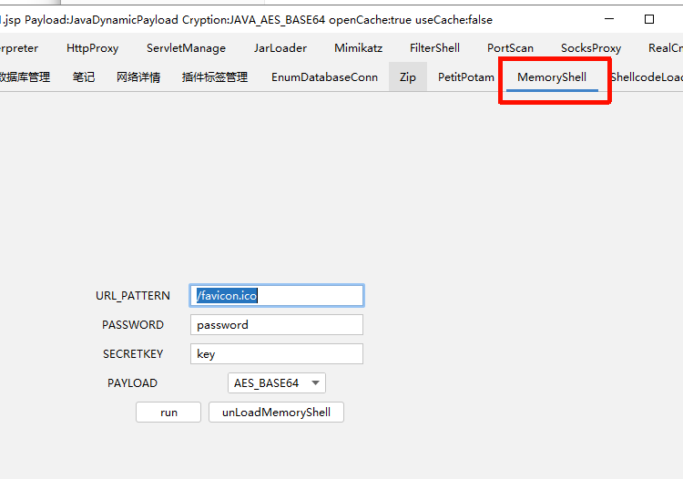

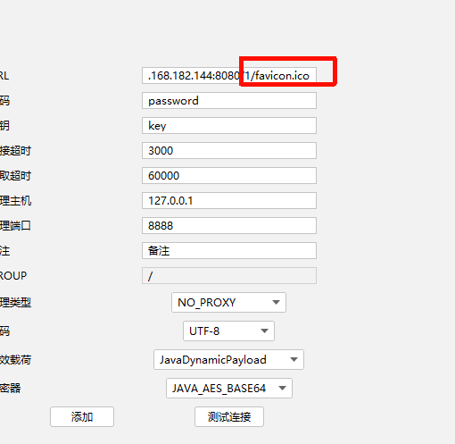

## 项目1scanner

上传scanner.jsp   ==(只能应对简单的内存码)==

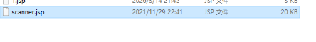

访问路径

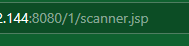

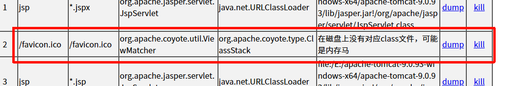

## 项目2arthas

运行 选则运行的java程序

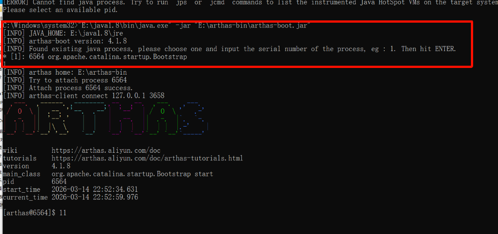

==内存码访问触发条件(Serlvet类型内存码)==

1 url地址路径 在源码中没有 不存在的(内存马) 利用路由关系查找Serlvet

```
查看URL路由（看Servlet内存马）
mbean | grep "name=/"
```

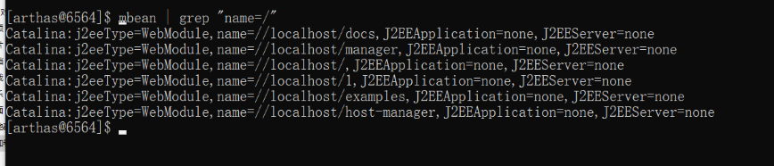

生成内存码后

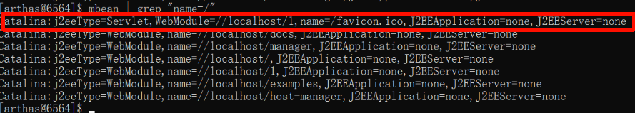

==Filter类型内存码==  arthas工具

生成内存码

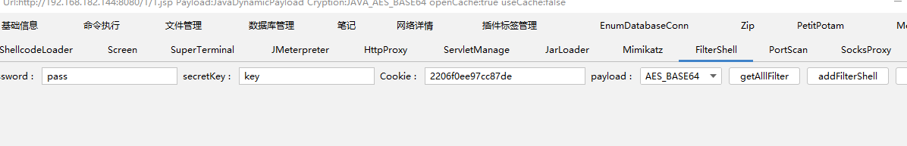

```
sc *.Filter
sc *.Servlet
```

找之前先怀疑看哪个像内存码

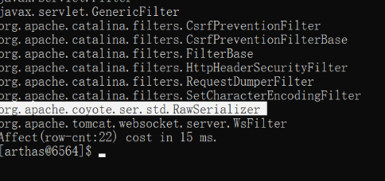

可以把怀疑的放到浏览器去查

如(`org.apache.catalina.filters.CsrfPreventionFilterBase`)

很明显有网上的解释介绍,说这个是真是存在的说明可能不是内存码(不严谨)

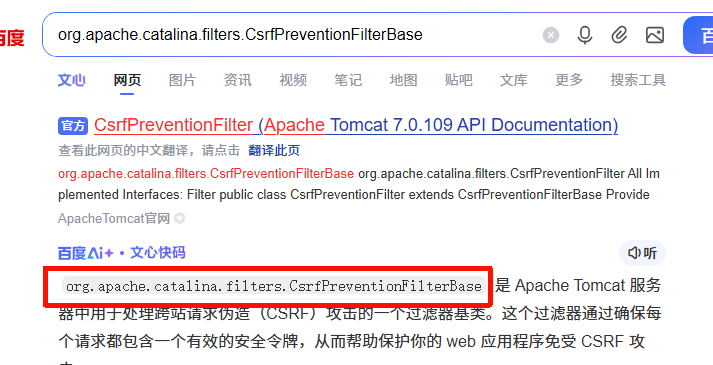

比较严识别是不是内存码的办法

```
jad反编译指定已加载类的源码
jad --source-only XXXX
```

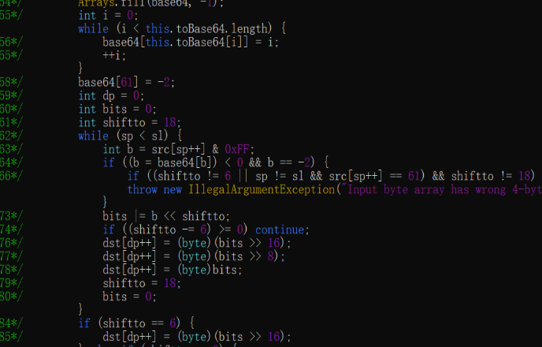

建议下载下来

```
dump已加载类的bytecode到特定目录
dump XXXX
```

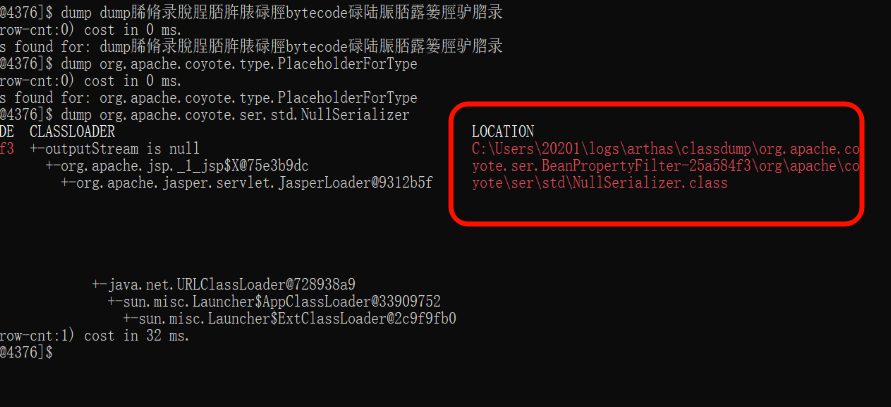

保存为一个class文件 用反编译软件或者idea打开

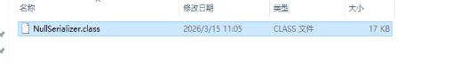

可以自己分析，也可以将代码保存到 `.java文件下`上传云沙箱

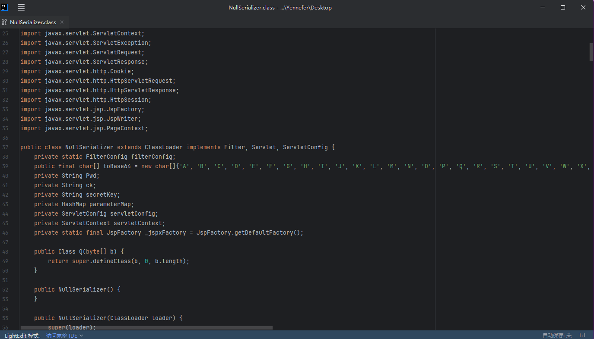

## shell-analyzer 查询内存码

检查当前环境选则 环境

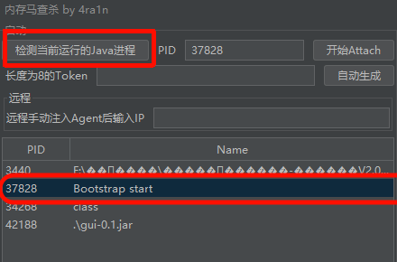

选择可以可疑的内存码进行反编译（默认从高到低排序）


## 查看日志

查看日志发现有未知路径在访问 并且访问成功 200  可能在遭受攻击

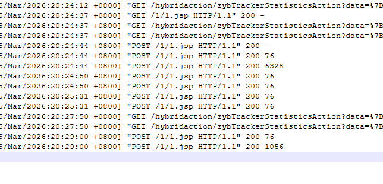
