## 中间件内存码

### Tomcat Valve ：动态注册Valve。

运行生成valve 内存码脚本文件

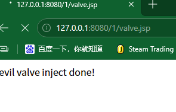

测试命令

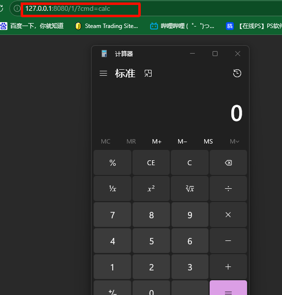

可以利用的工具 ==shell-analyzer==

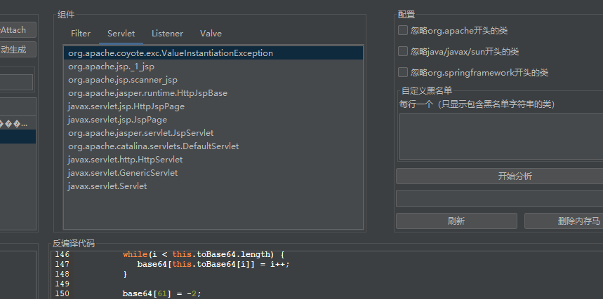

### SpringController型内存马：动态注册Controller及映射路由。

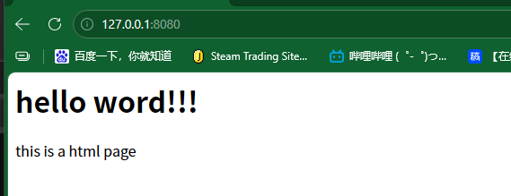

运行内存码脚本

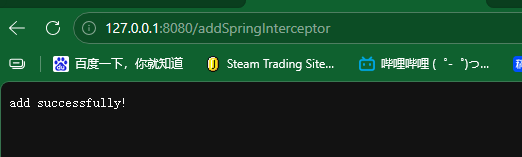

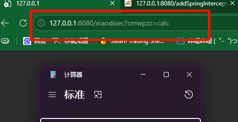

## cop 工具 （类多的情况下比较难用 不推荐）

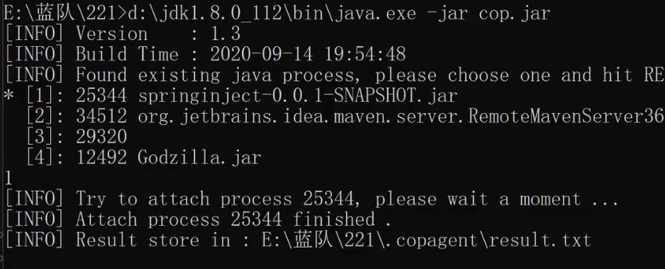

运行后产生文件 在文件中寻找

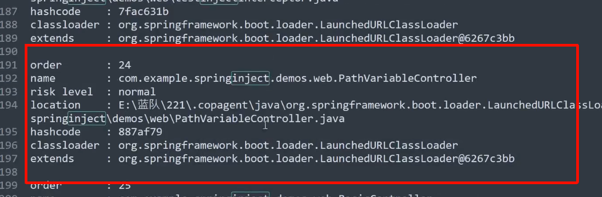

## arthas 工具

选择进程

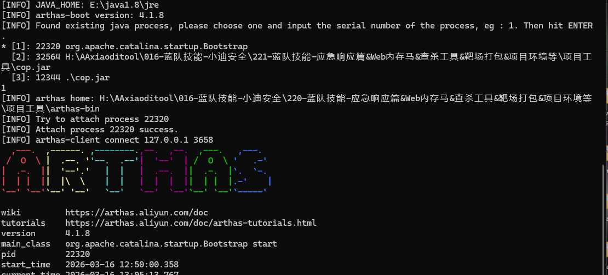

```
SpringController型内存马：动态注册Controller及映射路由。
SpringInterceptor型内存马：动态注册Interceptor及映射路由。
Spring Webflux型内存马：动态注册WebFilter及映射路由。

sc * | grep Controller
sc * | grep Interceptor
```

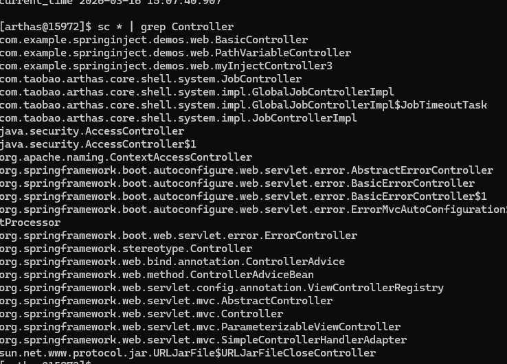

寻找可疑

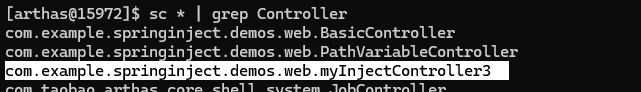

```
jad --source-only  xxxx //查看代码
```

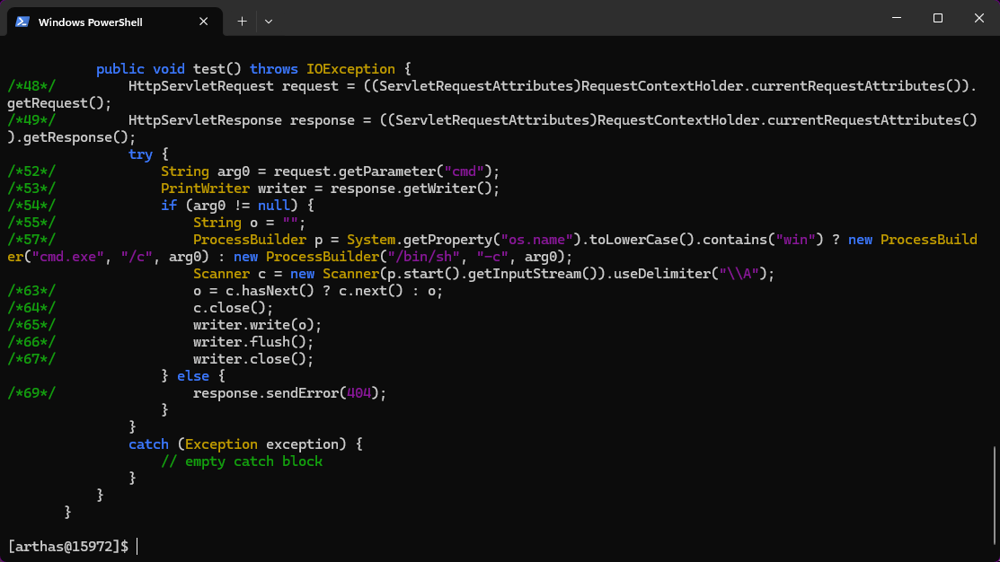

进入jar包根据路由关系删除类

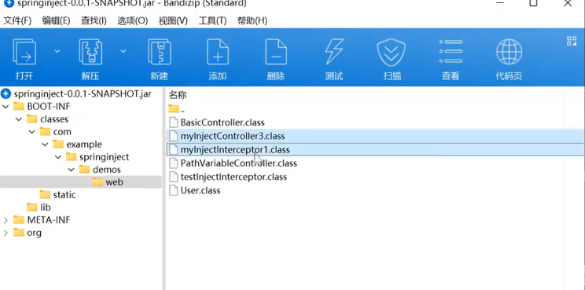

## Spring Webflux型内存马：动态注册WebFilter及映射路由

靶场已经开启  任意地址用哥斯拉连接

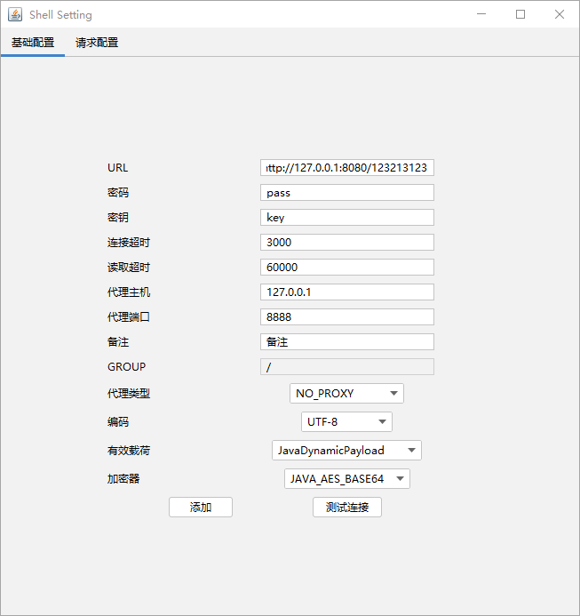

arthas使用语法：

关键字筛选 常规shell触发代码关键字


memshell shell os runtime

```
 sc * | grep Memshell
```

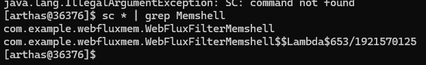

```
jad --source-only XXX 读取
```

识别后门

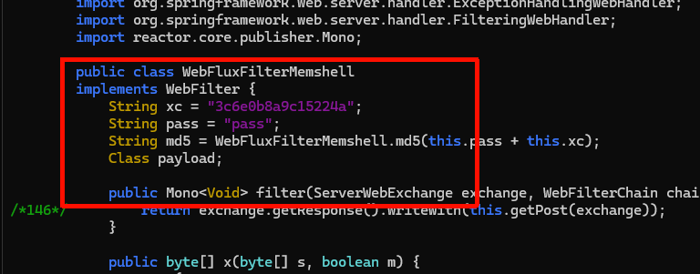

注意：
不同内存马类型查杀arthas检测：有的是基于内存马固定的后缀，名字，文件中的常见关键字去找到可疑类然后去定性