## windows日志采集

### 七牛日志采集

管理员运行.exe文件后 在3000端口打开

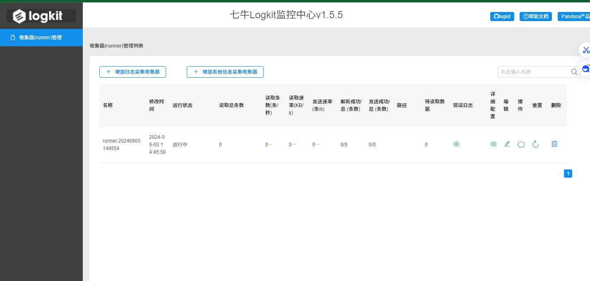

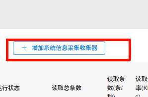

## WindowsLocalLogAnalysis-main 日志提取

日志提取.exe

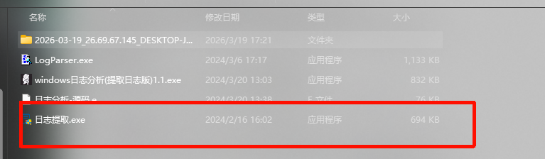

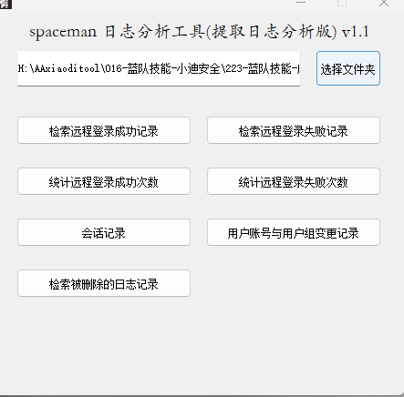

### fulleventlogview 查看日志

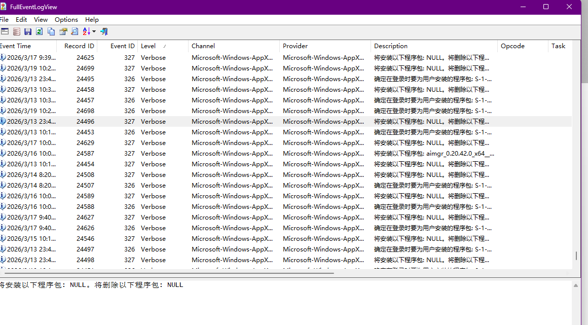

## Web 日志分析

### 360星图 （IIS/Apache/Nginx）

在config文件中修改日志目录  剩下的按照需求修改配置


运行

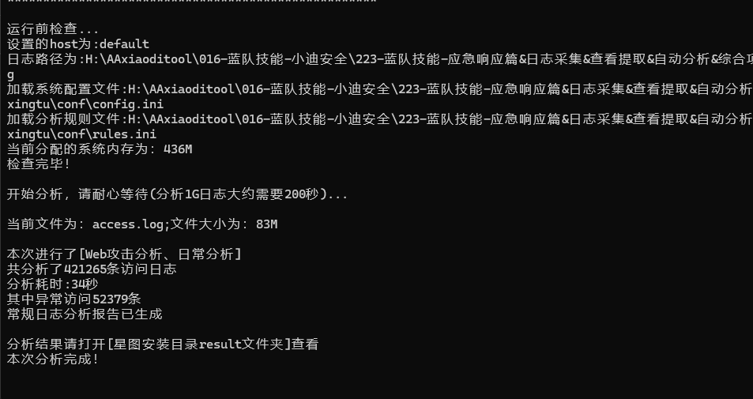

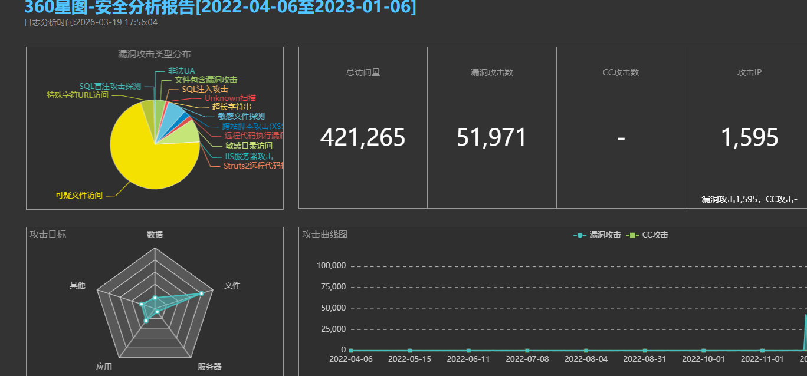

## Windows_Log-Winlog_Check（不好用）

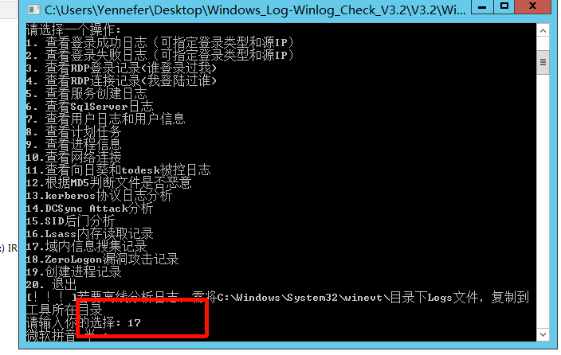

### Chainsaw  判断内网

在文件目录下创建Output文件夹  并放入之前提取的日志

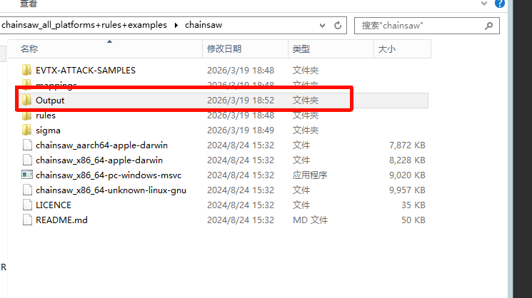

用命令执行

```
chainsaw.exe hunt output/ -s sigma/ --mapping mappings/sigma-event-logs-all.yml -r rules/ --csv --output results
```

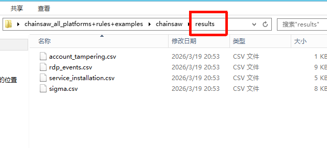

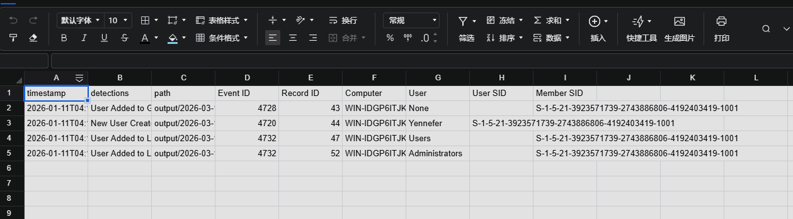

## ahmedkhlief/APT-Hunter  需要搭建

上传日志

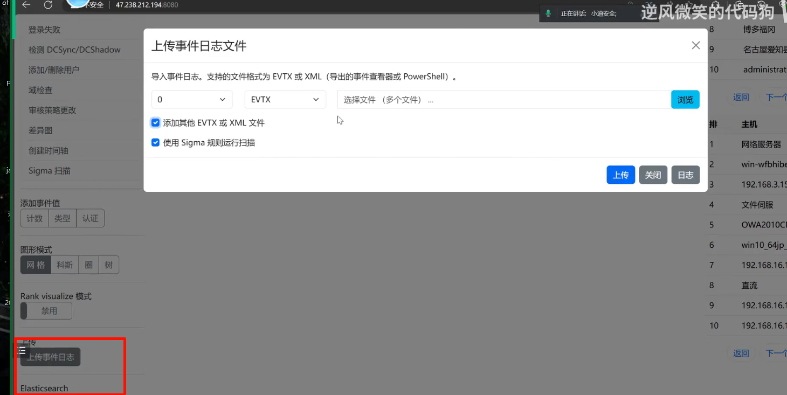

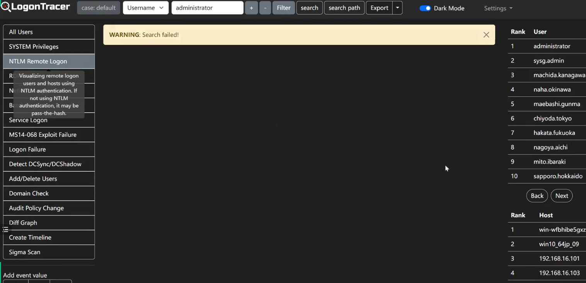

## Ashro_linux-main  Linux

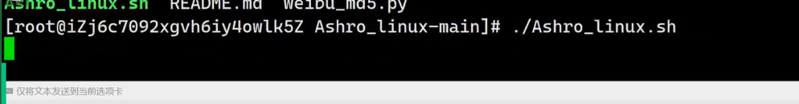

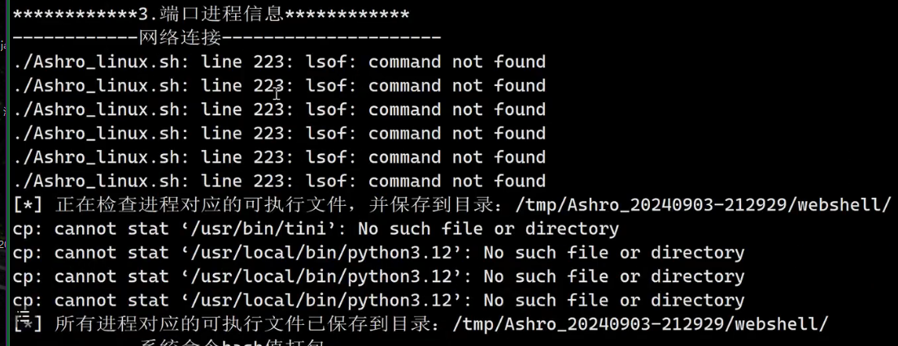

## Whoamifuck-main  Linux


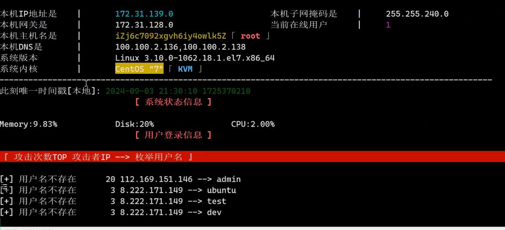