# ELK专业系统日志分析

快速搭建：

https://mp.weixin.qq.com/s/rakuhGVSoUysso1VD5r0aA

#### 放入文件分析日志

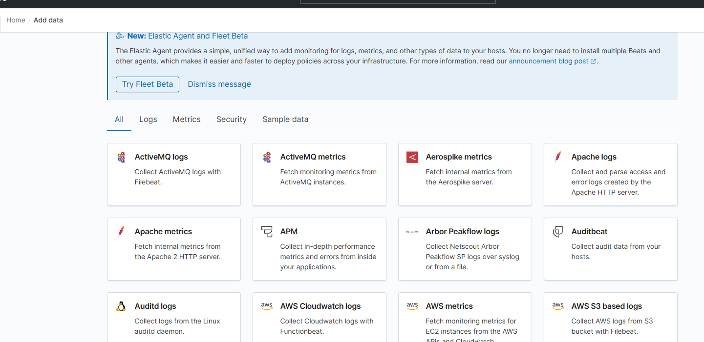

上传文件->设置索引名称

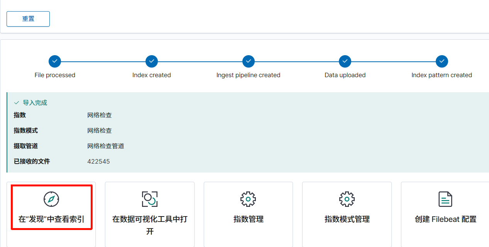

#### 收集日志 -分析日志

Linux


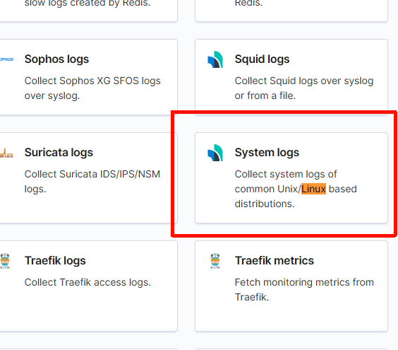

按照顺序输入命令   如果中途出现问题 可以先尝试换一种方法

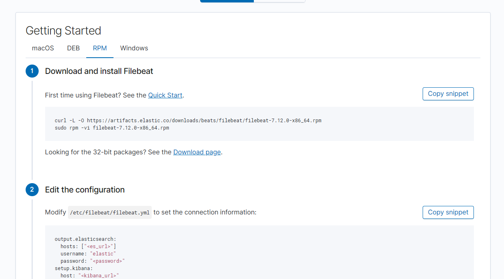

修改内容

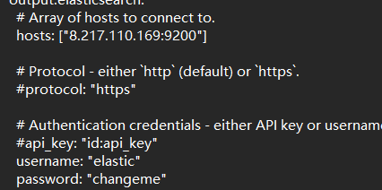

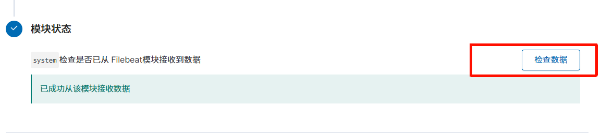

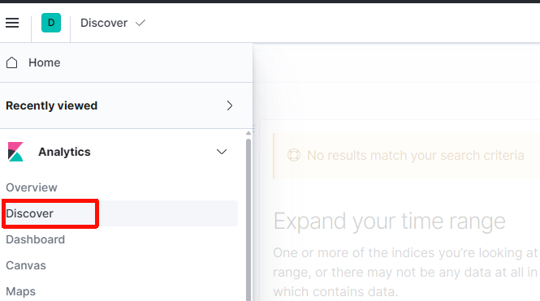

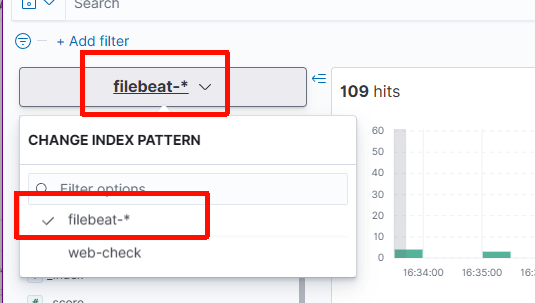

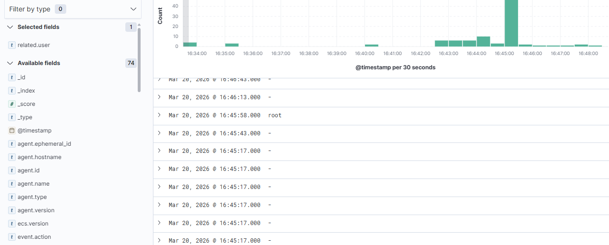

## 恶意文件Yara工具分析

把yara64.exe放到规则文件夹中

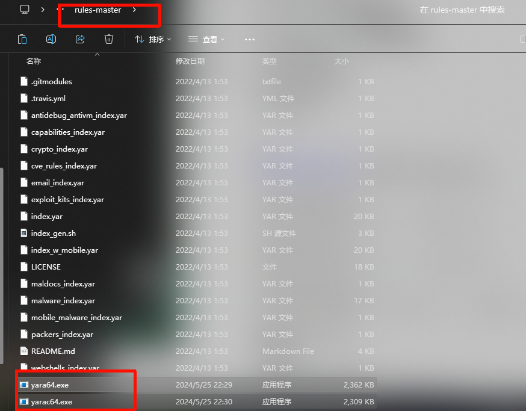

```
 .\yara64.exe .\malware_index.yar -r    目录
```

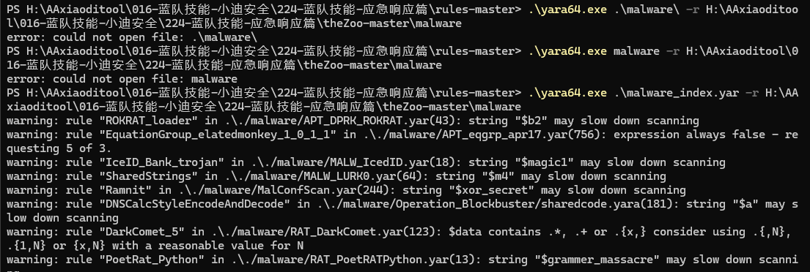

```
利用已知规则测试识别类型：(挖矿&勒索&C2&Webshell等)
yara64.exe malware_index.yar -r 目录

利用已知规则测试识别算法：
yara64.exe crypto_index.yar -r 目录

利用已知规则测试识别加壳：
yara64.exe packers_index.yar -r 目录 

利用已知规则测试识别反沙箱：
yara64.exe antidebug_antivm_index.yar -r 目录 

```

