## NIDS-Snort

安装教程[(Ubuntu22.04上Snort3的安装与基本配置-腾讯云开发者社区-腾讯云](https://cloud.tencent.com/developer/article/2616846))

在snort.conf文件中设置 要包含的规则

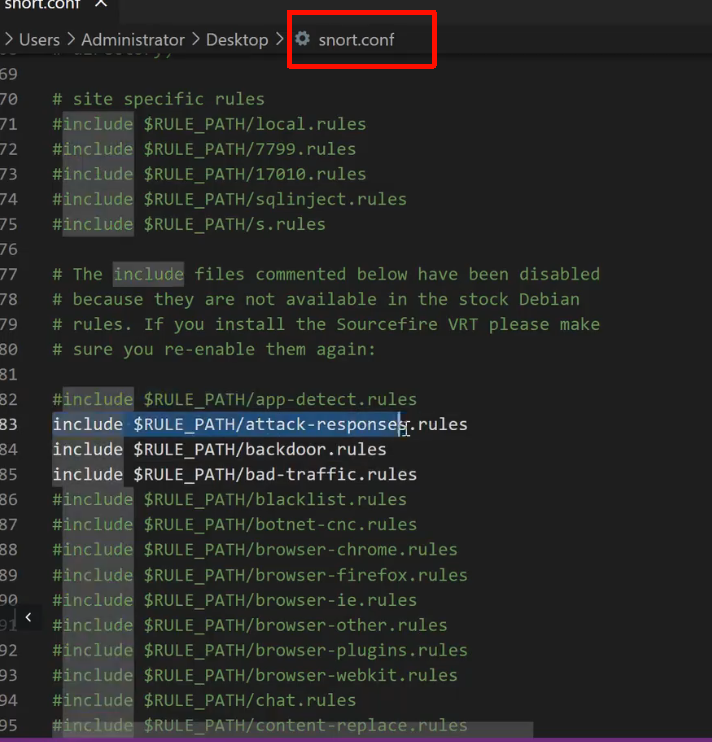

1、ICMP协议流量警告

开启监听

```
snort -i eth0 -c /etc/snort/snort.conf -A fast -l /var/log/snort
```

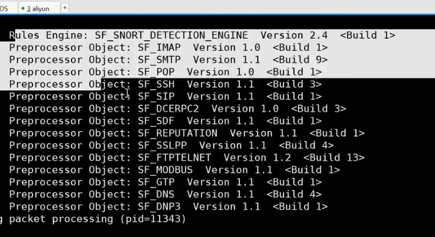

ping 主机 ip

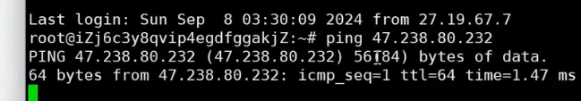

```
cat /var/log/snort/alert
```

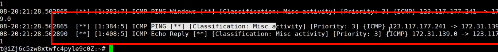

新建规则

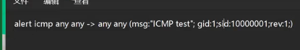

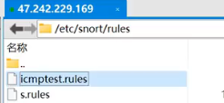

在配置文件中新建包含

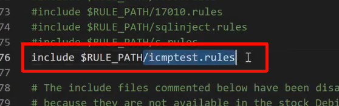

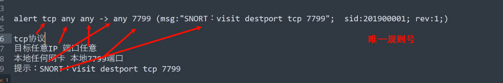

警告sql注入规则

```
alert tcp any any -> any 80 (msg:"Potential SQL Injection"; sid:1000001; rev:1; content:"' or '1'='1"; nocase;)
```

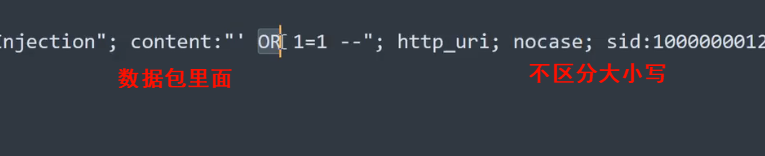

自定义规则

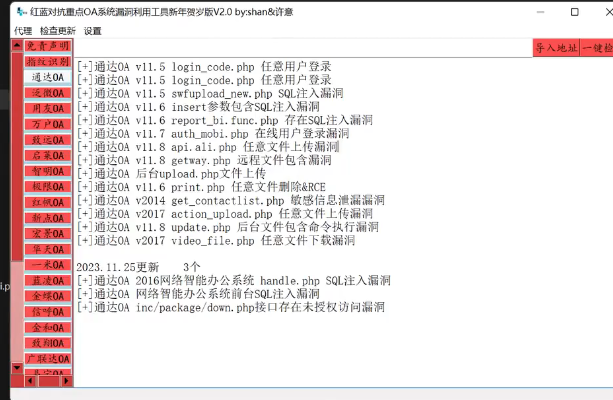

找到进程

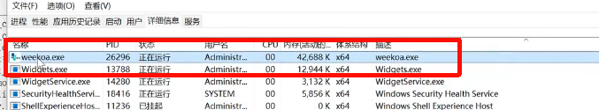

用proxifer 代理应用流量

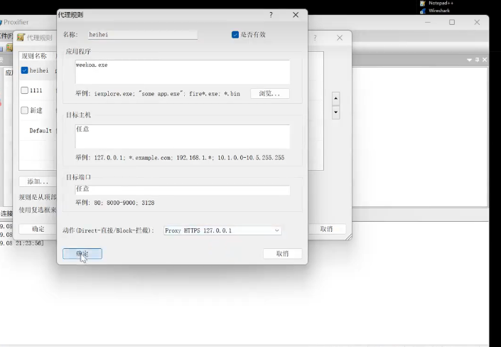

使用工具，抓包

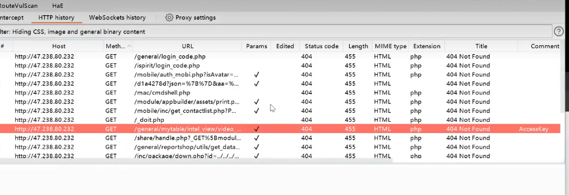

寻找特征

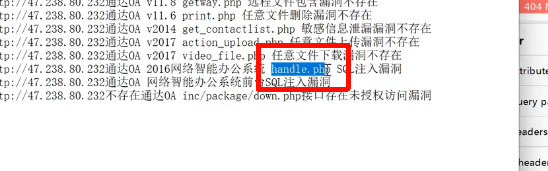

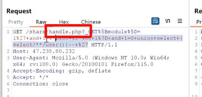

最快的办法交给ai   （bu'yi'd）


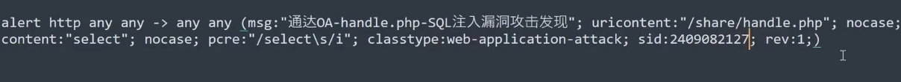

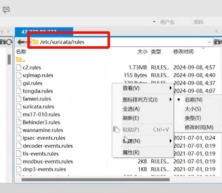

