## 雷池WEF

安装

```
bash -c "$(curl -fsSLk https://waf-ce.chaitin.cn/release/latest/manager.sh)"
```

### **使用WebGoat作为测试站点**

```
docker run --name webgoat -d -p 8080:8080 -p 9090:9090 registry.cn-shanghai.aliyuncs.com/kubesec/webgoat:v2023.8
```

注册账号

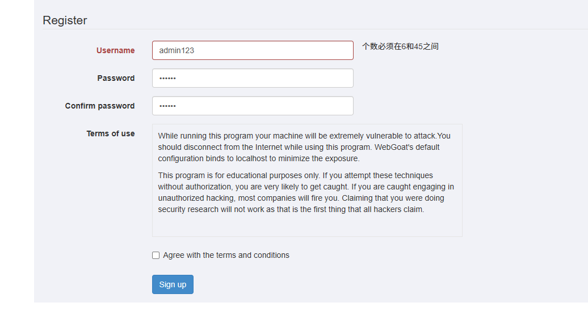

添加防护网站

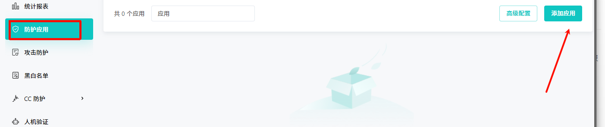

域名写真实域名（我用的本地搭建所以是随便写的域名）

上游服务器写被保护的地址

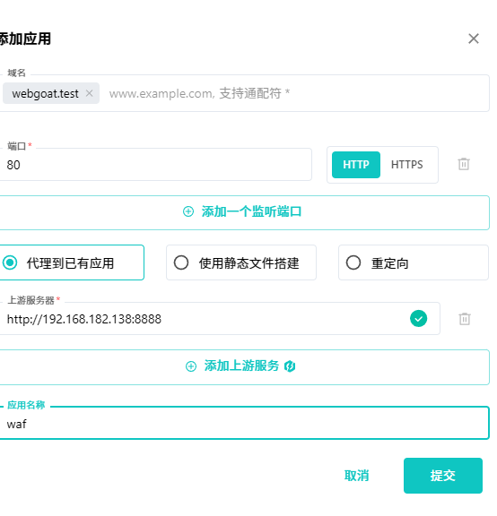

http://webgoat.test/WebGoat

尝试sql注入 

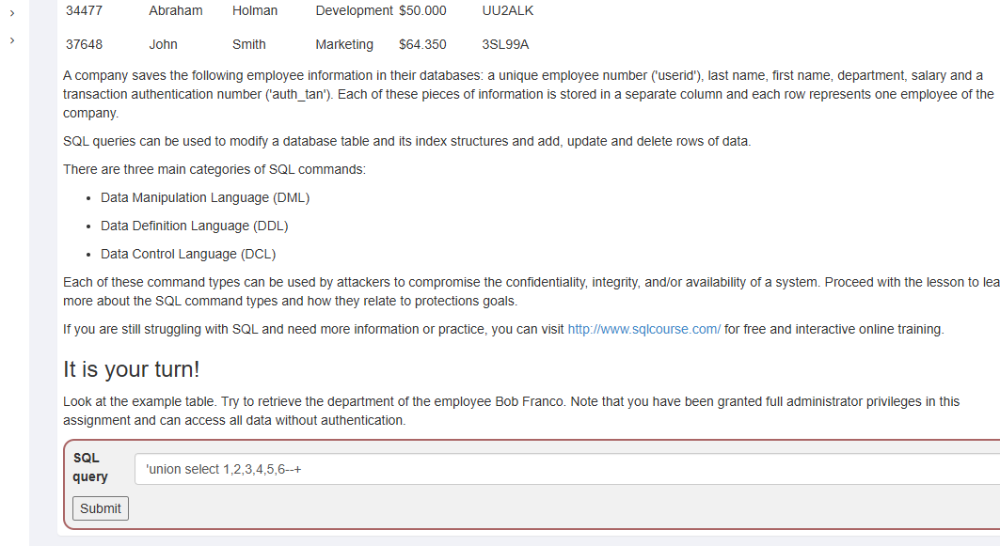

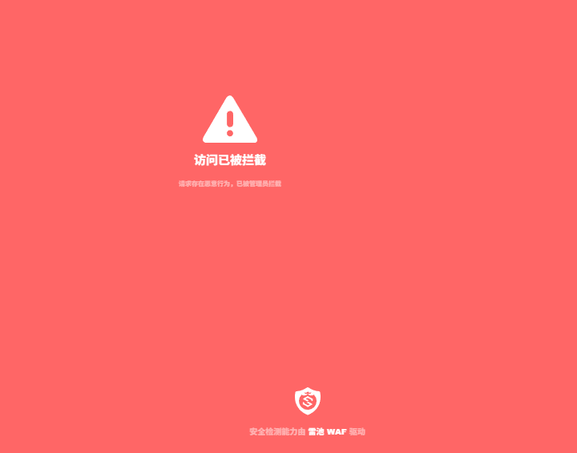

可以看见数据包

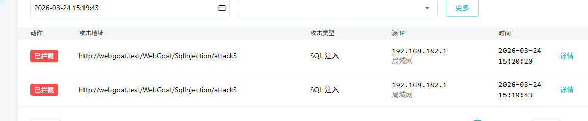

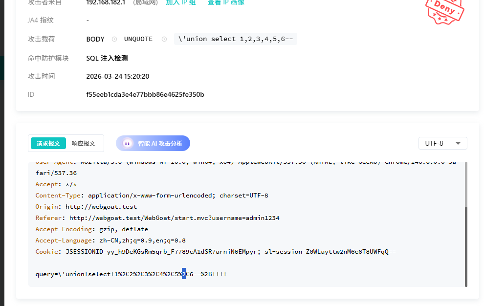

## 蜜罐-Hfish

https://hfish.net/#/README

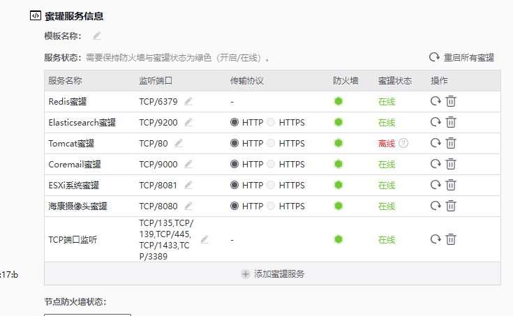

尝试访问后可以捕获到来源

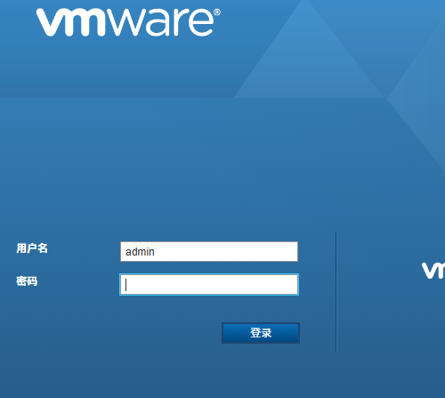

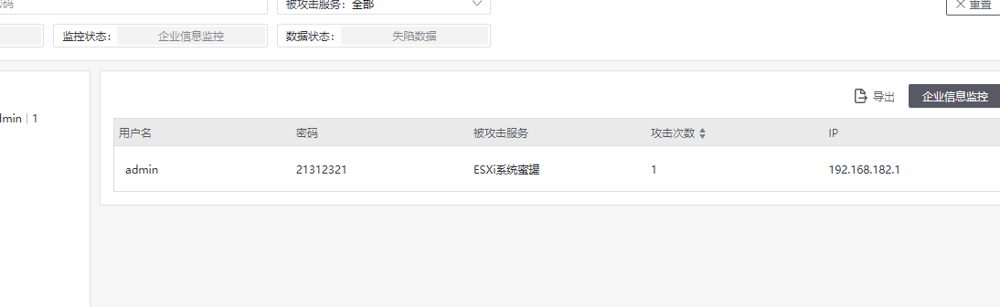

可以调用微步在线的api

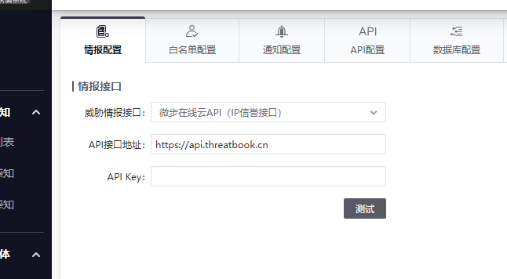