# Frp

配置服务器端访问配置文件可以看到访问端口

监听7000端口

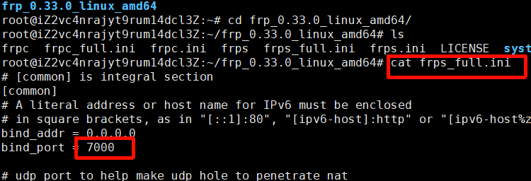

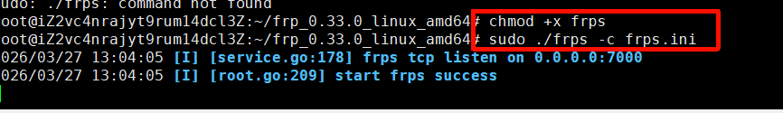

客户端

连接8.137.70.226 7000端口服务端

尝试将远程服务端的6666端口 转发到127.0.0.1 5555端口 采用tcp协议

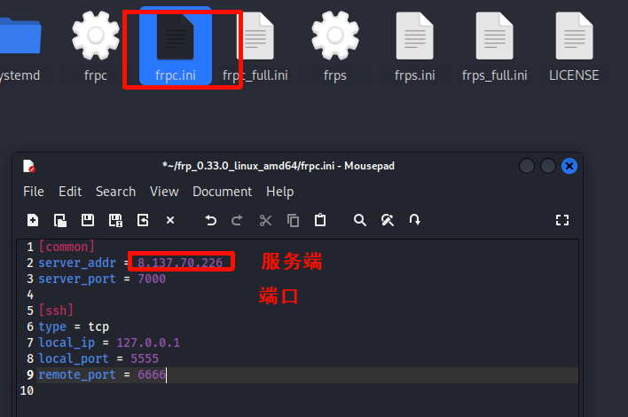

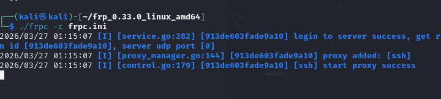

cs后门

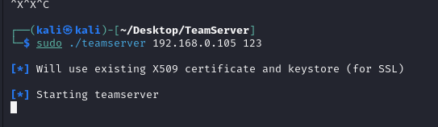

监听的是远程地址和它的端口

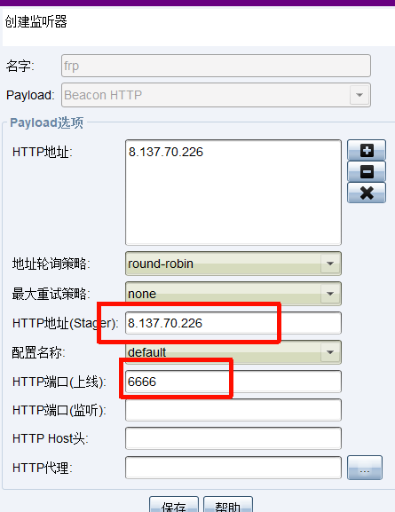

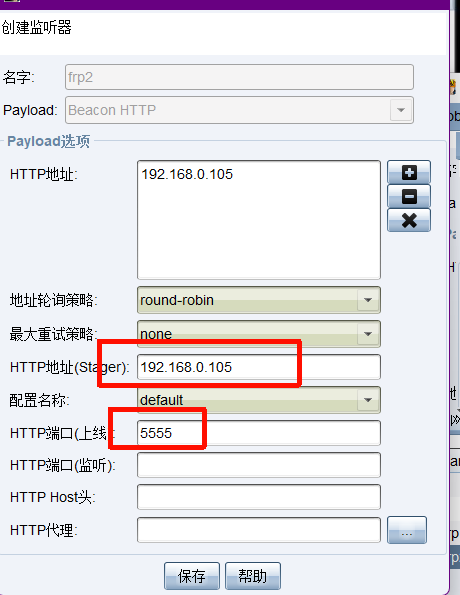

生成后门文件选择frp 运行后门成功上线

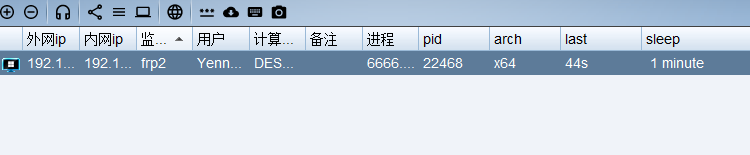

流量分析 采用window启动

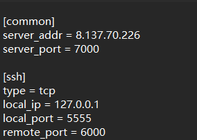

用wireshark和科莱启动后

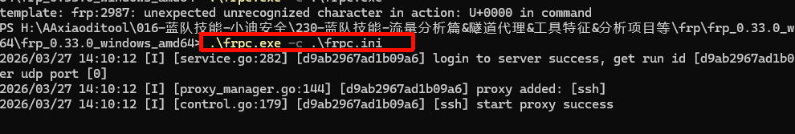

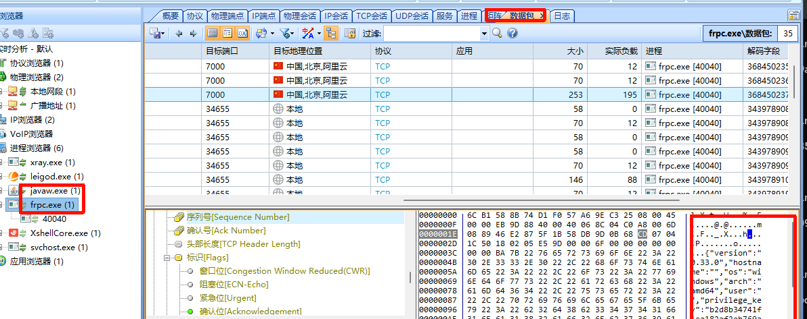


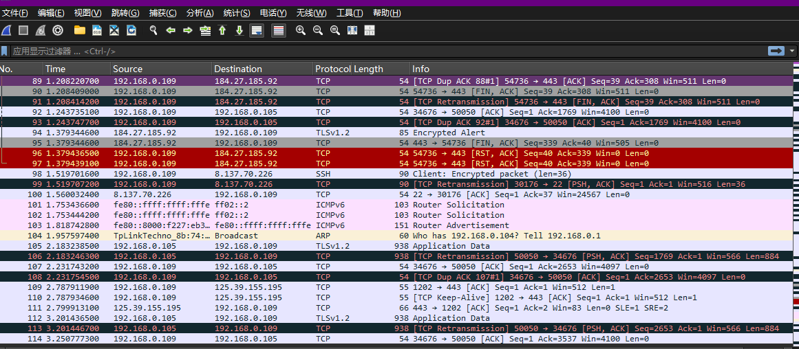

ip.addr == 8.137.70.226 服务器端ip

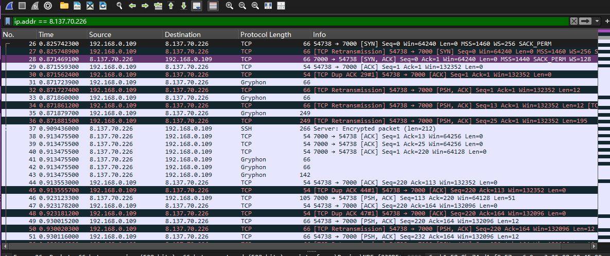

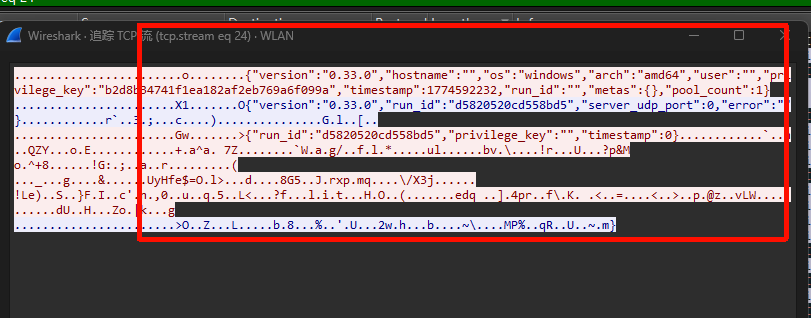

明显的工具特征


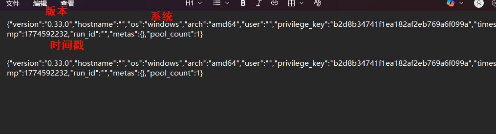

### 0.44版本启动


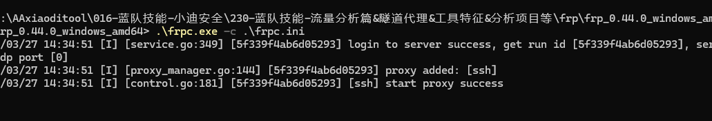

比0.33要少

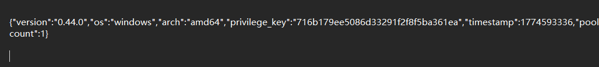

### 0.60版本  没有明显特征

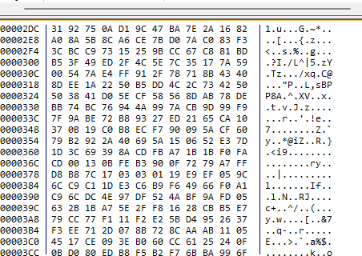

### 设置token  启用TLS加密

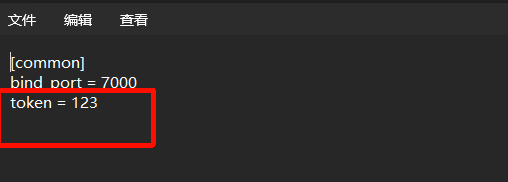

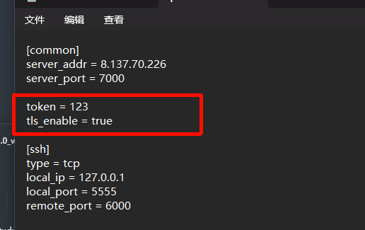

没有特征

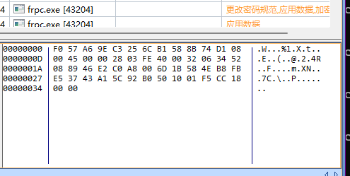

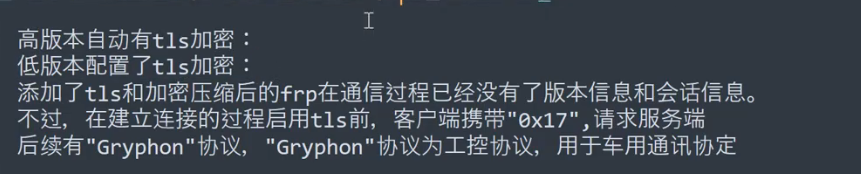

观察tcp到ssl之前

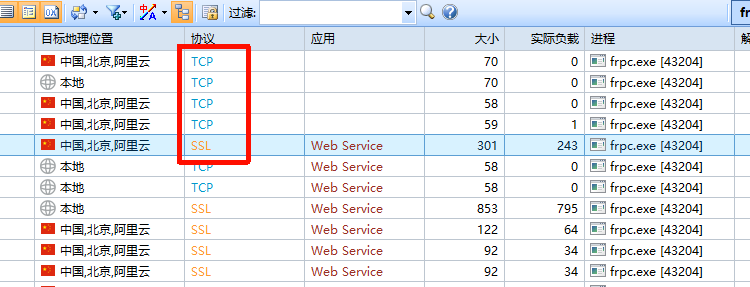

结尾是否有17

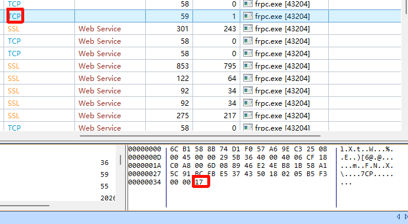

## nps  这个实验太卡了

启动

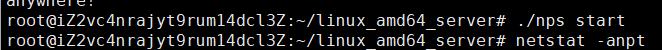

访问8080端口


新建客户端取个名字

```
./npc -server=8.137.70.226:8024 -vkey=mi89m1jmkrgsrvi4 -type=tcp
```

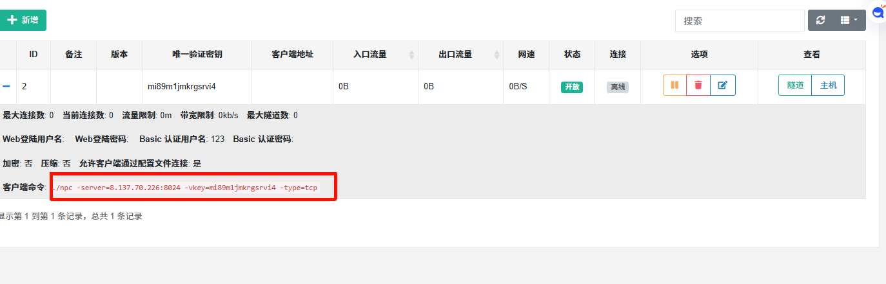

新增socks代理

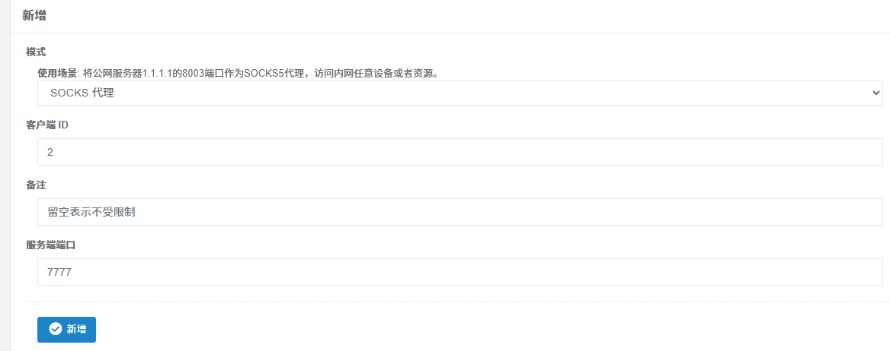连接成功后的特征：
1、明文版本号，MD5加密版本号
2、lib/common/const.go代码定义：

认证成功：服务端向客户端发送sucs，客户端发送main
连接后续使用隧道的特征：
3、通讯后有传输数据特征固定格式：
{"ConnType":"xx","Host":"xx","Crypt":false,"Compress":false,"LocalProxy":false,"RemoteAddr":"xx","Option":{"Timeout":5000000000}}

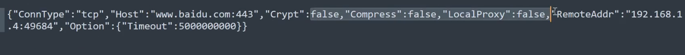