# Suricata

初次使用需要修改Suricata.yaml文件调整成自己的网段

# 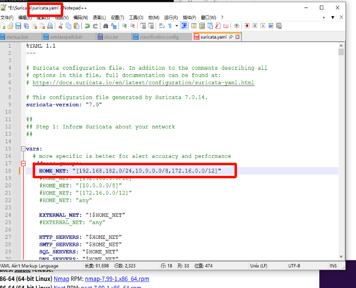

添加规则文件需要放到默认目录添加规则名

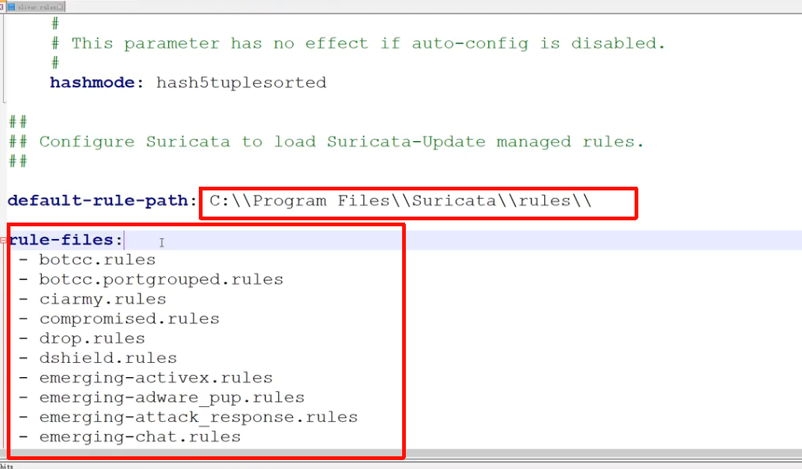

配置日志文件路径

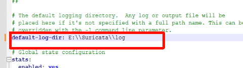

未配置的规则可以用-s加规则名   监听的网卡地址

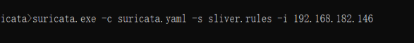

### cs规则

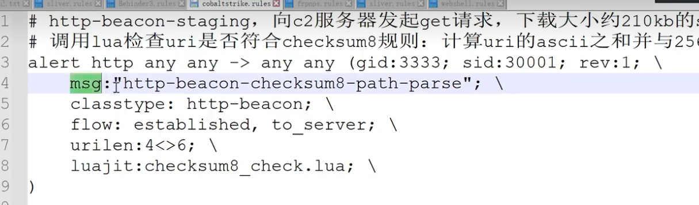

msg：提示信息

调用checksunm8_chck.lua  

调用lua检查uri是否符合checksum8规则：计算uri的ascii之和并与256做取余计算，余数为92则符合规则

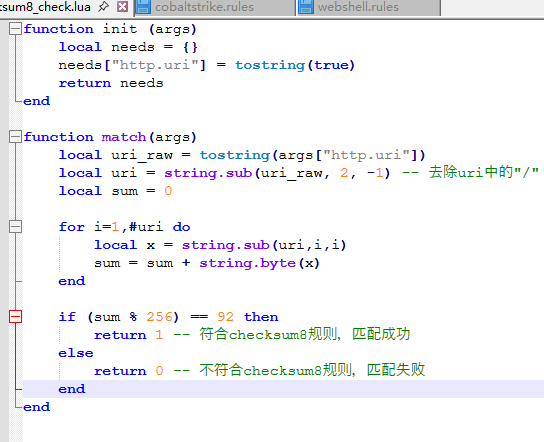

在config文件中配置 创建\lua_script文件夹放入checksunm8_chck.lua  

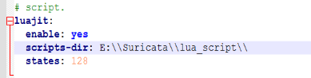

修改运行规则为假

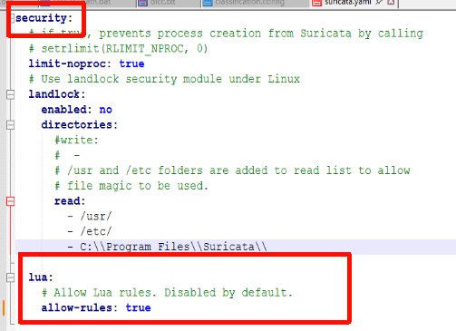

运行启动

```
suricata.exe -c suricata.yaml -s cobaltstrike.rules -i 192.168.182.146
```

上线后门成功有日志输出

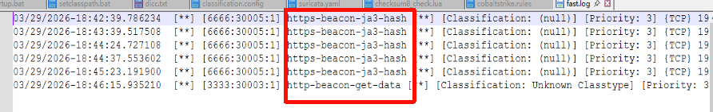

输入命令之后会有post提交

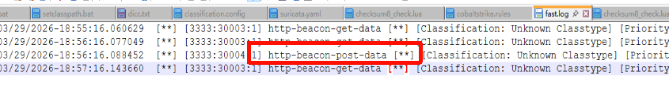

上线https

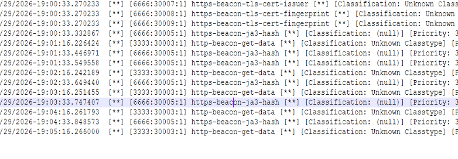
