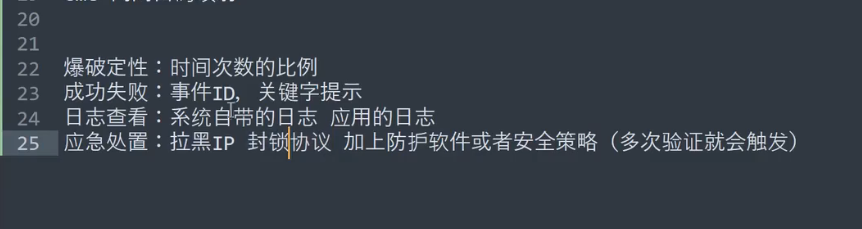

# 蓝队技能-应急响应篇&内网攻防&爆破事件&代理隧道&流量提进程&系统日志&处置封锁

```JAVA
#口令横向
场景说明：不管在内网还是在外网，协议口令爆破一直是攻击最常见的方式。
1、明确对应口令爆破的日志存储路径及查看
2、明确日志中有哪些属性和判断依据（筛选）
3、对于大量日志可在后面要讲到的效率项目工具

Linux-SSH
netstat -anpt
/var/log/auth.log
/var/log/secure
查看成功登陆：
cat /var/log/secure | grep "Accept"
查看失败登陆：
cat /var/log/secure | grep "Failed password for"
其他筛选登陆见打包PDF细节

Windows-RDP：
事件ID：4625/4624  失败/成功
登陆类型：2/3/5/10
事件日志：Windows日志>安全

Windows-SMB：
事件ID：4625/4624
登陆类型：2/3/5/10
事件日志：Windows日志>安全

Windows-MSSQL:
事件日志：管理>SqlServer日志

Windows-WMI:
该方法不会在目标主机留下日志
    
除上述外还有FTP,Redis,MYSQL,STMP等协议爆破事件，具体分析无非就是找对应日志存储文件后，文件中筛选失败登录请求进行排查应急。

#隧道技术
场景说明：内网或不出网的情况下，协议隧道技术很常见，如何定位到进程及攻击者？
1、明确隧道最常使用的协议技术
2、明确Windows,Linux中分析技术
3、对于有需要自定义排查协议可学后续开发脚本实现

ICMP比较有挑战性和代表性
至于DNS或者其他协议的隧道或者恶意程序其实都是一样的处置方法，

Linux-ICMP
实验：https://github.com/esrrhs/pingtunnel
sudo ./pingtunnel -type server -key 1234
sudo ./pingtunnel -type client -l :4445 -s 192.168.182.129 -t 192.168.182.129:4444 -tcp 1 -key 1234
分析：
https://github.com/Just-Hack-For-Fun/request_monitor
https://blog.csdn.net/native_lee/article/details/124751325
安装：
sudo apt update
sudo apt install bpftrace
chmod +x request_monitor.sh
chmod +x request_monitor.bt
sudo ./request_monitor.sh xx.xx.xx.xx
ps -aux
流量：Wireshark分析
处置：封IP及防火墙限制协议

Windows-ICMP
实验：https://github.com/esrrhs/pingtunnel
sudo ./pingtunnel -type server -key 1234
pingtunnel.exe -type client -l :4445 -s 192.168.182.129 -t 192.168.182.129:4444 -tcp 1 -key 1234
分析：Microsoft Message Analyzer
流量：Wireshark分析
处置：封IP及防火墙限制协议

```




